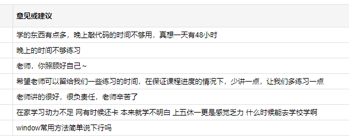
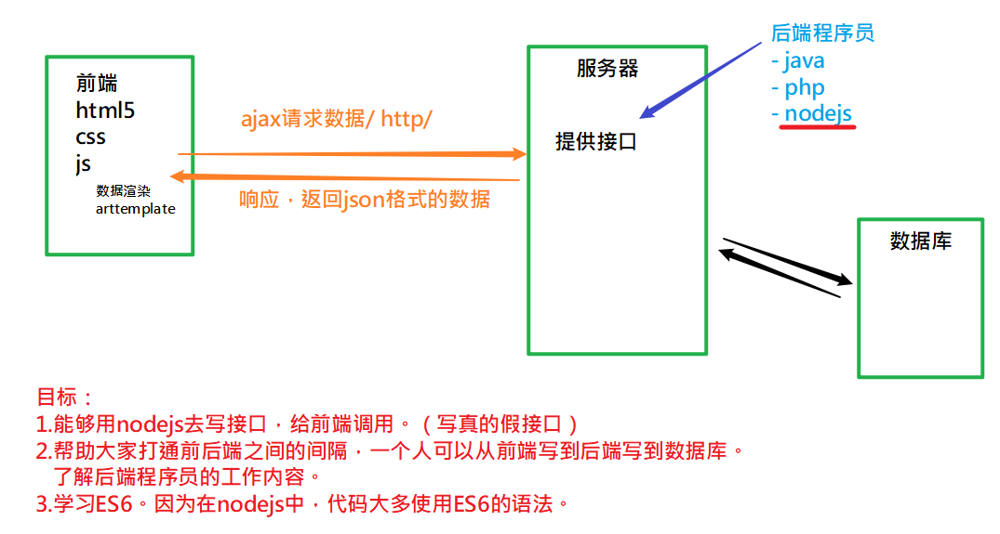
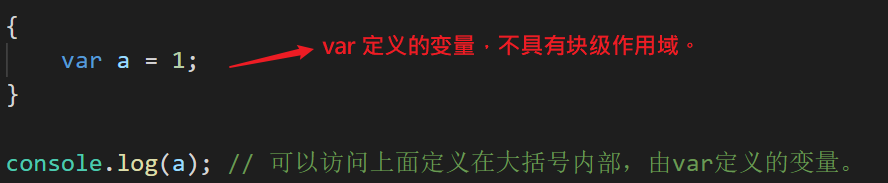
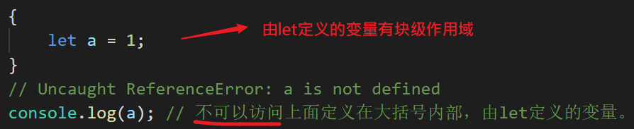

## 02-06反馈

解决方案：

- 每天正课控制在3-4小时，给出练习时间。
- 每天晚上7-9点之间，随时视频，语音在线。

## 整体介绍服务器端编程的内容安排

## es6

- 是一个ECMAScript6.0的简写。（2015.6推出的）
- 也代指其后所有的版本。（每年更新一版）
- 它非常有用，不学不行！！

## let & const

- 引入let是用来代替var。（因为var定义变量有很多不足）

- 引入const是因为之没有**常量**

## let

- 不能重复定义
- 没有变量提升
- 不会成window对象的属性

## 块级作用域

块级作用域(block)是指：

可以由 { } 来划分作用域的一种机制。在es6中，如果一个变量用let定义，则它就有块级作用域。

## 代码调试

​    debugger;    
​    // 调试代码时使用，如果加上它，则程序在执行时，
​    // 会停在此处，并进入调试状态

可以通过这个工具来查看变量的状态

## 常量

const:保存不能被修改的值。

特点：

- 名字一般是全大写。

- 定义就是要给初值。

- 定义之后不能修改。

  与let相似

  - 具有块级作用域；

  - 没有变量提升，必须先定义再使用常量也是独立的，

  - 定义后不会压入到window对象中，不是window对象的属性

  

## 本质

只能保存常量对象中保存的值不能变动 。

**如果常量中保存是的一个对象，则它并不能保证对象的属性不被修改。**

如果希望定义一个不能被改动的对象，可以使用Object.freeze()

## 作业

把大事件项目中的var 根据情况改成let 或者是const，上传github!

## 解构赋值

es6中提供一种用来：快速地从有结构的数据中取出值来赋值给变量。

## 数组的解构赋值

目标： 把数组中的值取出来，赋值给变量。

格式：let [变量列表] = 数组

规则：按下标一一对应。

## 参数默认值

在定义函数时， 提前给形参设置一个**保底的值**，如果实参没有传过来，就用这个值。

- 带默认值的形参放在形参列表的**最右边**。

  

## rest参数

在定义函数时，给最后一个形参前加...  。用来收集别的形参不要了的（剩余的）实参值，

保存在数组中。

用来代替arguments。

- 它是真数组，而arguments是伪数组
- 有些情况下，arguments是不能使用的（例如，在箭头函数中，就没有arguments）

