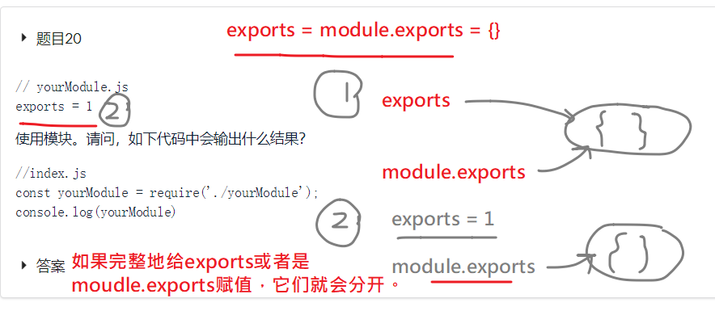
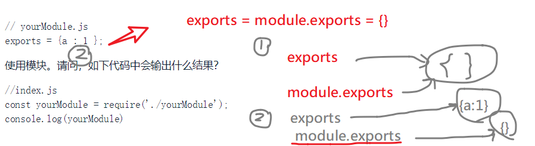
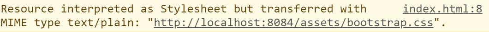
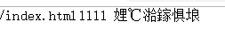
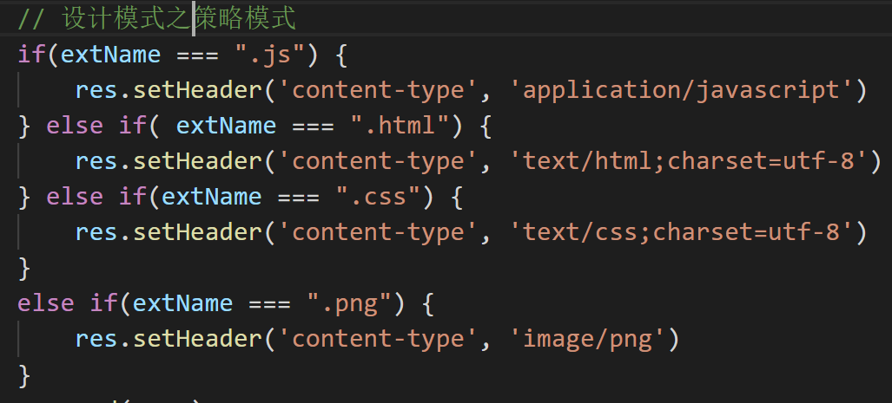
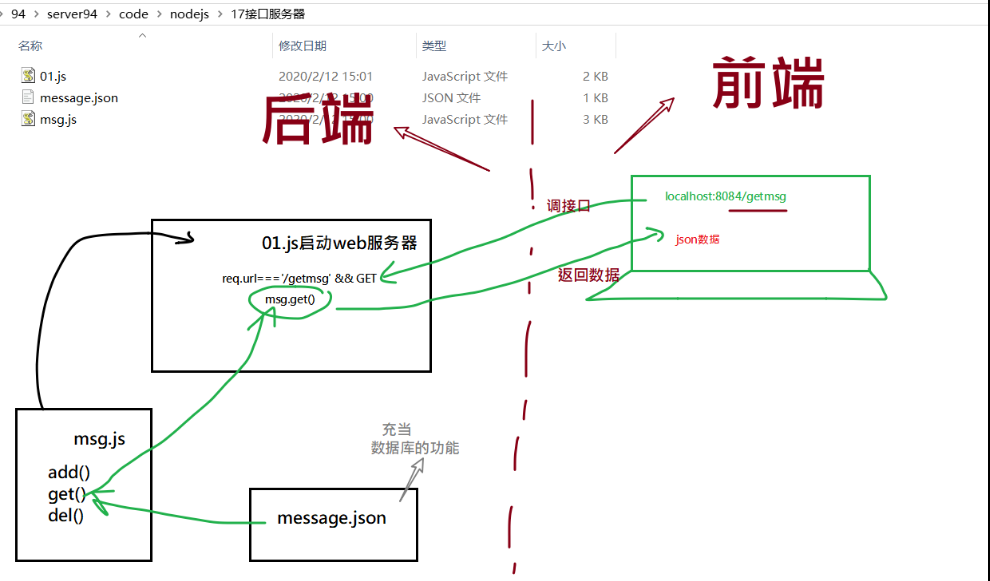
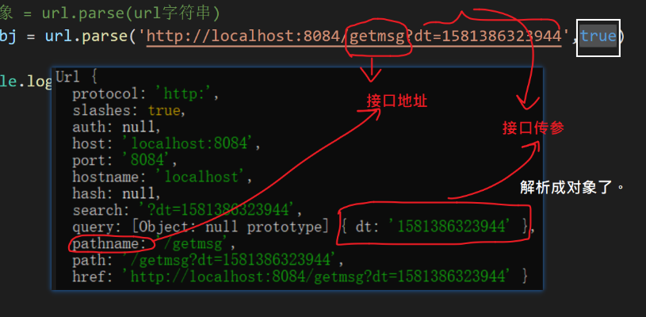
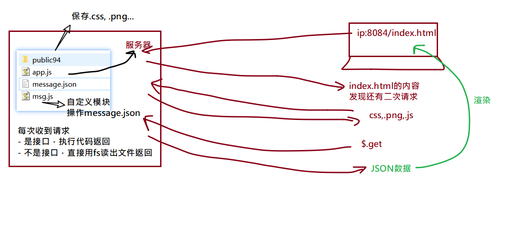

## 复习练习题





## 处理二次请求


从服务器获取html文件之后，如果这个html文件中还引用了其它的外部资源（图片，样式文件等），则浏览器会重新再发请求。


## 显示图片

`fs.readFileSync('./6.png')`

图片文件不是字符串格式，而应该是buffer格式

```javascript
else if(req.url === '/6.png') {
        // 读出图片的内容并返回
        // 图片文件不是字符串格式，而应该是buffer格式
        // readFileSync 不设置utf8就是buffer.
        // let cssStr = fs.readFileSync('./6.png','utf8');
        let fileBuffer = fs.readFileSync('./6.png');

        // res.end(字符串 | buffer)
        res.setHeader('content-type', 'image/png')
        res.end(fileBuffer)
    }
```


## 设置响应头

- 作用

响应头中的信息会被浏览器收到，浏览器会根据响应头中设置信息做相对应的处理。

- 后果

如果不设置响应头可能会出现浏览器不能正确解析返回内容的情况。

例如:



汉字乱码：



 `res.setHeader('content-type', 'text/css;charset=utf-8')`

```javascript
else if(req.url === '/style.css') {
    // 读出style.css并返回
    let cssStr = fs.readFileSync('./style.css','utf8');

    //设置响应头。
    // 响应头中的信息会被浏览器收到，浏览器会根据响应头中设置信息做相对应的处理。
    // 具体到content-type,这个响应头的作用是告诉浏览器本次响应体中数据是 什么东东。
    // text/css;charset=utf-8  .类形是css文本，编码是utf8格式。

    // 如果没有设置content-type,则浏览器会自已去识别 响应体中数据的类型。

    // 名字是：content-type，值是：text/css;charset=utf-8
    res.setHeader('content-type', 'text/css;charset=utf-8')
    res.end(cssStr)
}
```


## web服务器

目标：让放在某个文件夹下的所有的静态资源（.html,.css,.png....）都能直接访问。


思路 ：

 // 1. 获取当前用户要访问的资源路径。req.url

  // 2. 拼接服务器上对应的文件地址： /index.html =======> public94/index.html

  // 3. 读出来，并返回

 //  4. 读不出来，不存在这个文件，则返回404

```javascript
// 实现web服务器功能
// 目标：
// localhost:8084/index.html   ---->读出public94/index.html 返回
// localhost:8084/login.html   ---->读出public94/login.html 返回

const http = require('http')
const fs = require('fs')
const path = require('path')

const STATIC_PATH = "public94";  //  所有静态资源放置的地方

// 所有的静态资源放在public94
const server = http.createServer((req,res)=>{
    // 1. 获取当前用户要访问的资源路径。req.url
    // 2. 拼接服务器上对应的文件地址：  /index.html  =======> public94/index.html
    // 3. 读出来，并返回
    let filePath = path.join(__dirname, STATIC_PATH , req.url)
    try {
        let rs = fs.readFileSync(filePath)
        // 如果找不到这个文件，就会抛出错误，而进入catch分支。

        console.log(rs)
        // res.end(buffer 或者 string)
        res.end( rs )
    } catch(err){
        res.setHeader("content-type","text/html;charset=utf-8")
        // statusCode 就是状态码
        // 找到不文件，就设置404.
        res.statusCode = 404;
        res.end(`${req.url} 没有找到`)
    }
})

server.listen(8084, ()=>{
    console.log('亲爱的，你的服务器在8084端口....');
})

```


## 统一设置响应头content-type


不值钱的做法



值钱的做法

```javascript
// 实现web服务器功能
// 目标：
// localhost:8084/index.html   ---->读出public94/index.html 返回
// localhost:8084/login.html   ---->读出public94/login.html 返回

const http = require('http')
const fs = require('fs')
const path = require('path')

const STATIC_PATH = "public94";  //  所有静态资源放置的地方

// 集中设置 content-type 映射关系 
const TYPE_MAP = {
    ".html" : "text/html;charset=utf-8",
    ".css" : "text/css;charset=utf-8",
    ".png" : "image/png",
    ".js" : "application/javascript",
    ".jpg" : "image/jpg",
}
// 所有的静态资源放在public94
const server = http.createServer((req,res)=>{
    // 1. 获取当前用户要访问的资源路径。req.url
    // 2. 拼接服务器上对应的文件地址：  /index.html  =======> public94/index.html
    // 3. 读出来，并返回
    let filePath = path.join(__dirname, STATIC_PATH , req.url)
    try {
        let rs = fs.readFileSync(filePath)
        // 如果找不到这个文件，就会抛出错误，而进入catch分支。
        // res.setHeader("content-type","text/css;charset=utf-8")

        // 思路：根据不同的后缀名去设置不同的content-type.
        // 如何取出后缀名？ 用path模块的extname()
        let extName = path.extname( req.url )
        console.log(req.url)
        console.log(extName)
        
        // // 设计模式之策略模式
        if( TYPE_MAP[extName] ) {
            // TYPE_MAP[extName] : 取对象中的属性值。
            res.setHeader('content-type', TYPE_MAP[extName])
        }

        // TYPE_MAP[extName] && res.setHeader('content-type', TYPE_MAP[extName])
        
        res.end( rs )

    } catch(err){
        // res.setHeader("content-type","text/html;charset=utf-8")
        // statusCode 就是状态码
        // 找到不文件，就设置404.
        res.statusCode = 404;
        res.end(`${req.url} 没有找到`)
    }
})

server.listen(8084, ()=>{
    console.log('亲爱的，你的服务器在8084端口....');
})

```


## 写不带参数的get类型的接口

req.method 获取请求的方式   -----  接口的类型（GET,POST）

req.url 获取请口的地址             ----- 接口的地址

返回值：

- res.end(JSON.string(对象，数组)) . 原因是：res.end(只能写string,或者是buffer)

- res.setHeader('content-type', 'application/json;charset=utf-8')

  明确告诉浏览器，响应体中放置的数据是 json,编码是utf8
          

```javascript
const server = http.createServer((req,res)=>{
    // 约定请求的地址 和方式
    if(req.url === "/getmsg" && req.method === "GET") {
        // 获取本次请求的方式：req.method
        console.log(req.method);
        
        // 假设经过很多运算，得到数据
        let data = [{id:1,name:"张三",content:"寒雨连江夜入吴",dt:1234353322}]
        
        // 如何返回数据？
        // res.end(只能是  字符串  或buffer)
        // 需要把数转成字符串
        // 如果本次返回的数据是json字符串，则可以给浏览器设置响应头
        // 明确告诉浏览器，响应体中放置的数据是 json,编码是utf8
        res.setHeader('content-type', 'application/json;charset=utf-8')
        res.end(JSON.stringify(data))
    }else {

        res.end('404')
    }
})
```


## 从json文件中读出数据返回




## url模块parse

`url.parse(url地址，true)`

- true可以把查询字符串解析成对象。




## 用url模块来解析get请求的参数


```javascript
// 引入核心模块url
// 用来处理 req.url 这个属性，从中拆出 请求地址和请求参数
const url = require('url')

// 
let obj = url.parse(req.url,true)
// console.log(obj);
// obj.pathname :表示接口地址
// obj.query    :表示本次传参
```


## 增强接口功能-允许传dt

- 引入url模块，拆分req.url接收到的用户传入的地址 ====》 接口地址 及 传入的参数
- `url.parse(req.url,true)`
- 使用数组的filter功能，对数据进行过滤。


```javascript
// 目标：
// 提供接口服务器的功能。
// 用户以 GET 方式来访问 http://localhost:8084/getmsg 返回数据给用户
// 参数:
//    dt: 可选的。时间戳。 
//      如果用户传入了dt，则表示只返回大于此时间戳记录。
//         http://localhost:8084/getmsg?dt=1581386323940  
//      如果不传入，则表示直接返回所有的留言数据.
// 
// 通过postman的验证

const http = require('http')

// 引入核心模块url
// 用来处理 req.url 这个属性，从中拆出 请求地址和请求参数
const url = require('url')

// 引入自定义模块 ./
// 用来操作message.json文件 
const msg = require('./msg')

const server = http.createServer((req,res)=>{
    // 约定请求的地址 和方式
    // console.log(req.url);
    // 收到请求后，第一处理req.url

    let obj = url.parse(req.url,true)
    // console.log(obj);
    // obj.pathname :表示接口地址
    // obj.query    :表示本次传参
    
    if(obj.pathname === "/getmsg" && req.method === "GET") {
        // 获取本次请求的方式：req.method
        // console.log(req.method);
        // 本次请求的参数是
        console.log("本次请求的参数dt是",obj.query.dt);
        
        let dt = obj.query.dt 

        // 假设经过很多运算，得到数据
        let data = msg.get()
        
        if(dt){
            // 在data数组，只返回时间大于dt的记录
            let result = data.filter(function(item) {
                return item.dt > dt
            })
            res.setHeader('content-type', 'application/json;charset=utf-8')
            res.end(JSON.stringify(result))
        } else {
            res.setHeader('content-type', 'application/json;charset=utf-8')
            res.end(JSON.stringify(data))
        }
        
    }else {
        res.end('404')
    }
})

server.listen(8084,()=>{
    console.log("大人，我们的接口服务器启动在8084端口");
})

```


## 从前到后端实现留言板的功能

- ajax
- web服务器
- 接口





