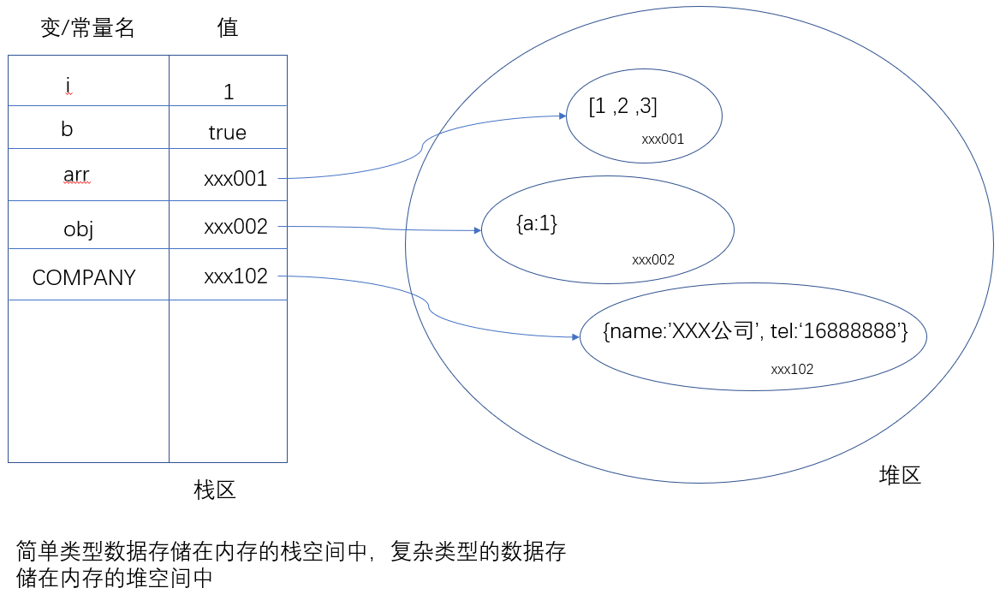

# let 和 const

我们之前定义变量的关键字是`var`，它定义的变量有很多奇怪的特点，如下有两点比较突出：

- 变量先使用再定义------ 变量提升（对于其它程序员来说，这个特点很奇怪！）。

  ```
  console.log(a);
  var a = 1;
  console.log(a)；
  ```

- 缺少块级作用域。

  ```
  // 此处为了使用循环，定义一个循环变量i。
  for(var i=1; i<10;i++){}
  // i在循环体之外也能使用。
  console.info(i);
  ```

这两个问题都容易让初学者混淆，也容易让从其它语言转过来的程序员混淆。为了解决这些问题，ES6中新增了let，而引入const的原因是，因为ES5中并没有提供`常量`的功能。


## let 变量

作用：定义变量。（var也是用来定义变量）

### let基本使用

格式： let 变量名 = 变量值；

它用来定义变量，基本使用格式与var关键字一样。在可以在使用var 的地方改成let。

### 与var的区别

- 不能重复定义
- 没有变量提升（var定义的变量是有变量提升的），必须`先定义再使用`
- 全局变量不会附加到window对象的属性中
- 具有块级作用域


#### 不能重复定义

```js
// 1. let 定义变量，变量不可以再次定义
let name = 'zhangsan';
name = 'lisi';
console.log(name); // lisi
let name = 'wangwu'; // 再次定义，报错：Identifier 'name' has already been declared
```

#### 块级作用域

作用域

- 全局作用域：变量不属于任何函数，处处可用。
- 局部作用域：特指在函数内部定义的变量，它的作用域受function {}所限制。
- 块级作用域（ES6中提出的）：在{}内定义的变量，它的作用域受{}所限制。
  - 在{} 内部，通过let关键字定义的变量就具有块级作用域。

如果是通过let关键字来定义变量的，则js代码中就可以通过{}来切分作用域了。

```js
// 具有块级作用域，块就是大括号
{
    let age = 18;
    console.log(age); // 18
}
console.log(age); // 报错，此作用域中没有age的定义

// 块级作用域的嵌套
{
    let a = 1;
    {
        let a = 2;
        console.log(a);
        a = 3;
        console.log(a);
    }
    console.log(a)
}

// 隐藏的块级作用域
for (let i = 0; i < 10; i++) {
    // i 只能在此范围内使用，因为有块级作用域
}
console.log(i);  // 报错，此作用域中没有i的定义
```


#### 没有变量提升

通过let定义的变量，不再有没有变量提升，必须严格遵守先定义再使用的原则。

```js
console.log(gender); // 报错，此时还没有定义gender
let gender = '男'; 

console.log(1); // 不报错，输出undefined
var a = 1; 
```


#### 全局变量不会赋值加在window对象中

let声明的全局变量不会以属性的形式附加在window对象中，全局变量与window对象再无关系。

```js
let hobby = '吃饭';
var a = 1
console.log(window.hobby); 
console.log(window.a); 
```


ES6中保留了对var的支持，你可以在代码中同时使用var和let。当然，建议使用let。

## const 常量

### 使用场景

程序员在协同开发项目时，会遇到一种场景：有一些数据大家都需要用到，但是都不能修改，即数据是`只读的`。举个例子：在开发公司的网站时，公司的基本信息：地址，公司名，电话等等信息可以在多个地方都需要使用，但不允许去修改。 显示，使用变量来保存这些信息是不适合的，因为变量不是只读的。这种情况下， 我们就可以把这些数据保存在常量中。

### 语法格式及命名规范

作用：定义一个只读的常量。

格式： `const 常量名 = 常量值;`

示例：`const COMPANY_NAME = "XXX公司"`

注意：

- 区别于变量名，常量名一般采用全大写的方式，多个单词之间使用_划线分隔。

### const特点

所谓常量，就是不能修改，即：

- 一旦定义就不能修改；
- 一旦声明，就必须立即初始化；


```javascript
const a = 1;
a = 2; // 报错
```

```
const a ; // 报错，没有初值
```


其它与let相似的特点

- 具有块级作用域
- 没有变量提升，必须先定义再使用
- 常量也是独立的，定义后不会压入到window对象中，不是window对象的属性

### 本质

`const`实际上保证的，并不是常量的值不得改动，而是`常量指向的那个内存地址所存的数据不得改动`。

```javascript
const obj = {a:1};
obj.a = 2;
console.log(obj); // 问题：obj对象的属性值a是否修改了。
```

- 对于简单类型的数据（数值、字符串、布尔值），它的值直接保存在栈区。就保存在常量名指向的那个内存地址中，因此等同于常量值。

- 对于复合类型的数据（如对象和数组），常量指向的内存地址，保存的只是一个指向实际数据的指针，`const`只能保证这个指针是固定的（即总是指向一个固定的地址），至于它指向的数据结构是不是可变的，就不能控制了。因此，`将一个对象声明为常量必须非常小心,它的属性是可以修改的`。

  

如果你真的希望定义一个不能修改的对象（属性不能添加，修改，删除），你可以使用Object.freeze()。下面是一段参考代码：它是一个可以把一个对象全部冻结的函数:

```javascript
function makeConst(obj){
	Object.freeze(obj);
	Object.keys(obj).forEach(function(key){
		if(typeof obj[key] === 'object'){
			makeConst(obj[key])
		}
	})
}
var obj = {a:1,b:2};
makeConst(obj);
obj.a = 200; //不报错，但是不生效
obj.c = 100; //不报错，但是不生效
console.log(obj); //值保持不变
```


## 小结

| 关键字 | 变量提升 | 块级作用域 | 初始值 | 更改值 | 通过window调用 |
| :----: | :------: | :--------: | :----: | :----: | :------------: |
|  let   |    ×     |     √      |   -    |  Yes   |       No       |
| const  |    ×     |     √      |  Yes   |   No   |       No       |
|  var   |    √     |     ×      |   -    |  Yes   |      Yes       |

实践过程中：let Or var.

在写项目时，这两种情况都有用到。如果你项目小组可以使用let，就请你彻底和var分手。

推荐优先级：

​	const > let > var