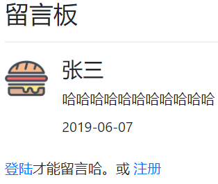
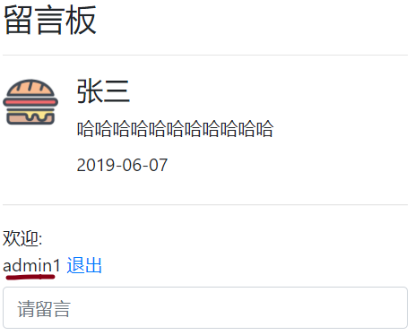
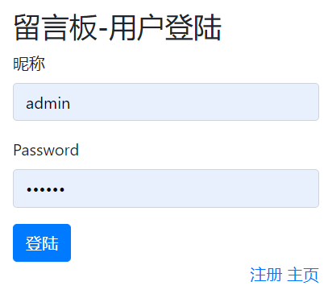
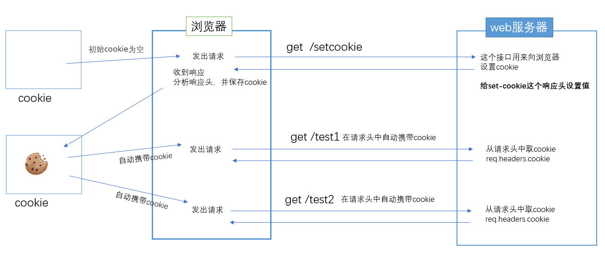
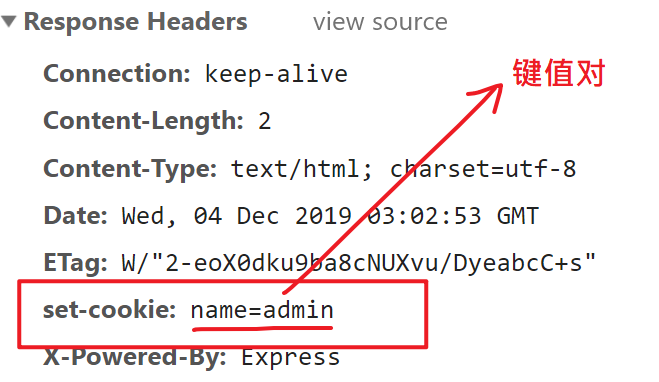
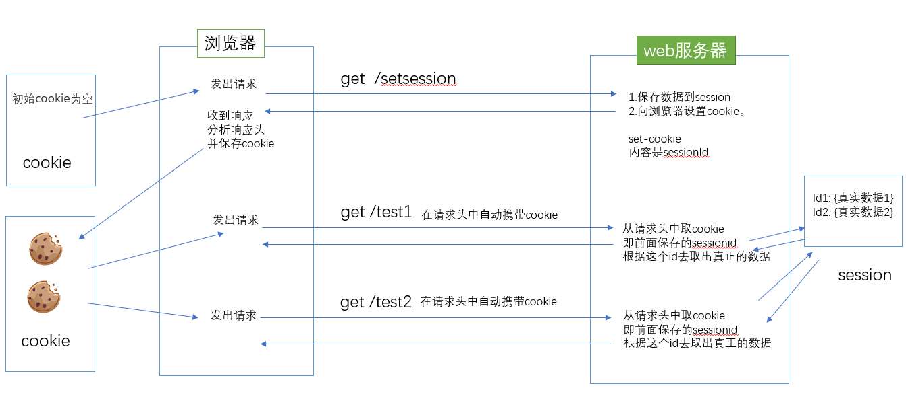

## 接口的访问权限


### 问题描述

需求：用户必须先登陆，才能添加留言。

如果没有登陆则看到的是：



只能看留言，不能添加。

如果登陆了：




需要补充一个login.html




解决方案是：

在服务器端补充两个接口， 如下 ：

接口名：login

类型:post。以普通键值对传参

参数：

- name: admin

- password:123

返回值：

```
{code:200,msg:'登陆成功'}
或者
{code:500,msg:'登陆失败'}
```

如果用户登陆成功，则设置session。


接口名：/checklogin

类型:   get。

参数：无

返回值：

```
{code:200,msg:'已登陆',loginname:'登陆用户名'}
或者
{code:500,msg:'未登陆'}
```

在index.html中调用。后端收到这个请求去取session，如果能取到，则说明当前是登陆的。


### cookie

- cookie是服务器将数据持久化（保存）存储到客户端（浏览器）的一种技术
- cookie是**键值对格式的字符串**
- 可以通过浏览器查看某个网站的cookie
- 如果浏览器保存了cookie，则向服务器发请求时，就会**自动带上这个cookie**。具体来说是把cookie放在请求头中，发送给服务器。



#### 查看cookie

在浏览器中查看

- 在application--> cookie中查看。
- 在发送请求时的请求头中查看

#### cookie的作用

- 本地临时少量数据的存储；

  

- 由于在向浏览器请求时会自动携带cookie，所以可以用它来做权限验证。

#### 从服务器设置cookie给客户端

##### 原生的方法

设置单个cookie

```javascript
//通过res.setHeader来设置响应头
res.setHeader('set-cookie', 'name=curry');
```




https://cart.jd.com/addToCart.html?rcd=1&pid=100002963957&pc=1&eb=1&rid=1575383295831&em=#none


设置多个cookie

```javascript
//通过res.setHeader来设置响应头。
//理解为这是一个键值对，多个cookie也只能写在一个setHeader()中。如果写两次res.setHeader()则后面一句会覆盖前面的设置。
res.setHeader('set-cookie', ['name=curry', 'age=30']);
```

如果cookie值是中文的话，还要对这个值进行额外的编码。

```
let name = new Buffer('好汉').toString('base64'); //5aW95rGJ
var info = new Buffer('5aW95rGJ', 'base64').toString();
```

##### express中提供的方法

express框架给我们提供了一个res.cookie方法，用来设置cookie

`res.cookie(cookie名, cookie值,{属性});`

#### cookie详细设置

参考：https://developer.mozilla.org/zh-CN/docs/Web/HTTP/Headers/Set-Cookie

从服务器端发送cookie给客户端，本质是通过设置Set-Cookie这个特殊的响应头来实现的，其中包括了对应的cookie的名称，值，以及各个属性。

```html
Set-Cookie: <cookie-name>=<cookie-value> 
Set-Cookie: <cookie-name>=<cookie-value>; Expires=<date>
Set-Cookie: <cookie-name>=<cookie-value>; Max-Age=<non-zero-digit>
Set-Cookie: <cookie-name>=<cookie-value>; Domain=<domain-value>
Set-Cookie: <cookie-name>=<cookie-value>; Path=<path-value>
Set-Cookie: <cookie-name>=<cookie-value>; Secure
Set-Cookie: <cookie-name>=<cookie-value>; HttpOnly
Set-Cookie: <cookie-name>=<cookie-value>; SameSite=Strict
Set-Cookie: <cookie-name>=<cookie-value>; SameSite=Lax

// Multiple directives are also possible, for example:
Set-Cookie: <cookie-name>=<cookie-value>; Domain=<domain-value>; Secure; HttpOnly
```

一个cookie所具有的主要的属性包括：

- Domain：域，表示当前cookie所属于哪个域或子域下面。对于服务器返回的Set-Cookie中，如果没有指定Domain的值，那么其Domain的值是默认为当前所提交的http的请求所对应的主域名的。比如访问 http://www.example.com，返回一个cookie，没有指名domain值，那么其为值为默认的www.example.com。
- Path：表示cookie的所属路径。
- Expire time/Max-age：表示了cookie的有效期。expire的值，是一个时间，过了这个时间，该cookie就失效了。或者是用max-age指定当前cookie是在多长时间之后而失效。如果服务器返回的一个cookie，没有指定其expire time，那么表明此cookie有效期只是当前的session，即是session cookie，当前session会话结束后，就过期了。对应的，当关闭（浏览器中）该页面的时候，此cookie就应该被浏览器所删除了。
- secure：表示该cookie只能用https传输。一般用于包含认证信息的cookie，要求传输此cookie的时候，必须用https传输。
- httponly：表示此cookie必须用于http或https传输。这意味着，浏览器脚本是不允许访问操作此cookie的(你不能在浏览器端通过document.cookie访问)。


#### 设置有效期 

expires字段来用设置这个cookie在哪个时间内是有效的。值得注意的是，时间格式是UTC时间格式（ 不是中国时间）。

具体的语法是：

`"cooke-name=cookie-value;expires=UTC时间"`

如下原生的写法

```
res.setHeader('set-cookie', ['id=1;expires=' + new Date(Date.now() + 1000 * 5).toUTCString()]);
```

表示id=1这个cookies在5秒之后失效。

使用express带的setCookie，则可以

`res.cookie('name', 'ok', { expires: new Date(Date.now() + 1000*5) })`

#### 在服务器端获取cookie

客户端浏览器向服务器发请求时，会自动在请求头上携带cookie，具体来说它被保存在req.headers.cookie中。要注意取到的cookie中只包括键值对，而cookies的属性（如过期时间）是看不到的。我们可以打印出来看看

```javascript
req.headers.cookie; //isLogin=true; name=xsfss
```

这个字符中包含了全部的cookie，为了把它们的值解析出来成一个对象，我们可以：

`手动解析`

通过node的核心对象querystring来进行解析。

```javascript
// 1. 把; 替换成&，以让querystring能够解析
let cookiestr = req.headers.cookie.replace('; ', '&');
console.log(req.headers.cookie);
console.log(cookiestr);
// 2 解析成对象
let cookieObj = qs.parse(cookiestr);
let { isLogin, name } = cookieObj;
```

`cookie-parser进行解析`

如果想快速解析，则可以使用cookie-parser这个包。

步骤如下：

第一步：先安装`npm install cookie-parser`

第二步：使用：

```javascript
var cookieParser = require('cookie-parser');
app.use(cookieParser());
```

第三步：调用

```javascript
// 某个具体的路由回调函数中，cookies会以对象的格式保存在req对象中
console.log(req.cookies);
```


#### 删除cookie

express框架提供了一个删除方法。从服务器端删除:

```javascript
app.get('/quit', (req, res) => {
  res.clearCookie('name');
  res.clearCookie('isLogin');
  res.redirect('/login.html');
});
```


### session



#### 原理

session 从字面上讲，就是会话。这个就类似于你和一个人交谈，你怎么知道当前和你交谈的是张三而不是李四呢？对方肯定有某种特征（长相等）表明他就是张三。

session 也是类似的道理，服务器要知道当前发请求给自己的是谁。为了做这种区分，服务器就要给每个客户端分配不同的“身份标识”，然后客户端每次向服务器发请求的时候，都带上这个“身份标识”，服务器就知道这个请求来自于谁了。至于客户端怎么保存这个“身份标识”，可以有很多种方式，对于浏览器客户端，默认采用 cookie 的方式来保存这个身份标记。

服务器使用session把用户的信息临时保存在了服务器上，用户离开网站后session会被销毁。这种用户信息存储方式相对cookie来说更安全，可是session有一个缺陷：如果web服务器做了负载均衡，那么下一个操作请求到了另一台服务器的时候session会丢失。或者服务器重启了session数据也会丢失。

#### 安装包

在express框架下， 我们可以通过安装  `express-session` 包来实现session的功能。

#### 设置

```javascript
//1. 引入session包
const session = require('express-session');

const app = express();

//2. 配置项
let conf = {
  secret: '123456', //加密字符串。 使用该字符串来加密session数据，自定义
  resave: false, //强制保存session即使它并没有变化
  saveUninitialized: false //强制将未初始化的session存储。当新建了一个session且未
  //设定属性或值时，它就处于未初始化状态。
};

//3. 使用express-session
app.use(session(conf));

```

#### 设置session


```
app.post('/loginAPI', (req, res) => {
    // 此处省略用户信息校验
    // 直接通过req.session来设置
	req.session.isLogin = true;
    req.session.name = req.body.username;
    res.end()
}

```

#### 获取session

```javascript
app.get('/index.html', (req, res) => {
    console.log(req.session.name)
}
```

#### 删除session

```javascript
app.get('/quit', (req, res) => {
    req.session.destroy();
}
```


#### 参考代码

```javascript
const express = require('express');
const session = require('express-session');
const bodyparser = require('body-parser');
const qs = require('querystring');
const app = express();

//2. 配置项
let conf = {
  secret: '4ey32erfyf3fgpg', //加密字符串。 使用该字符串来加密session数据，自定义
  resave: false, //强制保存session即使它并没有变化
  saveUninitialized: false //强制将未初始化的session存储。当新建了一个session且未
  //设定属性或值时，它就处于未初始化状态。
};
//3. 注册为express-session中间件
app.use(session(conf));
app.use(bodyparser.urlencoded({ extended: false }));
app.use(express.static('public'));

app.post('/loginAPI', (req, res) => {
  res.send(req.body.username);
  req.session.isLogin = true;
  req.session.name = req.body.username;
 
  let str = `
  <h1>${req.body.username}登录成功</h1>
  <a href='./vip.html'>vip</a>
  
  `;
  res.send(str);
});
app.get('/vip.html', (req, res) => {
  // session的值可以是任何的数据类型，比如布尔，数组，对象等
 
  let { isLogin, name } = req.session;

  if (isLogin) {
    let htmlstr = `
    <h1>weclome ${name}</h1>
    <a href='./quit'>退出</a>
    `;
    res.send(htmlstr);
  } else {
    res.send('<h1>请先登录</h1> <a href="./login.html">登录</a>');
  }
    
});

app.get('/quit', (req, res) => {
  req.session.destroy();
  res.redirect('/login.html');
});

app.listen(3000, () => {
  console.log(3000);
});
```


### cookie和session的优缺点

cookie原理：

- 从服务器端向客户端浏览器留下信息`设置响应头：set-cookie`；
- 浏览器每次访问服务器时都带上这些信息(自动携带cookie是浏览器的特点)；

session原理：

- 服务器端会为每个用户（浏览器）各自保存一个session（文件）。当服务器保存session之后，会以cookie的形式告诉浏览器，你的session编号是哪一个。它把session号返回给了浏览器，而把真实的数据保存在服务器。
- 下次再来访问服务器的时候，浏览器就会带着它自己的session号去访问，服务器根据session号就可以找到对应的session了。

cookie：优点是节省服务器空间，缺点不安全。不要保存敏感信息。

session：优点是安全，缺点需要服务器空间， 是一种最常见的解决方案。


### 留言板案例-步骤

#### 准备后端

```
const express = require('express')
const bodyParser = require('body-parser')
const session = require('express-session');

// 引入自定义模块
const message = require('./message.js')

const app = express();
//1. 引入session包

//2. 配置项
let conf = {
  secret: '123456', //加密字符串。 使用该字符串来加密session数据，自定义
  resave: false, //强制保存session即使它并没有变化
  saveUninitialized: false //强制将未初始化的session存储。当新建了一个session且未
  //设定属性或值时，它就处于未初始化状态。
};

//3. 使用express-session
app.use(session(conf));

app.use(bodyParser.urlencoded({extended:false}))

// 做静态资源托管
// app.use(express.static('public'))

app.use((req,res,next)=>{
    res.header('Access-Control-Allow-Origin', req.headers.origin); //需要显示设置来源
    res.header('Access-Control-Allow-Headers', 'Origin, X-Requested-With, Content-Type, Accept');
    res.header('Access-Control-Allow-Methods', 'PUT,POST,GET,DELETE,OPTIONS');
    res.header('Access-Control-Allow-Credentials', true); //带cookies
    next();
})

// 用户登陆
app.post('/login',(req,res)=>{
    let {name,password}= req.body;
    if(name === 'admin' && password==='123'){
        // 设置session
        req.session.loginname = 'admin'
        console.log(req.session);
        
        res.json( {code:200,msg:'登陆成功'})
    } else {
        res.json( {code:500,msg:'登陆失败'})
    }
})

app.get('/checklogin',(req,res)=>{
    console.log('你的登陆名是：',req.session.loginname);
    if(req.session.loginname){
        // 登陆
        res.json({code:200,msg:'已登陆',loginname: req.session.loginname})
    } else {
        res.json({code:500,msg:'未登陆'})
    }
    // res.send( '你的登陆名是：' + req.session.loginname)
})

app.get('/quit',(req,res)=>{
    // 退出 删除session
    req.session.destroy();
    res.json({code:200,msg:'退出成功'})
})

app.get('/getmsg',(req,res)=>{
    let msgArr =  message.get();
    let obj = {code:200, msg:'获取成功',data: msgArr }
    
    res.json(obj)
})

app.post('/addmsg',(req,res)=>{
    if(req.session.loginname){
        let  obj = req.body
        obj.dt = Date.now();

        message.add(obj)
        res.json({code:200,msg:'添加成功', data:obj })
    } else {
        res.statusCode = 403
        res.json({code:500,msg:'没有权限'})
    }
})

app.listen(8000,()=>{
    console.log(8000);
})
```

#### 准备前端

给每一个ajax请求都加上 crossDomain, xhrFields属性。

```
$.ajax({

crossDomain: true,//跨域
xhrFields: {
	withCredentials: true //带cookie
},


url,
type,
data,
success:function(){}
})
```


### 小结- 跨域带cookie

如果是发跨域的ajax请求需要带上cookie的话，要处理如下：

后端

```javascript
app.all('*', function(req, res, next) {
  console.log(`${Date.now()}:来自${req.connection.remoteAddress} 访问了 ${req.method}-${req.url}。参数是：${req.query},携带cookie:${req.headers.cookie}`);
  res.header('Access-Control-Allow-Origin', req.headers.origin); //需要显示设置来源
  res.header('Access-Control-Allow-Headers', 'Origin, X-Requested-With, Content-Type, Accept');
  res.header('Access-Control-Allow-Methods', 'PUT,POST,GET,DELETE,OPTIONS');
  res.header('Access-Control-Allow-Credentials', true); //带cookies
  next();
});
```

前端

```javascript
 $.ajax({
     crossDomain: true,
     xhrFields: {
         withCredentials: true
     },
     url,
     type
 })
```


