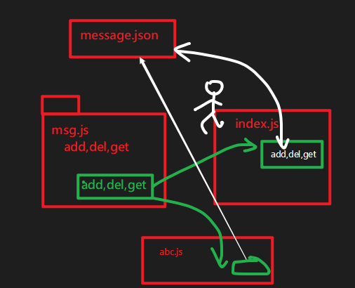
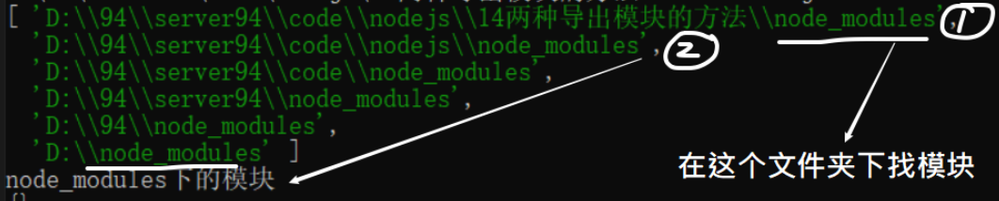
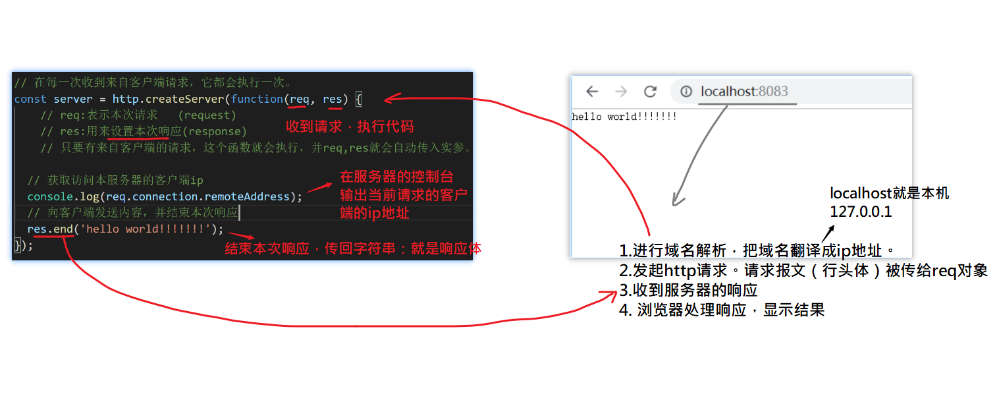
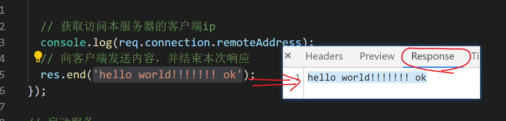
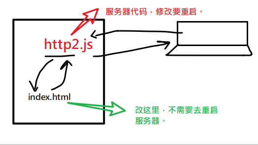

2020-02-11

## 复习 

### nodejs的作用

能够运行js代码 ；

充当服务器（后端）；

### nodejs运行js代码的两种方式

- REPL
- node 文件路径
  - 相对路径 (相对于当前的小黑窗，要运行js文件的位置)  `node ./a/b.js` 
  - 绝对路径 `node D:\94\server94\code\nodejs\01.js`

### 能够说出\__dirname 和 __filename的作用

全局变量：获取 当前的文件夹和文件的绝对路径。

### fs模块

它是一个核心模块，用来做文件处理。

两种版本的代码:

- 同步方法 readFileSync
- 异步方法 readFile

### path模块

它是一个核心模块，用来处理路径

- path.join()

## 模块

看起来就一个js文件；

定义这个模块（js文件）是为了在其它模块（js文件）中去使用；

- 在es6之前，js是不支持模块化的（不能在一个js文件中去引入另一个js文件）
- 在es6中是支持的。
- 在nodejs这个环境中也支持的。

## 使用自定义模块

1.定义模块。最重要是在文件中使用`module.exports = 要导出的东西`

2.导入模块。`const XXX = require('./相对路径')`

 -  只有是核心模块，或者是第三方模块时，才不需要加./。

## 应用

## 导出模块的两种方式

- module.exports
- exports

做题。

## require的工作机制

- 它会执行代码；并返回模块中的module.exports对象；

- 它有缓存。

- 具体的搜索路径

  - 如果是require(相对路径)，则在指定位置找到文件; 

  - 如果是require(模块名)

    - 这个模块名是某个核心模块。 直接在内存中找到核心模块。

    - 这个模块名不是核心模块（第三方模块），则搜索次序按module.paths属性中规定的顺序来找。具体是：

      - 1.在本级目录下，找node_modules文件夹，在这个文件夹下找

      - 2.在上级目录下，找node_modules文件夹，在这个文件夹下找

      - 3.在上上级目录下，找node_modules文件夹，在这个文件夹下找

      - ...

      - 4.在根目录下，找node_modules文件夹，在这个文件夹下找

      - 最后报错。

        

## 网络的三要素

- 协议

- 地址

- 端口

## 理解请求与响应

http服务器的工作流程：

- 只要收到请求，则回调函数就会执行。
- req是本次请求对象。
- res用来设置响应。
  - res.end("响应体")。1.结束本次请求，如果不写，则浏览器会死掉。 2. 设置响应体

## url输入地址回车

例如：http://www.baidu.com/index.html

1. 域名解析。把www.baidu.com翻译成ip地址，称为DNS寻址。

   - 向DNS服务器发请求

   - DNS返回ip地址给你。

     这里也有缓存。

2. http://13.XX.XXX.XXX/index.html

   要与这个主机：13.XX.XXX.XXX  建立连接。TCP三次握手。

   本机  -------你在吗----->  13.XX.XXX.XXX

   本机  <-------我在--------  13.XX.XXX.XXX

   本机  -------好的-------->  13.XX.XXX.XXX

3. 连接成功，发http请求`/index.html`
4. 服务器收到请求，处理，返回响应
5. 浏览器处理响应结果。
   1. 如果是一个.html资源，则进一步去做页面的渲染（dom树,css树........）
   2. 其它处理。

## req对象的两个属性

- url: 资源
- method ：方式

## 显示具体的页面

