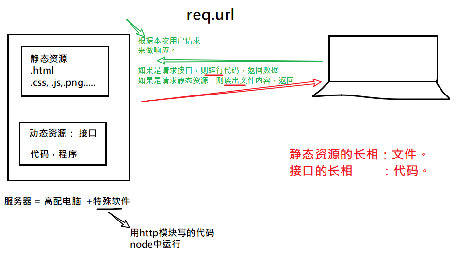
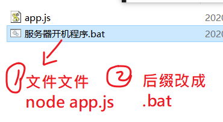
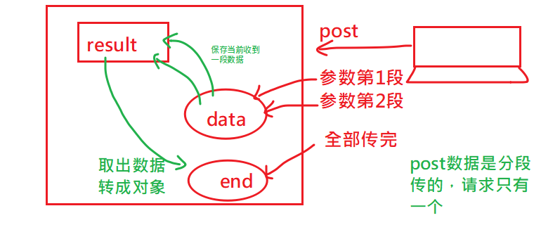

## 复习

### 静态资源与接口的区别



### url到底是什么？

用户能否根据url来确定，服务器会返回什么内容？

不能，

url到了服务器后，如何返回内容，完全由服务器来决定！

https://view.csslcloud.net/api/view/lecturer?roomid=4B6CB1F073DFA1B29C33DC5901307461&userid=44CACEB725BAB224

req.url:  /api/view/lecturer?roomid=4B6CB1F073DFA1B29C33DC5901307461&userid=44CACEB725BAB224


### 如何去创建一个web服务器

服务器 = 高配电脑 +特殊软件（提供：服务器就是依赖于这个软件才能提供服务）

要去写这么一个"软件":这个软件精简版只要三行代码：

```javascript
const http =require('http')
const server = http.createServer((req,res)=> {
    res.end('ok')
})
server.listen(8084,()=>{ console.log('服务器已经启动了')})
```


### 小技巧：双击打开



### web服务器-让我们自已写的网页，可以让别人来访问

把所有的网页放在一个文件夹中，用户来访问时，直接从这个文件夹中读出，并返回


### web服务器-提供接口的功能


## post 接口

- post接口的参数是在请求体中一段一段传过来的。
- 后端收到一段就触发一次req对象上的data事件，并以buffer格式传入当前收到这一段数据
- 后端收到全部的数据之后，会触发一次req对象上的end事件。

思路：




```javascript
else if(req.method ==="POST" && obj.pathname === "/addmsg") {
    console.log("post接口有人访问.....");
    let result = ""; // 用来保存接收到的参数

    req.on("data",function(buf){
        //post参数是一段一段向后端传递的
        // 后端也是一段一段接收的
        // 每次收到一段，则data就触发一次，会执行回调，回调函数的参数buf
        // 就是当前收到的这一段数据，它是buffer格式的。
        console.log("data事件发生，它表示当前收到了一部分数据...",buf);

        // 把当的收到的这一段数据，放在result
        result = result + buf; 
        // 隐式转换：result是字符串，而buf是buffer，把buffer转成string
    })
    req.on("end",function(){
        console.log("参数接收完毕");
        console.log(result);
        // result是查询字符串：name=tiny&age=30&content=123&aa=1111&aaaaa=wwwww
        // 希望得到对象的格式：{name:"tiny",age:30}
        // 如何把查询字符串转成对象？可以自已代码去转
        // 也可以使用核心模块querystring
        let obj =  querystring.parse(result)
        console.log(obj);
        // 按接口要求，加一个属性
        obj._t = Date.now();

        // post 接口中响应，一定是在end事件中写。
        res.end( JSON.stringify( obj))
    })
    // res.end("post")
}
```


## 前后端都是自己的留言板

