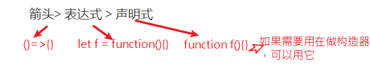

# 函数的拓展

es6对函数的功能进行了一些拓展，补充了很多功能。学习这个部分的内容我们就可以更加灵活优雅地使用函数啦。

## 参数默认值

在定义一个函数时，我们可以给形参设置默认值：当用户不填入这个值时，我们有一个保底的值可以使用。这个特性在很多其它的编程语言中一个基础的特性，而在ES6之前，是不支持的，我们需要通过一些变通的方式来实现。

### 理解默认值

参数的默认值在之前的课程内容已经涉及，例如在`xhr.open(type,url,是否异步) `方法中，第3个参数默认是true，即表示异步ajax。

默认值的意思是：

- 如果传入，就用你传的值
- 如果不传入，就使用某一个特殊的、事先定义好的值。这个值也就是默认值。

#### ES5的实现

```js
// ES5 中给参数设置默认值的变通做法
function open(type, url,isAsync) {
    if(isAsync === undefined){
        isAsync = true;
    }
    console.log(type, url, isAsync);
}
// 下面这两句是等价的
open("get","common/get")；// 
open("get","common/get",true)；
open("get","common/get",false)；
```

以上代码主要是利用形参的一个特点：没有赋值的话，其默认值是undefined。代码是可以工作的，但是显得很累赘，es6提供了更简单的实现。

#### ES6的实现

##### 格式

在定义一个函数时，在形参列表中对参数进行赋值操作。

```javascript
function 函数名(参数名1='默认值1'，参数名2='默认值2'，参数名3='默认值3'){
    
}
```

##### 示例

```
function open(type, url,isAsync=true) {
    console.log(type, url, isAsync);
}
// 下面这两句是等价的
open("get","common/get")；// 第三个参数使用默认值
open("get","common/get",true);

open("get","common/get",false); 
```

思考：能否跳过isAsync,url，而只给type设置默认值？

注意:

- 带默认值的形参放在形参列表的**最右边**。

#### 练习

```javascript
function f(a=1,b=2){
	console.log(a,b,a+b);
}
f(10)
f(10,20)
f()

function f2(a=1,b){
	console.log(a,b,a+b);
}
f2(10)
f2(10,20)
f2(,3)
f2()

// 与解构赋值一起使用
// 留作业，明天统一答疑
function f1({a=1,b=2}={}){
   console.log(a,b,a+b);
}

f1({a:10,b:20})
f1({a:20})
f1({c:1})
f1()
```


## rest 参数

rest （其它的，剩余的）参数 用于获取函数多余参数(例：形参只有2，实参传了200个)，并把它们放在一个数组中。

### 语法格式

在定义函数时，在`最后一个参数`前面加上`...`， 则这个参数就是剩余参数；

```javascript
let fn = function(参数1，参数2，...rest参数){}
```

只是在定义函数时，在形参列表中区别一下，而在**调用函数时并无区别**。

### 示例

回答如下问题

```javascript
function f2 (x,...y){
    console.log(x,y)
}
f2(1,2);
f2(2,3,4);

function f1 (x,y){
    console.log(x,y)
}
f1(1,2);
f1(2,3,4);
```

### 应用--代替arguments

问题：编写一个函数，求所有参数之和；

方法一：arguments

方法二：rest参数

```javascript
function getSum (){
    //  在这里写你的代码
    var sum = 0 ; 
    for(var i = 0; i < arguments.length; i++){
        console.info( arguemnts[i])
        sum += arguments[i];
    }
}
```

如果以箭头函数 的方式去定义这个函数，则内部不可以使用arguments这个对象了。此时，我们就可以使用

rest 参数，它可以替代 arguments 的使用。 代码如下：

```js
// 参数很多，不确定多少个，可以使用剩余参数
const  getSum = (...values) => {
    var sum = 0 ; 
    for(var i = 0; i < values.length; i++){
        console.info( values[i])
        sum += values[i];
    }
}
// 调用
console.log(fn(6, 1, 100, 9, 10));
```

与arguments相比，它是一个真正的数组，可以使用全部的数组的方法。

## 箭头函数

箭头函数能让代码更简洁；箭头函数能让函数的功能更加纯粹；

```javascript
let fn3 = x => x * 2;
```


### 什么是箭头函数

ES6 中允许使用箭头函数的方式来定义一个函数。前面学习的定义一个函数有两种方式:

1. 函数声明式
2. 函数表达式

现在有了一个新的方式：

​	3. 箭头函数

### 格式

```javascript
let 函数名 = （形参1，...形参n）=>{
    // 函数体
}
```


### 定义一个箭头函数

```js
// 1. 函数声明式
function fu1(x){
    return x * 2;
}
// 2. 函数表达式
let fn2 = function (x) {
    return x * 2;
}
// 3. 箭头函数
let fn3 = (x) => {
    return x * 2;
}
```

第一眼看到这个箭头函数时，会觉得很奇怪。如果从函数表达式的格式出发， 经过如下`2步演化`步骤就可以得到。

1. 把function 关键字 后移动到 （）和  {} 中间
2. 把function 改写成 =>

注意：

	- `=>`是一个整体，不要加空格
	- 箭头函数只在定义上有些区别，但在函数调用格式上，是没有区别的。


### 简化写法

- 当形参有且只有一个，可以省略小括号

  ```
  let f = (x) => {console.log(x)}
  // 可以简化成：
  let f = x => {console.log(x)}
  ```

- 当函数体只有一条语句，可以省略大括号;

  ```
  let f = x => {console.log(x)}
  // 可以简化成：
  let f = x => console.log(x)
  ```

- 当函数体只有一条语句，并且就是return语句，则可以省略return和大括号。

  ```
  let f = x => {return x*2 }
  // 可以简化成：
  let f = x => x*2
  ```

  注意如果返回值是一个对象，要加()

  ```
  let f = x => {return {a:1}  }
  // 可以简化成：
  let f = x => {a:1} // 报错
  let f = x =>({a:1})
  ```


### 箭头函数与普通函数的区别

- 内部没有arguments
- 内部没有this
- 不能作为构造器

#### 没有 arguments

```js
let fn = (a,b) => {
    console.log(arguments); // 报错，arguments is not defined
};
fn(1, 2);
```

#### 内部的`this`对象，指向定义时所在的对象，而不是使用时所在的对象。

1.箭头函数可以访问this对象，但这个this对象指向在定义箭头函数时它时所处的对象(宿主对象),而不是运行时的对象。

```js
var name = 'lisi'; // 测试时，这里必须用var，因为用let声明的变量不能使用window调用
let obj = {
    name: 'zhangsan',
    f1 : () => {
        console.log(this); // window对象
        console.log(this.name); // lisi
    },
    f2 : function(){
        console.log(this); // obj
        console.log(this.name); // zhangsan
    },
    f2 : function(){
        console.log(this); // obj
        console.log(this.name); // zhangsan
    }
};
obj.f1();
```

箭头函数中的this指向是**固定化**的，并不是因为箭头函数内部有绑定this的机制，实际原因是箭头函数根本没有自己的this，导致内部的this就是外层代码块的this。

```
var obj = {};
var f1 = functoin(){console.log(this)}
var f2 = ()=>{console.log(this)}

f1();
f1.call(obj)// call可以修改普通函数内部的this的值
f2();
f2.call(obj);// call并不能修改箭头函数内部的this的值
```

#### 箭头函数不能作为构造函数

```js
let Person = () => {
	
};
let obj = new Person(); // 报错，Person is not a constructor
// 换个角度理解，箭头函数中都没有自己的this，怎么处理成员，所以不能当构造函数
```


> 在javascript中，函数是一等公民 ,它除了起到最基本的提炼代码之外，还可以当做构造器来使用，它能做的事件太多了。在ES6提出的箭头函数给函数减负了。


### 最佳实践

（1）优先级：





（2）如果在函数的内部涉及this的使用，则要特别小心this，实在不放心就打印出来看看。（如果函数的内部没有this，则可以放心使用箭头函数）