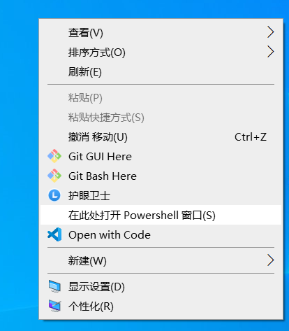
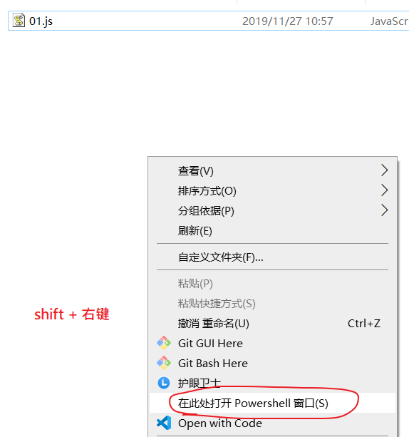
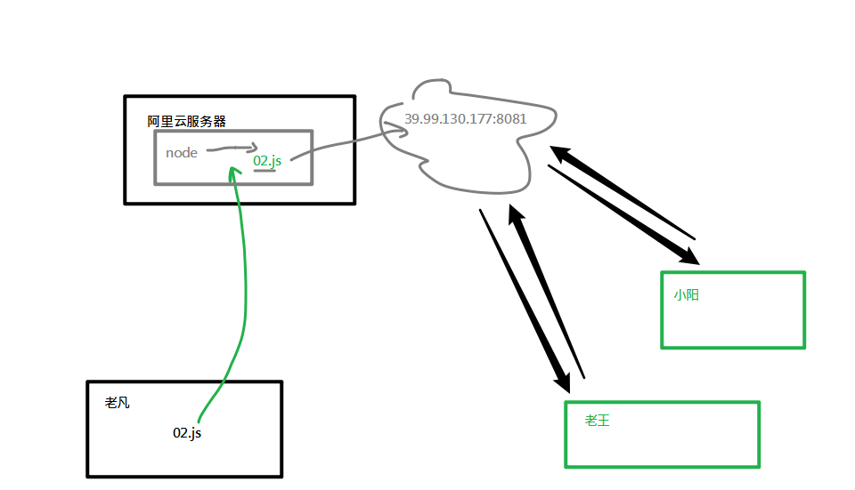

安装并使用nodejs

## 安装nodejs

### 下载

官网： https://Nodejs.org/en/  中文网：http://Nodejs.cn/

- 版本说明

  - **LTS**： 长期稳定版(Long Term Support))。 项目开发建议使用长期稳定版
  - **Current**： 最新版。最新版包含了一些新功能，如果想学习最新的功能，则可以使用该版本。最新版可能会有一些未知的bug。


### 安装

1) 双击安装文件开始安装（不同系统选择对应的安装文件）

2) 傻瓜式安装，一路 'next' 即可

注意：

- 建议安装目录所使用`英文路径` (不要安装在类似于  d:/软件/node)
- 安装完成之后， 不会在桌面出现快捷图标

### 测试是否安装成功

打开任意一个**小黑窗**，输入`node  -v`能够看到Nodejs版本号即为安装成功。

- cmd窗口(window+R, --->运行-->录入cmd,回车)

- powershell（window10操作系统）

  任意位置，按下shift，右键。

  


> 注意：安装nodejs之后，并不会像其它应用程序一样产生桌面的图标，或者是双击打开

## 在node环境下运行js代码

我们前面的学习中，js代码都是在**浏览器**中运行的，现在开始学习nodejs后，我们有了第二个环境中可以运行js代码。即有两种`方式`可以运行js代码：

- 在nodejs 提供的repl中环境
- 单独执行外部的js文件

### 方法1：在 REPL中运行

REPL(Read Eval Print Loop:交互式解释器) 表示一个电脑的环境，类似 Window 系统的终端或 Unix/Linux shell，我们可以在终端中输入命令，并接收系统的响应。

Node 自带了交互式解释器，可以执行以下任务：

- **读取** - 读取用户输入，解析输入了Javascript 数据结构并存储在内存中。
- **执行** - 执行输入的数据结构
- **打印** - 输出结果
- **循环** - 循环操作以上步骤直到用户两次按下 **ctrl+c** 按钮退出。

具体操作：

1. 在任意控制台中输入node 并回车确定，即可进行入node自带的REPL环境。
2. 此时，你可以正常写入js代码，并执行。
3. 如果**要退出，连续按下两次ctrl+c**


### 方法2：执行一个JS文件

1. 请事先准备好一个js文件。例设这里的路径是：e:/index.js

   具体内容是

```javascript
var a = 1;
console.info(a + 2);
```

2. 打开小黑窗，进入到这个文件的目录
   - 技巧:在资源管理器中按下shift，同时点击鼠标右键，可以选择在此处打开powershell/命令行窗口。
   - 
   - cd 命令可以用来切换当前目录。
   - 进入这个目录 后，直接在地址栏中写入 `cmd`也可以在小黑窗中切换到当前目录。

3. 接下来 通过  ` node js文件路径` 的格式来执行这个js文件。 例如：

```javascript
node index.js
```

注意:

- 执行js文件时，如果当前命令行目录和js文件**不在**同一个盘符下，要先切换盘符
- 执行js文件时，如果当前命令行目录和js文件**在**同一个盘符中，则可以使用相对路径找到js文件并执行

## nodejs的helloworld程序

下面，我们来通过一个最基本的http服务器程序来见识nodejs的作用。

第一步：新建一个文件，名为  `d:/http.js`( 文件名及路径名可以自行设置，建议均不使用中文字符)

第二步：在文件中录入如下代码。

```javascript
// 引入http模块
const http = require('http');

// 创建服务
const server = http.createServer(function(req, res) {
  console.log(`来自${req.connection.remoteAddress}的客户端在${new Date().toLocaleTimeString()}访问了本服务器`);
  res.end(`<h1>hello world! very good!!</h1> <p>${req.connection.remoteAddress}</p>`);
});
// 启动服务
server.listen(8081, function() {
  console.log('服务器启动成功，请在http://localhost:8081中访问....');
});
```

第三步：运行js代码。在小黑窗中进入到d盘根目录，键入命令 `node http.js`，此时会弹出一个小黑窗，不要关。

第四步：打开一个浏览器页面，输入'http://localhost:8081'，观察效果：

	- 浏览器中的效果
	- 小黑窗中的效果

第五步：把localhost改成你自己电脑的ip地址，再把这个路径发你的同学（同一个局域网）来访问。

- 如果不能访问，有可能你需要手动关闭你自己计算机的防火墙。


## 扩展

