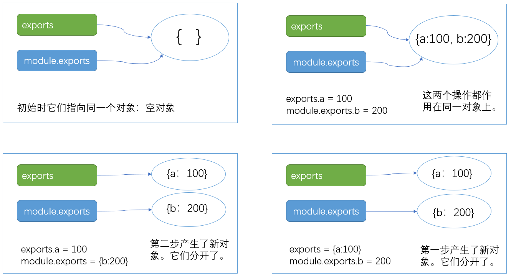

# 自定义模块

在nodejs中模块分成三类：

- 核心模块(fs,path,....)

- 自定义模块

- 第三方模块

  

我们对代码的封装是以模块（`一个独立的.js文件`）为单位进行的。一般的做法是实现好某一个功能之后，封装成一个模块，然后在其它文件中使用这个模块。

类比于js自定义函数，自定义模块的使用场景是：

- 代码需要在项目重用
- 代码需要提供给他人使用
- 代码虽然不需要重用，但封装成模块有利于优化代码结构，方便后期维护与扩展


一共有两步：

1. 定义模块。就是创建一个js文件。

2. 使用模块。在需要使用的地方去导入文件。


## 定义模块

所谓定义模块，就是新建一个js文件。在给这个js文件取名时，要注意一下：

-  我们一般会用模块名给它命名。类比于核心模块，例如，你的模块叫myModule，则这个js文件最好叫myModule.js
-  不要与核心模块的名字重复了。就像我们定义变量**不要与核心关键字重名**，你自己定义的模块也不要叫fs.js,因为nodejs有一个核心模块就叫fs.js。
-  要记得**导出模块**

示例：我们定义一个模块，文件名是myModule.js。 在js文件内我们定义一些函数，变量，它们会根据我们的业务要求做一些不同的工作。最后根据情况导出这些函数，变量。

```javascript
//myMath.js
const myPI = 3;
function add(a, b) {
  return a + b;
}
// 通过module.exports来导出模块
module.exports = {
  myPI,
  add
};
```

注意：

- module.exports 是固定写法，一般放在文件的最末尾，也只用一次。
- module.exports表示当前模块要暴露给其它模块的功能。
  - 它可以导出对象，数组，函数等等类型。为了方便组织代码，导出对象的情况比较多。
  - 不必要导出你定义的所有函数，对象，数组等。那些没有导出的部分就相当于这个模块的内部变量了。


##  导入模块

完成了模块定义之后，我们就可以在另一个文件（也可以是另一个模块）中使用这个模块了。

```
1. 导入模块；
2. 先打出出看看；
```

当一个模块被成功引入之后，就可以类比使用核心模块的过程一样去使用它们了。

```javascript
// index.js
// 1. 导入模块
// 注意这里使用的是相对路径。可省略.js.
const myMath = require('./myMath');

// 在使用之前请先打印出来看看
console.log(myMath);

// 2. 使用模块中的方法
let rs = myMath.add(23,45);
console.log(rs)
```

注意：

- 使用require语句引入你定义好的模块
- 这里必须使用`相对路径`的格式去引入自定义模块


## 应用

通过自定义模块改造对message.json的操作

1. 定义模块

新建message.js文件，其中内容如下：

```javascript
// 封装对message.json的操作，并导出


// 文件模块
const fs = require('fs');
// 路径模块
const path = require('path');

const DATA_FILE = "message.json"
// NB的优化：消除魔术数！

// 拼接一个绝对路径
let filePath = path.join(__dirname,DATA_FILE)

/**
 * 获取message文件中的内容
 */
const get = () => {
    // 使用 同步 的方式读
    let rs = fs.readFileSync(filePath,'utf8')  
    // rs数据 是什么格式的？ string
    // json是一种特殊格式的字符串
    let arr = JSON.parse(rs) 
    // 把JSON字符串  ===》 JS中的数据-数组
    
    // console.log( typeof rs)
    // console.log( arr )
    // console.log(rs)
    return arr;
}


/**
 * 添加留言
 * 传入name及content即可，id是自动增长的，dt是时间戳
 * 
 * @param {*} name  用户名
 * @param {*} content  内容
 */
const add = (name,content)=>{
    // 分析:如何向一个.json文件中添加一条数据
    // 思路：
    // 1. 读出文件内容，转成数组
    let arr = get()
    
    // 2. 用数组的append方法，添加一条记录
    // 数组的最后一个元素如何获取？ [3,4] 要长度减一。
    // let id = arr.length ? (arr[arr.length-1]["id"] + 1) : 1
    let id = 1;
    // 现在数组中有元素，则length肯定是大于0
    if(arr.length) {
        // 在最后一个元素的id的基础上加1
        id = arr[arr.length-1].id + 1
    } 

    let obj = {
        id,
        // id: arr.length+1,// 它是跟着数组长度变化而增长的
        name,
        content,
        dt:Date.now() // 时间戳
    }

    arr.push( obj ) //追加到数组的尾部
    
    // 3. 把当前的数组写回到文件中去
    // 采用同步的写文件 writeFile
    // 把数组转字符串再写入
    fs.writeFileSync(filePath,JSON.stringify(arr))
    // console.log(arr);
    return arr
}

/**
 * 删除
 * @param {*} id  要删除的那一条记录的id号
 * 
 * message.json中保存了很多记录
 */
const del = id => {
    // 自已写代码
    // 思路：
    // 1. 取出全部的数据，得到一个数组
    let arr = get();
    // 2. 在数组中找出id值为指定参数的那条记录，然后删除它。
    //  找出索引，
    let idx = arr.findIndex(item => item.id == id)
    console.log(idx);
    //  调用splice
    //  在一个数组中删除下标为idx的元素
    arr.splice(idx, 1)
    // 3. 把删除了记录之后数组写回到文件中
    // 采用同步的写文件 writeFile
    // 把数组转字符串再写入
    fs.writeFileSync(filePath,JSON.stringify(arr))
}

/**
 * 修改 message.
 */
const update = () => {

}
module.exports = {
    "get" : get,
    "add" : add,
    "del" : del
}
```

2. 使用模块

完成模块的封装之后，就可以在其它模块中使用了。


## 导出模块的两种方式

- exports
- module.exports

[参考](https://nodejs.org/api/modules.html#modules_exports_shortcut)。

在阅读其它人的代码时，可能会遇到这两种不同的写法。所以我们还是有必要了解一下的。

例如：cookie模块，body-parser模块，arry-flatten模块中的导出均采用不同的方式。


它们的关系是：  

- 在初始时，exports和module.exports是指向同一块内存区域，其内容都是一个空对象。exports是module.exports的别名，即：

```javascript
exports === module.exports
```

所以下面两种写法的效果是一样的：

> ```
> //1 mymodule.js
> exports.f = function(){ }
> exports.pi = 3.1415926
> ```
>
> ```
> //2 mymodule.js
> module.exports.f = function(){ }
> module.exports.pi = 3.1415926
> ```

- 在定义模块时：
  - 如果直接给exports对象赋值（例如：exports={a:1,b:2}），此时，exports就不会再指向module.exports，而转而指向这个新对象，此时，exports与module.exports不是同一个对象。
- 在引入某模块时，以该模块代码中`module.exports`指向的内容为准。
- 在导出模块过程中，建议只用一种方式（建议直接使用module.exports）。




## require的加载机制

在我们使用一个模块时，我们会使用require命令来加载这个模块。以加载一个自定义模块为例，require(文件名)的效果是：

1. 执行这个文件中的代码
2. 把这个文件中的module.exports对象中的内容返回出来。

以如下代码为例：

```javascript
// moudule1.js
var a = 1;
var b = 2;
console.log(a+b);
var c = a+b;
module.exports = {
	data: c
}
```

在index.js中使用模块

```javascript
// index.js
const obj = require('./moudule1.js');
console.log(obj);

//这里的obj对象就是moudule1.js中的module.exports对象
```

require加载规则：

- `require` 优先加载**缓存**中的模块。同一个模块第一次require之后，就会缓存一份，下一次require时就直接从缓存中去取。

- 如果是加载**核心模块**，直接从内存中加载，并缓存

  - 加载核心模块的格式是 `const xxx = require("模块名")` 。不能写相对路径！

- 如果是**相对路径**，则根据路径加载**自定义模块**，并缓存
  - 以`require('./main')`为例（ 省略扩展名的情况）
  - 先加载 `main.js`，如果没有再加载 `main.json`，如果没有再加载 `main.node`(c/c++编写的模块)
  
- 如果不是自定义模块，也不是核心模块，则加载**第三方模块**
  
  以`require('XXX')`为例：
  
  - node 会去本级 node_modules 目录中找xxx.js ----> xxx.json ----> xxx.node(找到一个即返回)，找到并缓存。
  - 如果找不到，node 则取上一级目录下找 `node_modules/xxx` 目录，规则同上
  - 如果一直找到代码文件的文件系统的根路径还找不到，则报错


> 在xxx.js中输出module.paths可以查看