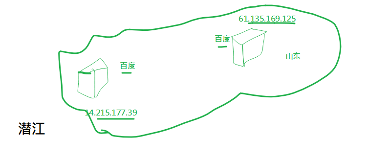
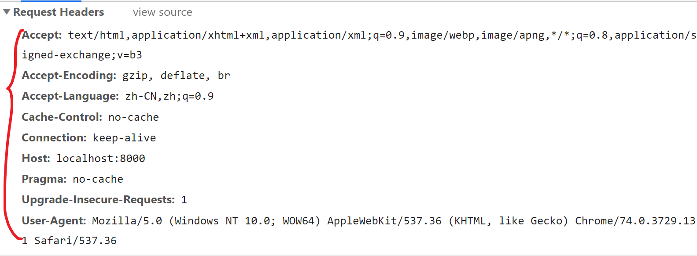

http是nodejs的核心模块，它能让我们能够通过简单的代码创建一个Web服务器，处理http请求。

## 基本使用

### 快速搭建Web服务器

1. 新建文件`http1.js`，写入如下代码。

```js
// http1.js
// 引入核心模块 http
const http = require('http');

// 创建服务
const server = http.createServer(function(req, res) {
  // 获取访问本服务器的客户端ip
  console.log(req.connection.remoteAddress);
  // 向客户端发送内容，并结束本次响应
  res.end('hello world');
});
// 启动服务
server.listen(8081, function() {
  console.log('success');
});
```

2. 运行代码。打开小黑窗，键入 `node http1.js`
3. 在浏览器地址栏中输入：localhost:8081 观察效果。

说明

1. 把localhost改成本机ip地址，让同一局域网的同学访问。
2. 如果你修改了代码，必须先停止服务，然后再启动。这样才能生效。
   - 停止服务： 在小黑窗中按下ctrl+c 停止服务。
   - 重启服务：就是重新运行程序。在小黑窗中运行 `node http1.js`
3. 更改res.end()的内容，`重启`后，再次观察。
4. 它的作用是启动一个服务，所以执行代码后并不会跳出来，还保持在运行状态。


## 基本网络概念

### ip地址

全称：`I`nternet `P`rotocol Address。

作用：标识一个网络设备（计算机、手机、电视...）在**某一个具体的网络**当中的地址。要访问某个电脑上的资源，先要找到它的ip。

分类：ipV4,ipV6 (<http://www.gov.cn/xinwen/2018-09/03/content_5318951.htm>)

格式：`[0-255].[0-255].[0-255].[0-255]` 即为四个 0-255 的数字组成（以ip4为例）。在同一个网络中，计算机的IP是不允许相同的，都是唯一的。`220.181.38.149` 

`127.0.0.1` 特指本机ip地址。


### 域名

域名是ip地址的别名。由于ip地址不好记忆，我就给它们取个好记的别名。

localhost这个域名特指127.0.0.1这个地址。

> 一个ip对应一个域名，但一个域名对应多个ip。www.baidu.com是一个域名，它的主机显然不只一台。



域名解析系统(DNS)。把域名翻译成Ip地址的系统。

### 端口

一个IP地址的端口可以有65536个，范围是从[0，65535]）。不同的端口被不同的软件占用，以提供不同的服务。 

一台电脑可以通过安装多个服务器端软件来提供服务，比如[Web服务](https://baike.baidu.com/item/Web服务)、FTP服务、SMTP服务等。显然，通过ip地址是无法区分不同的服务的。`这里就需要用到 “IP地址+端口号”来区分不同的服务`。

对比理解

- 如果理解IP地址（一台服务器）是一栋大商场，端口就是商场中的商铺的编号。
- 如果理解IP地址（一台服务器）是公司的前台电话，端口就是公司中各个部门的分机号。

通过`netstat -a -n -o` 查看端口使用情况


不同的软件使用不同的端口号。

- http: 80
- https:443
- mysql:3306 

### 协议

网络三要素：

- 协议：约定双方说话的方式；
- ip地址：位置。
- 端口：占用哪个分机号

制定通讯规则。不同的协议的作用也不同。

#### http协议

- HTTP(HyperText Transfer Protocol) 超文本传输协议。

- 协议双方： 浏览器与web服务器都要遵守的协议

- 请求通常是由像浏览器这样的接受方发起的

- HTTP 协议中明确规定了`请求数据`和`响应数据`的格式(**报文**)

  - 浏览器 请求 资源 要遵守 http 协议：  请求报文

    - 请求行：请求类型  请求地址    协议及版本号
    - 请求头：键值对格式。告诉服务器本次请求所携带的信息。`content-type:application/x-www-form-ulrencoded`
    - 请求体:  get 类型的请求，没有请求体。请求体的作用是用来和服务器传递参数。(不是每次请求都有请求体：get请求是肯定没有请求体的，post请求可以有请求体)

  - 服务器 返回 资源 要遵守 http 协议：  响应报文

    - 响应行：协议及版本   状态码及说明
    - 响应头：键值对格式。告诉浏览器本次响应所携带的信息。`content-type:application......`
    - 响应体:  本次返回给浏览器的内容。

    

## 理解http请求与响应

在上面的代码中，我们通过http.createServer方法创建一个http服务。

```javascript
// 创建服务
const server = http.createServer((req, res) => {
  console.log(req.connection.remoteAddress);
  res.end('hello world');
});
```

其中的参数是一个匿名的回调函数：当有http请求进来时，它会自动被调用。`请求一次，它就被调用一次`。

这个回调函数有它有两个参数，这是我们要重点学习的。

- 第一个参数表示`来自客户端浏览器的请求`，第二个参数用来`设置对本次请求的响应`。它们的形参名并不重要，但是一般约定第一个参数名使用req或者request表示，第二个参数使用res或者resposne表示。

- 当某个客户端来请求这个服务器时，这个函数会自动调用，同时会自动给这两个参数赋值。

- 第一个参数中包括本次请求的信息。

  - req：请求对象。其中有很多的属性，例如：

    - req.url。本次请求的地址

      

    - req.method。   获取请求行中的请求方法

      

    - req.headers。    获取请求头

      

- 第二个参数用来设置本服务器对这次请求的处理。

  - res.end(参数) 

    - 参数有两种：字符串和buffer
    - 作用：
      - 设置响应体
      - 结束请求，返回。如果不写这一句，则客户端浏览器`永远收不到响应`。
  
- res.setHeader()  设置响应头，比如设置响应体的编码
  
  `res.setHeader('content-type', 'text/html;charset=utf-8');`
  
- res.statusCode 设置状态码 
  
    `res.stausCode=204`


## 根据不同 url 地址处理不同请求

前面已经可以对浏览器的请求做出响应了，但是响应的内容总是一样的。能不能根据url的不同，做出合适的响应呢？当然可以，那么首先就需要知道浏览器请求的url是什么。

涉及到和请求相关的信息，都是通过请求响应处理函数的第一个参数完成的。

代码示例

```javascript
// http.js
// 引入核心模块http
const http = require('http');

// 创建服务
const server = http.createServer(function(req, res) {
  if(req.url === "/a.html"){
      res.setHeader('content-type', 'text/html;charset=utf-8');
      // 通过res.end()返回
  }
  else if(req.url === "/b.html"){
      // ....
  }
  else{
     res.end("404");
  }
});
// 启动服务
server.listen(8081, function() {
  console.log('success');
});
```


## 实现web服器

静态资源指的是html文件中链接的外部资源，如.html, css、js、image文件等等。

如果用户请求的是静态资源，服务器的处理方法就是：读出文件内容，返回给用户。

### 处理.html

目录结构：

```
--index.html
--server.js
```

server.js用来启动web服务器，它实现的功能是：当用户请求http://localhost:8000或者http://localhost:8000/index.html时读出index.html的内容再返回给浏览器

参考代码：

index.html

```html
<!DOCTYPE html>
<html lang="en">
<head>
    <meta charset="UTF-8">
    <meta name="viewport" content="width=device-width, initial-scale=1.0">
    <meta http-equiv="X-UA-Compatible" content="ie=edge">
    <title>Document</title>
    <style>
        h1{
            text-align: center;
        }
    </style>
</head>
<body>
    <h1>index.html</h1>
</body>
</html>
```

server.js

```javascript
const http = require('http');

const server = http.createServer(function(req,res){
    if(req.url==='/' || res.url==='index.html') {
        console.log('/301.html')
        res.statusCode = 301;
        // res.setHeader('location','http://www.baidu.com')
        res.end()
    } else if(req.url === '/302.html'){
        console.log('/302.html')
        res.statusCode = 302;
        // res.setHeader('location','http://www.qq.com')
        res.end()
    } else {
        // res.setHeader('location','http://www.baidu.com')
        res.end("er0r")
    }
})

server.listen(8000,()=>{
    console.log('ok'); 
})
```


### 二次请求

从服务器获取html文件之后，如果这个html文件中还引用了其它的外部资源（图片，样式文件等），则浏览器会重新再发请求。

假设在index.html中还引入了 style.css 1.png 或者 .js文件，则：浏览器请求localhost:8000/index.html之后，得到的从服务器反馈的内容，解析的过程中还发现有外部的资源，所以浏览器会再次发出第二次请求，再去请求相应的资源。

一个最朴素的想法是枚举不同的请求来返回不同的文件。

目录结构

```
|-index.html
|-index.css
|-1.png
|-server.js
```

index.html中还引用了index.css和1.png

```html
<!DOCTYPE html>
<html lang="en">
<head>
    <meta charset="UTF-8">
    <meta name="viewport" content="width=device-width, initial-scale=1.0">
    <meta http-equiv="X-UA-Compatible" content="ie=edge">
    <title>Document</title>
    <style>
        h1{
            text-align: center;
        }
    </style>
+    <link rel="stylesheet" href="./style.css">
</head>
<body>
    <h1>index.html</h1>
+    
</body>
</html>
```

上面的+号只是表示这里的代码需要修改。


```javascript
const http = require('http');
const fs = require('fs');
const path = require('path');

//创建服务器
const app = http.createServer((req, res) => {

  if (req.url === '/index.html') {
    let htmlString = fs.readFileSync(path.join(__dirname, 'index.html'));
    res.end(htmlString);
  }
  else if (req.url === '/style.css') {
    let cssString = fs.readFileSync(path.join(__dirname, 'style.css'));
    res.setHeader('content-type', 'text/css');
    res.end(cssString);
  } else if (req.url === '/1.png') {
    let pngString = fs.readFileSync(path.join(__dirname, '/1.png'));
    res.end(pngString);
  } else {
    res.setHeader('content-type', 'text/html;charset=utf-8');
    res.statusCode = 404;
    res.end('<h2>可惜了, 找不到你要的资源' + req.url + '</h2>');
  }
}); 
//启动服务器，监听8082端口
app.listen(8082, () => {
  console.log('8082端口启动');
});
```

### 为不同的文件类型设置不同的 Content-Type

通过使用res对象中的setHeader方法，我们可以设置content-type这个响应头。这个响应头的作用是告诉浏览器，本次响应的内容是什么格式的内容。以方便浏览器进行处理。

常见的几中文件类型及content-type如下。

- .html：` res.setHeader('content-type', 'text/html;charset=utf-8') `
- .css：`res.setHeader('content-type', 'text/css;charset=utf-8')`
- .js：`res.setHeader('content-type', 'application/javascript') `
- .png：`res.setHeader('content-type', 'image/png')`

其它类型，参考这里：https://developer.mozilla.org/en-US/docs/Web/HTTP/Basics_of_HTTP/MIME_types

`res.setHeader('content-type', 'application/json;charset=utf-8')`

### 批量处理请求

由于我们无法事先得知一个.html文件中会引用多少个静态资源，所以，我们不能像处理某个页面一样去处理它们。

我们的解决办法是：

- 把所有的静态资源全放在一个指定的目录里；
- 收到用户的请求之后，去指定的目录下去找对应的文件
  - 找到，把内容读出来返回给用户。
  - 找不到，报404。

目录如下：

```
|-public
|-public/index.html
|-public/stye.css
|-public/1.png
|-server.js
```

在上面的目录结构中，我们把所有的静态资源全放在public下面，然后使用server.js来启动web服务器。

对应的请求与响应的关系是：

| 用户的请求地址                   | 服务器的动作                      |
| -------------------------------- | --------------------------------- |
| http://localhost:8000/index.html | 读出public/index.html的内容并返回 |
| http://localhost:8000/style.css  | 读出public/style.css的内容并返回  |
| http://localhost:8000/1.png      | 读出public/1.png的内容并返回      |


server.js 创建服务器

```javascript
// 启动web服务器
// 用户在访问http://localhost:8000/XXXX时，直接去读public123/XXX返回给浏览器

// 引入模块
const http = require('http')
const path = require('path')
const fs = require('fs')
// 创建服务
const server = http.createServer( function(req, res) {
    // 根据用户的req.url 去读 pulic123 下面的文件
    //   /index.html   ----------- >  /public123 /index.html 
    let filePath =  path.join( __dirname, 'public123', req.url)
    console.log(req.url) 
    console.log(filePath)

    fs.readFile(filePath,function(err,data){
        if(err){
            // 文件不存在
            res.statusCode = 404;
            res.setHeader('Content-type','text/html;charset=utf8')
            res.end(`${req.url}不存在！！！！！！`)
        } else {
            res.end(data)
        }
    })
})
// 启动服务，监听端口
server.listen(8000,function(){
    console.log(8000);
    
})
```

