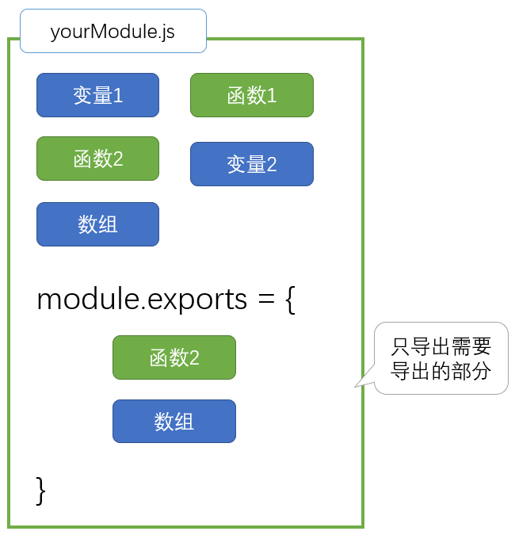
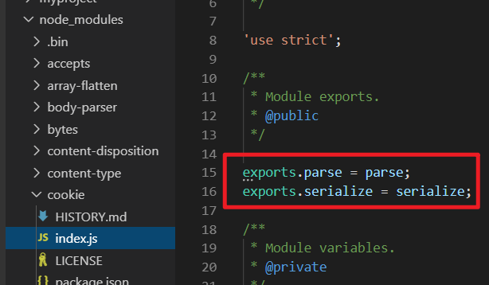
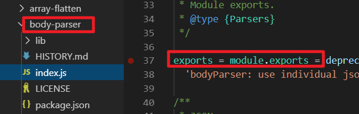
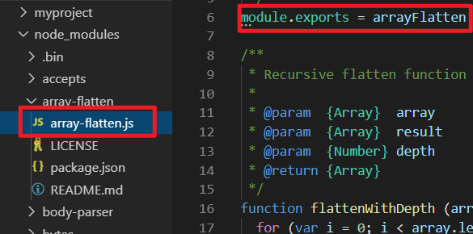
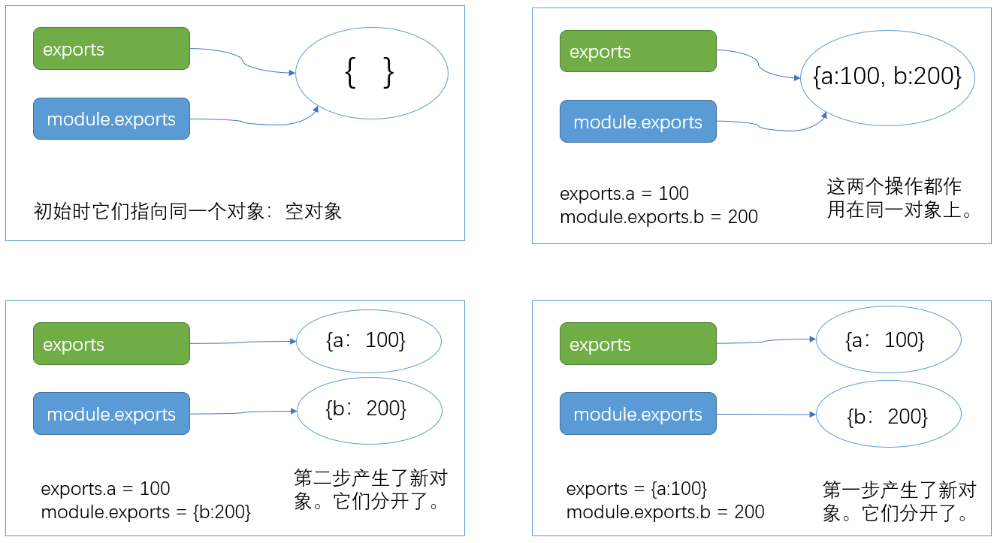

## 自定义模块

在nodejs中 ，我们对代码的封装是以模块（`一个独立的.js文件`）为单位进行的。一般的做法是实现好某一个功能之后，封装成一个模块，然后在其它文件中使用这个模块。

类比于js自定义函数，自定义模块的使用场景是：

- 代码需要在项目重用
- 代码需要提供给他人使用
- 代码虽然不需要重用，但封装成模块有利于优化代码结构，方便后期维护与扩展

### 基本步骤

一共有两步：

1. 定义模块。就是创建一个js文件。

2. 使用模块。在需要使用的地方去导入文件。


#### 定义模块

所谓定义模块，就是新建一个js文件。在给这个js文件取名时，要注意一下：

-  我们一般会用模块名给它命名。类比于核心模块，例如，你的模块叫myModule，则这个js文件最好叫myModule.js
-  不要与核心模块的名字重复了。就像我们定义变量**不要与核心关键字重名**，你自己定义的模块也不要叫fs.js,因为nodejs有一个核心模块就叫fs.js。
-  要记得导出模块

示例：我们定义一个模块，文件名是myModule.js。 在js文件内我们定义一些函数，变量，它们会根据我们的业务要求做一些不同的工作。最后根据情况导出这些函数，变量。

```javascript
//myMath.js
const myPI = 3;
function add(a, b) {
  return a + b;
}
// 通过module.exports来导出模块
module.exports = {
  myPI,
  add
};
```

注意：

- module.exports 是固定写法，一般放在文件的最末尾，也只用一次。
- module.exports表示当前模块要暴露给其它模块的功能。
  - 它可以导出对象，数组，函数等等类型。为了方便组织代码，导出对象的情况比较多。
  - 不必要导出你定义的所有函数，对象，数组等。那些没有导出的部分就相当于这个模块的内部变量了。




####  导入模块

完成了模块定义之后，我们就可以在另一个文件（也可以是另一个模块）中使用这个模块了。

```
1. 导入模块；
2. 先打出出看看；
```

当一个模块被成功引入之后，就可以类比使用核心模块的过程一样去使用它们了。

```javascript
// index.js
// 1. 导入模块
// 注意这里使用的是相对路径。可省略.js.
const myMath = require('./myMath');

// 在使用之前请先打印出来看看
console.log(myMath);

// 2. 使用模块中的方法
let rs = myMath.add(23,45);
console.log(rs)
```

注意：

- 使用require语句引入你定义好的模块
- 这里必须使用`相对路径`的格式去引入自定义模块

### 通过自定义模块改造留言板案例

在server.js的两个接口中涉及到对留言内容的两个操作：添加，获取。那我们可以把这个部分的工作封装在message.js这个模块中。

1. 定义模块

新建message.js文件，其中内容如下：

```javascript
// 留言模块
const fs = require('fs')
const path = require('path')

// 统一定义数据库文件的地址 
const FILE_PATH = path.join(__dirname, 'db.json')

const add = function(msgObj) {
    // console.log(this);
    // console.log('add留言',msgObj);
    // 1. 读出留言内容
    let msgArr = this.get()
    console.log( msgArr.length) 
    // 2. 添加msgObj
    msgArr.push(msgObj)
    // 3. 写入db.json
    fs.writeFileSync(FILE_PATH, JSON.stringify(msgArr) )
}

module.exports = {
    add,

    get(){
        console.log('获取留言');
        // 读出db.json中的内容，它是一个字符串
        let jsonStr = fs.readFileSync(FILE_PATH,'utf8')
        // 把字符串转成数组返回
        return JSON.parse(jsonStr);
    }

}
```

2. 使用模块

完成模块的封装之后，就可以在server.js中使用了。

```javascript
const http = require('http')
const url = require('url')
const fs = require('fs')
const path = require('path')
const qs = require('querystring')

// 引入自定义模块
const message = require('./message.js')


const server = http.createServer((req,res)=>{
   let urlObj = url.parse(req.url);
   let {pathname} = urlObj; // 取出请求的地址
   console.log(pathname );

   if(pathname === '/getmsg' && req.method === 'GET'){
        // 1. 获取当前所有的留言内容
 +       let msgArr =  message.get();
        let obj = {code:200, msg:'获取成功',data: msgArr }
    
        // 2. 返回
        res.setHeader('content-type','application/json')
        res.end( JSON.stringify(obj) )
   } 
   else if(pathname === '/addmsg' && req.method === 'POST'){
       // 1. 收集post的参数
       let result = ''

       req.on('data',function(rs){
        // rs表示收集到的一部分数据；
        // 这个回调会多次被调用
        result = result + rs;
       })

       req.on('end',function(){
            // 全部的数据接收完成，会执行一次。
            // 1. 收集参数，组成对象obj
            var obj = qs.parse(result)

            // 补充参数. obj就是本次留言 对应 的对象
            obj.dt = Date.now();
            // 2. 调用模块的add方法
+            message.add(obj)

            res.setHeader('content-type','application/json;charset=utf8')
            res.end(JSON.stringify( {code:200,msg:'添加成功', data:obj }))
       })
   }

   else {
       // 对于pathname ，直接去public下面读出对应的文件内容，并返回
       let filePath = path.join(__dirname,'public',pathname )
       console.log(filePath);
       fs.readFile(filePath,function(err,data){
           if(err){
               res.statusCode = 404
               res.end('404')
           } else {
            // if(当前请求的是css) ｛要添加一个特殊的响应头｝
            if(path.extname(pathname) === '.css'){
                res.setHeader('content-type','text/css')
            }
            res.end(data)
           }
       })
   }
})

server.listen(8000,()=>{
    console.log(8000);
    
})

```


### 扩展：两种导出模块的内容的方式：

- exports
- module.exports


[参考](https://nodejs.org/api/modules.html#modules_exports_shortcut)。

在阅读其它人的代码时，可能会遇到这两种不同的写法。所以我们还是有必要了解一下的。

例如cookie模块，body-parser模块，arry-flatten模块中的导出均采用不同的方式。









它们的关系是：  

在初始时，exports和module.exports是指向同一块内存区域，其内容都是一个空对象。exports是module.exports的别名，即：

```javascript
exports === module.exports
```

所以下面两种写法的效果是一样的：

> ```
> //1 mymodule.js
> exports.f = function(){ }
> exports.pi = 3.1415926
> ```
>
> ```
> //2 mymodule.js
> module.exports.f = function(){ }
> module.exports.pi = 3.1415926
> ```

细节在于：

- 在定义模块时：
  - 如果直接给exports对象赋值（例如：exports={a:1,b:2}），此时，exports就不会再指向module.exports，而转而指向这个新对象，此时，exports与module.exports不是同一个对象。
- 在引入某模块时，以该模块代码中module.exports指向的内容为准。
- 在导出模块过程中，建议只用一种方式（建议直接使用module.exports）。




### require的加载机制

在我们使用一个模块时，我们会使用require命令来加载这个模块。以加载一个自定义模块为例，require(文件名)的效果是：

1. 执行这个文件中的代码
2. 把这个文件中的module.exports对象中的内容返回出来。

以如下代码为例：

```javascript
// moudule1.js
var a = 1;
var b = 2;
console.log(a+b);
var c = a+b;
module.exports = {
	data: c
}
```

在index.js中使用模块

```javascript
// index.js
const obj = require('./moudule1.js');
console.log(obj);

//这里的obj对象就是moudule1.js中的module.exports对象
```

require加载规则：

- `require` 优先加载**缓存**中的模块。同一个包第一次require之后，就会缓存一份，下一次require时就直接从缓存中去取。
- 如果是**相对路径**，则根据路径加载**自定义模块**，并缓存
  - `require('./main')`  省略扩展名的情况
  - 先加载 `main.js`，如果没有再加载 `main.json`，如果没有再加载 `main.node`(c/c++编写的模块)
- 如果不是相对路径，则加载核心模块，并缓存
- 如果不是自定义模块，也不是核心模块，则加载**第三方模块**
  - node 会去本级 node_modules 目录中找
  - 如果在 node_modules 目录中找到 `moment` 目录，则加载该模块并缓存
  - 如果过程都找不到，node 则取上一级目录下找 `node_modules` 目录，规则同上
  - 如果一直找到代码文件的文件系统的根路径还找不到，则报错

