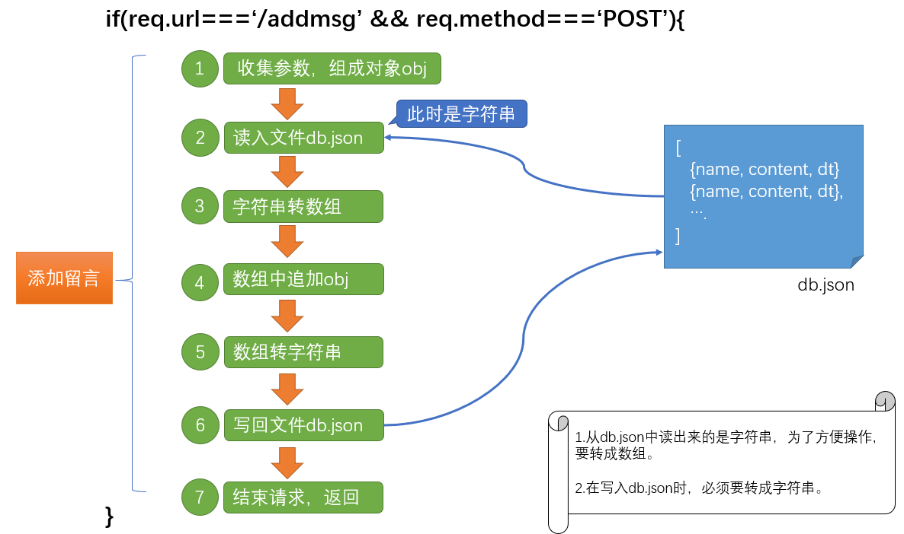

nodejs讲义

从前端到后端；扩展前端技能栈；


## 留言板案例

我们现在已经可以实现：

- 静态资源服务器。把.html, .js, .png 等文件放在指定的文件夹下，让用户来访问。
- 接口
  - post
  - get
- 文件读写。

下面来一起实现留言板案例。

思路：

1. 静态网页放在public下。

2. 准备好一个db.json文件。它用来**保存留言数据**。其格式大致如下：

   ```
   [{"name":"test","content":"留言内容","dt":1574998861809}]
   ```

   

3. 添加两个接口

   (1) getmsg。 get类型，它的功能是从db.json中读取留言内容，并返回

   (2) addmsg。post类型，它的功能是接收用户传入的name,content，并额外补上dt 以构成一条留言数据，再把它添加到db.json中。

4. 准备server.js。它用来实现web服务器。在这个服务器中具备三个功能
   1. 允许访问public下的静态资源
   2. 提供getmsg接口
   3. 提供addmsg接口


当时我们并不知道后端接口是如何实现的，现在我们来实现这两个接口。

### 整体目录结构

整体目录结构如下：

```
|msg
|--server.js                            主程序
|--db.json                              以json字符串格式保存留言信息
|--/public/index.html                   页面
|--/public/jquery.js
|--/public/assets/bootstrap.css
|--/public/assets/avatar.png
```

### 实现步骤

要实现这个功能，一共可分成四步：

1. 实现getmsg接口。用postman测试。
2. 实现addmsg接口。用postman测试。
3. 静态web服务器。让客户端浏览器能够浏览到留言板的静态页面。
4. 实现留言板的具体功能。


### 实现getmsg接口

接口约定：

接口名：getmsg

类型：get

地址：http://localhost:8000/getmsg

参数：无

返回值：`{code:200,msg:'获取成功',data:[]}`

示例:

```javascript
{code:200,msg:'获取成功',data:[{name:'',content:'',dt}]}
```

通过postman测试


#### 步骤1 准备 db.msg

新建文件夹msg,并在msg下新建db.json文件,其内容如下：

```
|-msg
|--db.json
|--server.js
```

其中db.json的内容是：

```
[{name:'test',content:'test',dt:1574998861809}]
```

这里是准备一条测试数据。


#### 步骤2 设置server.js

设置server.js

```javascript
const http = require('http')

const url = require('url')

const fs = require('fs')

const path = require('path')


const server = http.createServer((req,res)=>{
   let urlObj = url.parse(req.url);
   console.log((urlObj));
   let {pathname} = urlObj; // 取出请求的地址
   if(pathname === '/getmsg' && req.method === 'GET'){
        // 1. 获取当前所有的留言内容
        // 去db.json中读出内容，得到是一个字符串
        let filePath = path.join(__dirname, 'db.json')

        fs.readFile(filePath,'utf8',function(err,result){
            if(err){
                res.statusCode = 500;
                res.end( JSON.stringify( {code:500,msg:'获取失败'} ))
            } else {
                console.log(result);// json字符串
                console.log(typeof result);
                // JSON.parse( result ) 把它转成对象
                
                let obj = {code:200, msg:'获取成功',data: JSON.parse( result )}
                
                // 2. 返回
                res.setHeader('content-type','application/json')
                res.end( JSON.stringify(obj) )
            }
        })
   } else {
       res.end('err')
   }
    
})

server.listen(8000,()=>{
    console.log(8000);
    
})
```


### 实现addmsg接口

#### 接口约定

接口名：addmsg

类型：post

地址：http://localhost:8000/addmsg

参数：

- name: 字符串， 游客名。
- content: 字符串，留言内容。

返回值：`{code:200,msg:'添加成功',data:{name:'',content:'',dt} }`

- data 中是添加成功后，本条留言的内容。

通过postman测试。


#### 实现思路

第一步：收到用户的留言名字及内容。注意，这里是post接口。

第二步：补充一个时间戳信息，并组成一个对象。

第三步：读出db.json中的内容。

继续在server.js中添加接口。



参考代码

```javascript
const http = require('http')

const url = require('url')

const fs = require('fs')

const path = require('path')
const qs = require('querystring')

// 统一定义数据库文件的地址 
const FILE_PATH = path.join(__dirname, 'db.json')

const server = http.createServer((req,res)=>{
   let urlObj = url.parse(req.url);
   console.log((urlObj));
   let {pathname} = urlObj; // 取出请求的地址
   if(pathname === '/getmsg' && req.method === 'GET'){
        // 1. 获取当前所有的留言内容
        // 去db.json中读出内容，得到是一个字符串
        

        fs.readFile(FILE_PATH,'utf8',function(err,result){
            if(err){
                res.statusCode = 500;
                res.end( JSON.stringify( {code:500,msg:'获取失败'} ))
            } else {
                console.log(result);// json字符串
                console.log(typeof result);
                // JSON.parse( result ) 把它转成对象
                
                let obj = {code:200, msg:'获取成功',data: JSON.parse( result )}
                
                // 2. 返回
                res.setHeader('content-type','application/json')
                res.end( JSON.stringify(obj) )
            }
        })
   } 
   else if(pathname === '/addmsg' && req.method === 'POST'){
       // 1. 收集post的参数
       let result = ''

       req.on('data',function(rs){
        // rs表示收集到的一部分数据；
        // 这个回调会多次被调用
        result = result + rs;
       })

       req.on('end',function(){
            // 全部的数据接收完成，会执行一次。
            // 1. 收集参数，组成对象obj
            var obj = qs.parse(result)

            // 补充参数. obj就是本次留言 对应 的对象
            obj.dt = Date.now();

            // 2. 读入文件db.json
            let msgStr = fs.readFileSync(FILE_PATH,'utf8');
            // 3. 转成数组
            msgArr = JSON.parse (msgStr)
            // 4. 数组中追加留言
            msgArr.push(obj);
            // 5. 6写回db.json。msgArr是一个数组，不能直接写入，要先转字符串
            fs.writeFileSync(FILE_PATH, JSON.stringify( msgArr) )
            
            console.log(obj,msgArr);
            // 7. 返回
+           res.setHeader('content-type','application/json;charset=utf8')
            res.end(JSON.stringify( {code:200,msg:'添加成功', data:obj }))
       })
   }
   else {
       res.end('err')
   }
})

server.listen(8000,()=>{
    console.log(8000);
    
})
```

在res.end()中，如果有汉字，需要先设置charset `res.setHeader('content-type','application/json;charset=utf8')`

### 实现静态web服务器

步骤：

1. 准备public文件夹
2. 修改server.js代码

在项目的根目录下，新建目录public，并把准备好的留言板素材复制到public下。

```javascript
const http = require('http')

const url = require('url')

const fs = require('fs')

const path = require('path')
const qs = require('querystring')

// 统一定义数据库文件的地址 
const FILE_PATH = path.join(__dirname, 'db.json')

const server = http.createServer((req,res)=>{
   let urlObj = url.parse(req.url);
   let {pathname} = urlObj; // 取出请求的地址
   console.log(pathname );

   if(pathname === '/getmsg' && req.method === 'GET'){
        // 1. 获取当前所有的留言内容
        // 去db.json中读出内容，得到是一个字符串
        

        fs.readFile(FILE_PATH,'utf8',function(err,result){
            if(err){
                res.statusCode = 500;
                res.end( JSON.stringify( {code:500,msg:'获取失败'} ))
            } else {
                console.log(result);// json字符串
                console.log(typeof result);
                // JSON.parse( result ) 把它转成对象
                
                let obj = {code:200, msg:'获取成功',data: JSON.parse( result )}
                
                // 2. 返回
                res.setHeader('content-type','application/json')
                res.end( JSON.stringify(obj) )
            }
        })
   } 
   else if(pathname === '/addmsg' && req.method === 'POST'){
       // 1. 收集post的参数
       let result = ''

       req.on('data',function(rs){
        // rs表示收集到的一部分数据；
        // 这个回调会多次被调用
        result = result + rs;
       })

       req.on('end',function(){
            // 全部的数据接收完成，会执行一次。
            // 1. 收集参数，组成对象obj
            var obj = qs.parse(result)

            // 补充参数. obj就是本次留言 对应 的对象
            obj.dt = Date.now();

            // 2. 读入文件db.json
            let msgStr = fs.readFileSync(FILE_PATH,'utf8');
            // 3. 转成数组
            msgArr = JSON.parse (msgStr)
            // 4. 数组中追加留言
            msgArr.push(obj);
            // 5. 6写回db.json。msgArr是一个数组，不能直接写入，要先转字符串
            fs.writeFileSync(FILE_PATH, JSON.stringify( msgArr) )
            
            console.log(obj,msgArr);
            // 7. 返回
            res.end(JSON.stringify( {code:200,msg:'添加成功', data:obj }))
       })
   }

   else {
       // 对于pathname ，直接去public下面读出对应的文件内容，并返回
       let filePath = path.join(__dirname,'public',pathname )
       console.log(filePath);
       fs.readFile(filePath,function(err,data){
           if(err){
             res.statusCode = 404
             res.end('404')
           } else {
               // if(当前请求的是css) ｛要添加一个特殊的响应头｝
            if(path.extname(pathname) === '.css'){
                res.setHeader('content-type','text/css')
            }
            res.end(data)
           }
       })
   }
})

server.listen(8000,()=>{
    console.log(8000);
    
})
```


### 实现功能


```html
<!DOCTYPE html>
<html lang="en">
  <head>
    <meta charset="UTF-8" />
    <meta name="viewport" content="width=device-width, initial-scale=1.0" />
    <meta http-equiv="X-UA-Compatible" content="ie=edge" />
    <title>留言板</title>
    <link rel="stylesheet" href="./assets/bootstrap.css" />
  </head>
  <body>
    <div class="container">
      <h1 class="display-6">留言板</h1>
      <hr />
      <ul id="messages" class="list-unstyled">
        <!-- <li class="media">
          
          <div class="media-body">
            <h4>张三</h4>
            <p>哈哈哈哈哈哈哈哈哈哈哈</p>
            <p>2019-06-07</p>
          </div>
        </li> -->
      </ul>
      <hr />
      <form>
        <div class="form-group">
          <label for="txt_name">称呼：</label>
          <input class="form-control" id="txt_name" type="text" />
        </div>
        <div class="form-group">
          <label for="txt_content">留言：</label>
          <textarea
            class="form-control"
            id="txt_content"
            cols="80"
            rows="5"
          ></textarea>
        </div>
        <button id="btn_send" type="button" class="btn btn-primary">提交</button>
      </form>
    </div>
    <script src="./jquery-1.8.1.js"></script>

    <script>

      const getAndShow = () => {
        $.get('./getmsg',result=>{
          console.log(result);
          let {code,data} = result
          if(code === 200){
            //0.清空留言显示区域
            $('#messages').empty();

            data.forEach( item => {
              let {name,content,dt} = item
              let str = `
              <li class="media">
                
                <div class="media-body">
                  <h4>${name}</h4>
                  <p>${content}</p>
                  <p>${(new Date(dt)).toLocaleString()}</p>
                </div>
              </li>
              `
              console.log((str));
              $('#messages').append( str )
            })
          }
        })
      }
    
      getAndShow();

      $('#btn_send').click( ()=> {
        // 1. 获取数据
        let name = $('#txt_name').val().trim()
        let content = $('#txt_content').val().trim()
        
        // 2. 判断是否为空
        if(name === '' || content === ''){
          alert('不能为空')
          return; 
        }
        // 3. 发请求，添加
        $.post('./addmsg', {
            name,
            content
          },
          res=>{
            console.log(res);
            let {code,msg} = res;
            if(code === 200){
              // 添加成功
              // 1. 清空留言区域
              $('#txt_name').val('')
              $('#txt_content').val('')
              // 2. 重新获取数据
              getAndShow();

            }
          }
        )
      })
    </script>
  </body>
</html>

```

注意：

- 合理使用es6的语法
  - 箭头函数
  - 解构赋值
  - 简化对象的写法
  - const,let
  - 模板字符串
- 关于接口地址
  - `http://localhost:8000/getmsg` 改成`./getmsg`。这个好处是 它会自动补全前面的域名及端口，避免跨域错误。

