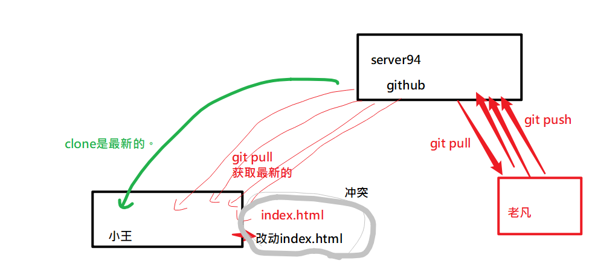

## 不要直接改从github上clone下来的，别人的代码！



## 安装nodejs

官网下载；

直接安装；

node -v 检查是否安装成功；


## 在 REPL中运行


## node 文件路径 执行一个JS文件

```javascript
# node 文件路径
node 01.js
node code/01.js
```


## nodejs基本介绍

是一个容器，可以在里面运行ECMAScript代码。

它提供了很多的模块，可以很方便地实现web服务器的功能（让我们具备写后端代码的能力，例如写接口）


目标

- 了解后端开发
- 会写真的假接口
- 了解nodejs，为后续学习其它的前端框架做准备


## 模块化

一个语言如果可以支持：在一个文件中引入另一个文件，并访问其中的变量，数据.. ,称这个语言是支持模块化的。

后端的编程语言的都支持: java,php........

ECMASciprt6.0(2015年)才开始支持模块化。

在nodejs中，也支持模块化的（一个.js文件中可以引入另一个文件.js）。

模块分类：

- 核心模块
- 自定义模块
- 第三方模块
  - 统一由npm来管理。

## 使用核心模块-以fs为例

步骤：

1. require引入
2. 使用。
   	- 在使用之前console.log()一下。
   	- 通过查询api手册，学习它们的用法。


## fs.readFile

功能：读出文件内容

格式:fs.readFile('路径',utf8,(err,data)=>{ })

要点：

- 不写utf8,得到是Buffer,如果要转字符串，直接.toString()
- 写了utf8,得到就是字符串
- 如果有错误，则err有值，
- 如果没有错误，则data有值
- 它是异步的！


## fs.readFileSync

功能：读出文件内容

格式: let rs = fs.readFile('路径',utf8)

要点：

- 它是同步的。
- 如果遇到了错误了，需要额外使用 try {   } catch(err) { } 结构来处理错误。


## fs.writeFile,appendFile 写文件

writeFile是覆盖模式

appendFile是追加模式


## 使用绝对地址来操作文件读写

相对地址有问题： 问题出在这这个相对地址是以当前在哪个目录运行node命令为准。

解决方案就是使用绝对地址。

`__dirname + "相对地址"`


## path模块

它是另一个核心模块。它用来提供对路径相关的操作方法。

- path.join()
- path.parse()
- path.basename()
- [其它](http://nodejs.cn/api/path.html)