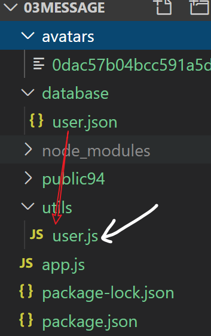

每日反馈

| 姓名   | 意见或建议                                                   |
| ------ | ------------------------------------------------------------ |
| ***    | 知识量有点大，脑子不够用了，怎么办。`自已总结一下，不是所有都要背下来` |
| 秦李天 | 老师，您能在用一个知识点，属性，方法以前，先讲一下它咋用或者是怎末产生的吗？是实话我这两天的课听的有点差劲，我感觉班上不是我一个人这样的状态。`能不能具体一点` |
| 王际霖 | 核心模块 的 一些方法 记得 还是有些 混乱 望高人 出谋划策      |

整体复习一下


nodejs

- 当服务器：让你的网页能够被其他人访问。
- 写接口：让ajax的请求到这里来。


get不带参数


## 请求与响应


一个典型的请求与响应：


## nodejs设置响应 行头体

```javascript
const http = require('http')

const server = http.createServer((req,res)=>{
    // 响应行： HTTP/1.1 状态码 状态码的说明
    res.statusCode = 404;

    // 响应头：
    // 理解成一个对象，其中有很多键值对，每一个都表示不同的含义。
    // content-type:告诉浏览器，本次响应体中的内容是html,并且是utf8编码的
    res.setHeader("content-type","text/html;charset=utf8")
    
    // 响应体:给请求带回去的核心内容。
    // 设置响应体  res.end("响应体")
    res.end("<h1>大家好</h1>")
})

//  第一个参数是端口号.可以自已定义
//  第二个参数是一个回调，表示当前端口监听成功时，它会执行
server.listen(8080,()=>{
    console.log("服务器已经启动");
})
```


## ajax设置请求 行头体

```javascript
var xhr = new XMLHttpRequest(); 
// xhr.open: 请求的url地址，就是请求行的一部分
xhr.open("post","http://localhost:8080/getapi");
// 设置请求头
xhr.setRequestHeader("content-type","application/x-www-form-urlencoded")

// 设置请求体
// 请求体用来包含本次请求要传递给后端服务器的数据。
xhr.send("a=1&b=2")
```

## express框架 初体验

- 它是基于nodejs的第三方模块
- 要使用npm 来安装
- 它是对http模块的增强

```javascript
// 引入 第三方模块 
const express = require('express')

// 创建express实例
const server = express()

// req,res和http模块中的一样
// 只是，express框架增强它们的功能
// res.send() 就是express 给res提供的新方法
//  相比res.end()它可以直接传入对象，并自动设置响应头。

// 如果有请求 '/' 路径，则执行后面的回调函数。
server.get('/', (req, res) => {
    // req对象中保存本次请求的所有信息
    console.log('有人访问了',req.url)
    res.end('Hello World!')
    // res.end({"a":1})
    // res.send({"a":1})
})

// 如果有请求 '/abc' 路径，则执行后面的回调函数。
server.get('/abc', (req, res) => {
    // req对象中保存本次请求的所有信息
    console.log('有人访问了',req.url)
    // res.end('Hello World!')
    // res.end({"a":1})
    res.send({"a":1})
})

// 开启服务，监听端口 300
// 服务器启动成功，则输出
server.listen(3000, () => console.log('Example app listening on port 3000!'))

```


## 托管静态资源

目标：让指定文件夹下的所有文件都可以直接访问

格式：

```javascript
// 不需要加前缀： localhost:8080/xxx.html
server.use( express.static("pyg") )

// 需要加前缀： localhost:8080/pyg/xxx.html
server.use('/pyg', express.static("pyg") )
```

示例

```jav
const express = require('express')

// 创建一个express实例
const server = express();

// 就这一句，就可以实现 访问静态资源
// express.static("要托管的文件夹")
// 在这个文件夹下的所有的静态资源都可以直接访问
// server.use( express.static("pyg") )
server.use("/pyg", express.static("pyg") )

// 让web02目录下的文件也可以直接访问
server.use( express.static("web02") )


server.listen(8080,()=>{
    console.log("express服务器已经在8080端口，准备好了");
    
})

```


## 路由

作用：决定 当以什么方式收到什么路径的请求时，做什么事。

格式：

```javascript
 app.请求方式（"请求路径",(req,res)=>{
     // req就是本次请求对象
     // res就是本次响应对象
     
 }）
```

写接口

```javascript
// 路由： 请求的方式是get,请求的路径是 /abc, 回调函数是(req,res)=>{}
app1.get("/abc",(req,res)=>{
    res.send("ok")  
})


app1.post("/abc",(req,res)=>{
    // res.send("post-abc")  
    res.send({code:200,data:[1,2,3]})  
})
```


## get接口带参数

express框架已经把url地址中的查询字符串自动转成了对象并附加在req对象上：

`req.query`

```
app1.get('/api/getdata',(req,res)=>{
    // req.query自动会保存在url地址栏中查询字符串，
    // 直接给转好对象
   
    console.log(req.query);
    // res.end()一样。结束请求，并返回响应体
    // res.send(req.query)
    
    // res.json() 与res.send()相同，都可以直接返回一个对象。
    res.json(req.query)
})
```


## post接口带参数-参数是 普通键值对

两步：

- 使用body-parser
- 直接在req.body上获取参数。

```javascript
const bodyParser = require('body-parser');

const app1 = express();
//  使用包
app1.use(bodyParser.urlencoded({extended:false}));
// 使用包之后，它会自动地把请求体中的参数解析成对象，并且
// 附加在req对象上的body属性中

app1.post("/api/post",(req,res)=>{
    // 如何获取传过来的参数？
    // 需要两步：
    // 1.引入bodyparser
    // 2.在req.body上获取参数
    console.log(req.body);
    
    res.json(req.body)  
})
```


## post接口带参数-参数是 JSON

如果你要传递数据比较复杂，不能用普通的键值对格式，只能传一个复杂对象。此时，后端的接口

要以`bodyParser.json()`来接收。

步骤:

- app1.use(bodyParser.json())
- 在某个接口的内部，直接通过req.body来获取传入的参数


## post接口带参数-参数是 formData

涉及文件上传

额外使用第三方包：multer

- 安装 npm install multer

- 使用

  -  const multer = require('multer');

    // 配置
    const upload = multer({dest:'uploads/'}) 

  - app1.post("/api/upload",**upload.single**("avatar"),(req,res)=>{})

  

```javascript
const multer = require('multer');

//  配置
const upload = multer({dest:'uploads/'}) 
// upload.single("cover")  处理单个文件上传。
// 文件所在的参数是 cover
// 把cover属性对应的文件保存在 upload对象所设置的目录中
// 同时，把当前这个文件的信息保存在req.file属性中。
app1.post("/api/upload",upload.single("avatar"),(req,res)=>{

    // 当前这个文件的信息保存在req.file属性中。
    console.log(req.file);

    // req.body 保存那些个不是文件的参数信息
    console.log(req.body);
    
    res.send("ok")
})
```


## 用express重写留言板

### 建立基本项目结构

### 静态资源托管

把留言板的页面（.html,css,js...)拷贝到某一个文件夹下。

### 修改reg.html。添加一个头像的字段。


### 在后端准备接口，实现注册功能

// 实现一个接口来做用户注册功能

// 用户在页面上，传递：用户名，密码，头像

// 在后端：

// 1. 把他的头像文件保存起来.

//  放在avatars目录下

// 2. 把用户的信息保存到user.json文件中

//  user.json是我们专门来用来保存用户信息的 临时数据库

约定接口：

名称： /user_add

方式：post

功能：用户注册

参数：

- name：用户
- pwd：密码
- avatar: 头像文件

返回值：

- {code:200 , msg:"注册成功"}
- {code:404 , msg:"失败原因"}


### 实现最基础的接口代码，用postman测试

```javascript
app.post('/user_add',upload.single("avatar"),(req,res)=>{
    console.log(req.file)
    console.log(req.body)

    res.send("ok")
})
```


### 封装一个对user.json进行操作的模块

把这个模块封装好之后，在app.js中引入，在接口中去使用这个模块，完成向user.json中添加用户的功能。

#### get 方法



```javascript
// 目标：写一个模块来对 database/user.json进行操作
const fs = require("fs")
const path = require("path")

// 找到要操作的user.json的路径
const FILE_PATH = path.join(__dirname,"../database/user.json")
// console.log(FILE_PATH);

// 获取
const get = ()=>{
    // 1. 读出user.json文件中的内容
    let fileStr = fs.readFileSync(FILE_PATH, 'utf8');
    // console.log(fileStr);
    
    // 2. 转成json对象
    let arr = JSON.parse( fileStr )
    // 3. 返回
    return arr
}

// 测试
var result = get()
console.log(result);

// 添加

```


#### add方法

实现一个用来添加用户数据的add方法

```javascript

/***
 * 添加
 * name: 用户名
 * pwd: 密码
 * avatarUrl: 头像地址
 */
const add = (name,pwd,avatarUrl) => {
    // 1. 获取数据，数组格式
    let arr = get();
    // 2. 向数组中添加一个对象
    // 原数组的最后一个元素的id+1
    let id = arr.length ? arr[arr.length - 1].id + 1 : 1 
    arr.push({
        id,
        name,
        pwd,
        avatarUrl
    })
    // 3. 写回去user.json文件
    fs.writeFileSync(FILE_PATH, JSON.stringify(arr))

    // 4. 返回新数据
    return arr;
}
```


### 完成接口功能

在app.js中引入user.js，调用它的add方法

```javascript
const express = require('express')

// 引入自定义模块
const user = require('./utils/user')

const multer = require('multer')
//  配置
const upload = multer({dest:'avatars/'}) 
const app = express()
// 托管静态资源
app.use(express.static("public94"))

// 实现一个接口来做用户注册功能
// 用户在页面上，传递：用户名，密码，头像
// 在后端：
// 1. 把他的头像文件保存起来.
//    放在avatars目录下
// 2. 把用户的信息保存到user.json文件中
//    user.json是我们专门来用来保存用户信息的 临时数据库


app.post('/user_add',upload.single("avatar"),(req,res)=>{
    // console.log(req.file)
    // console.log(req.body)
    let {name, pwd} = req.body;
    let avatarUrl = req.file.path;

    //调用自定义模块，实现添加方法
    user.add(name,pwd,avatarUrl)

    res.send({
        code: 200,
        msg: "用户注册成功"
    })
})
app.listen(8084,()=>{
    console.log("服务器启动了 8084");
    
})
```


### 前端页面ajax发请求

```html
<!DOCTYPE html>
<html lang="en">
  <head>
    <!-- Required meta tags -->
    <meta charset="utf-8" />
    <meta name="viewport" content="width=device-width, initial-scale=1, shrink-to-fit=no" />

    <!-- Bootstrap CSS -->
    <link rel="stylesheet" href="./assets/bootstrap.css" />
    <style>
      .login {
        width: 400px;
        margin: 50px auto;
      }
    </style>
    <title>留言板-用户注册</title>
  </head>
  <body>
    <div class="container">
      <div class="login shadow-sm p-5">
        <h3>留言板-用户注册</h3>
        <div class="form-group ">
          <label for="username">昵称</label>
          <input type="text" class="form-control" id="username" placeholder="昵称" />
        </div>
        <div class="form-group">
          <label for="password">Password</label>
          <input type="password" class="form-control" id="password" placeholder="Password" />
        </div>
        <div class="form-group ">
          <label for="useravatar">头像</label>
          <input type="file" class="form-control" id="useravatar"/>
        </div>
        <div>
          <button class="btn" id="btn" type="button">注册</button>
        </div>
        <div class="text-right"><a href="./login.html">登陆</a> <a href="./index.html">主页</a></div>
      </div>
    </div>
    <script src="./jquery-1.8.1.js"></script>
    <!-- <script src="./config.js"></script> -->
    <script>
      $('#btn').click(function() {
        // 获取用户名和密码
        let name = $('#username').val().trim()
        let pwd = $('#password').val().trim()
        // 获取input框中用户选中的文件
        //   用户选中的文件都保存在input框的files属性中
        let input = document.getElementById("useravatar");
        //files[0] 用户选中第一个文件
        let avatar = input.files[0]
        console.log(name,pwd,avatar);
        
        // 判断是否为空
        if(name === '' || pwd === ''){
          alert('不能为空')
          return
        }
        // 构造一个空的formData对象
        var fd = new FormData();
        // 追加三个参数
        fd.append("name",name);
        fd.append("pwd",pwd)
        fd.append("avatar", avatar)

        $.ajax({
          url: 'http://localhost:8084/user_add',
          type:"post",
          data: fd,
          contentType:false,
          processData:false
        }).then(res=>{
          console.log(res);
          
        })

      });
    </script>
  </body>
</html>

```


## 小结

express框架

- 静态资源托管
  - app.use(express.static('public94'))
- 用路由写接口
  - app.get('/ 地址 ',(req,res)=>{})
    - 用req.query来取参数
  - app.post('/地址',(req,res)=>{})
    - 请求体的参数有三种不同格式，由本次请求的content-type决定
      - application/x-www-form-urlencoded  普通键值对。 **bodyparser**
      - appllcation/json;   json 。**bodyparser**
      - multipart/form-data;    formData: **multer**

