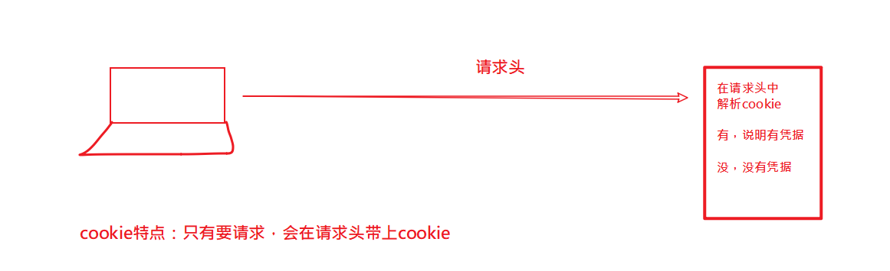
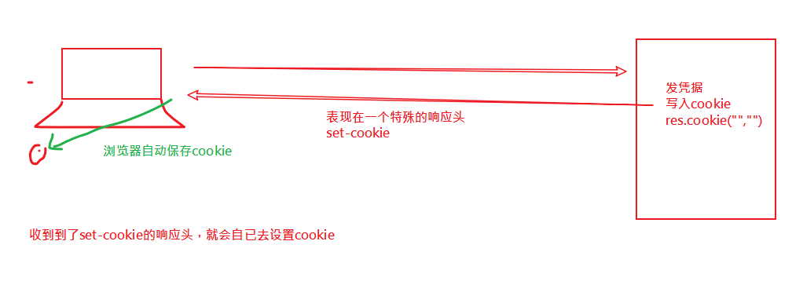
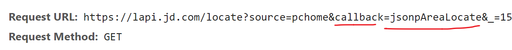

## 每日反馈

| 姓名 | 意见或建议                                                   |
| ---- | ------------------------------------------------------------ |
| ***  | 老师，你在电脑上操作的时候慢一点，因为直播，看着太快了。反应不过来。 |
| ***  | 老师能不能再说一下 用express 时 Post请求要怎么配置 上传文件时要怎么配置 代码里面分开写了 有点弄不清 |
| ***  | 您讲的知识太多也太快，真的消化不良了。 有些新知识刚讲一下就立刻使用，用完就继续学习新的知识然后再使用，反反复复，最后还得把今天甚至这几天学的新知识都结合起来做一下案例实操，原谅我实在做不到啊。 有时感觉像是坐在电脑前监督你给我们录视频一样，现在班里有基础的同学跟零基础的小白听起课来完全是两个世界了。 一天全部都是讲课，等一天课程结束，到晚上，自己打开电脑都不知道从哪儿开始，该做什么，是看讲义、视频、还是怎么样？完全无所适从。`1.思维导图 2.讲义快速过一遍。3.写代码。3.1看我给你们的代码，写注释。每一句代码做什么事；3.2  2倍速度，发视频，对着写。自已再写一次：边写边看。 3.3独立完成。` |
| ***  | 感觉自己就是欠练，唉                                         |


post接口 普通键值对

```javascript
const bodyParser = require('body-parser');
app1.use(bodyParser.urlencoded({extended:false}));
// 实现一个接口： post 
// url: /api/post,支持传入任何参数普通键值对
// 返回值：收到的参数

app1.post("/api/post",(req,res)=>{
    // 如何获取传过来的参数？
    // 需要两步：
    // 1.引入bodyparser
    // 2.在req.body上获取参数
    console.log(req.body);
    

    // res.send("post-abc")  
    res.send(req.body)  
})
```


post接口 JSON

```javascript
const bodyParser = require('body-parser');
app1.use(bodyParser.json())
app1.post("/api/postJSON",(req,res)=>{
    // 如何获取传过来的参数？
    // 需要两步：
    // 1.引入bodyparser
    // 2.在req.body上获取参数
    console.log(req.body);
    

    // res.send("post-abc")  
    res.send(req.body)  
})
```


post formdata

```javascript
// 1. 引入
// multer用来处理文件上传的接口(发布文章：封面图像,标题....)
const multer = require('multer');

// 2. 配置
const upload = multer({dest:'uploads/'}) // 
// 自动放到这个文件夹中，如果文件没有创建，则multer自动创建。

app1.post("/api/upload",upload.single("cover"),(req,res)=>{

    // 当前这个文件的信息保存在req.file属性中。
    console.log(req.file);

    // req.body 保存那些个不是文件的参数信息
    console.log(req.body);
    
    res.send("ok")
})
```


## 会话

> 服务器问你的身份？ 你是谁？
>
> 思路：
>
> 1. 访问一个登陆页，成功之后，服务器给一个**凭据**保存到浏览器 。 （前台交钱，给你卡）
> 2. 浏览器拿着这个**凭据**去访问主页。（拿卡找tony老师）
> 3. 主页收到请求之后，检查**凭据**。（tony老师检查）


实现会话技术

- cookie（了解）

- session（推荐）


## cookie

服务器向浏览器上写入的凭据，这个凭据表现为cookie。

一旦浏览器中有这个凭据(cookie)，则下一次请求**本网站**上的页面时，会**自动**带上：具体是在一个叫cookie的请求头中。


写入cookie(服务器向浏览器写入cookie)

​	核心是设置一个名字为set-cookie的响应头；

获取cookie（服务器获取本次请求的cookie）

	- req.headers.cookie 。但它不好看，是一长长的字符串，需要进一步解析
	- 额外安装包：cookie-parser

删除cookie

​	res.clearCookie('cookie名')

设置有效期：

​	// 给cookie设置有效期。

   // 如果超过了这个时间，则cookie会自动爆炸（自已消失）

   // expires: 日期格式。

   // new Date(Date.now() + 1000*10) 表示10s之后的时间

 ```javascript
res.cookie('salary', '20000', { expires: new Date(Date.now() + 1000*10) })
 ```


## cookie身份验证






## session

是基于cookie的。它与cookie的区别在于：

- 它不是把真实凭证信息放在浏览器，而只是放了一把钥匙（cookie就是钥匙），真实数据放在服务器。
- 收到请求，解析出来钥匙(cookie),再用钥匙去服务器中找出数据。


## 实践

1. 安装express ,express-session

2. 配置

   固定写法，在官网上参考

3. 使用
   1. 设置session 。 req.session.属性名 = 属性值；
   2. 获取session。  req.session.属性名
   3. 销毁session。req.session.destory()

## session vs cookie

cookie原理：

- 从服务器端向客户端浏览器留下信息`设置响应头：set-cookie`；
- 浏览器每次访问服务器时都带上这些信息(自动携带cookie是浏览器的特点)；

session原理：

- 服务器端会为每个用户（浏览器）各自保存一个session（文件）。当服务器保存session之后，会以cookie的形式告诉浏览器，你的session编号是哪一个。它把session编号返回给了浏览器(cookie是session编号)，而把真实的数据保存在服务器。
- 下次再来访问服务器的时候，浏览器就会带着它自己的session编号（cookie）去访问，服务器根据session号就可以找到对应的session了。

cookie：优点是节省服务器空间，缺点不安全。不要保存敏感信息。

session：优点是安全，缺点需要服务器空间， 是一种最常见的解决方案。


## session实践 - 带登陆功能的留言板

目标：

- 只有登陆用户才能发表留言。

思路：

- 提供一个登陆页面及后端接口，在登陆功能之后，发凭证（设置session）
- 在进入主页时，先去获取当前用户信息：检查是否登陆，如果成功，则允许发表留言，否则就只能是查看留言。

有两个接口

- /user_login : 实现登陆功能
- /get_user: 获取当前用户信息（检查是否登陆）


### 写接口，完成登陆功能

在app.js中，添加接口

```javascript
// 用户登陆
// 约定:普通键值对传参
// 参数：name, pwd
// 返回值：
//  {code:200,msg:'登陆成功'}
//  {code:400,msg:'用户名密码错误'}

app.post('/user_login',(req,res)=>{
    // 1. 获取通过post传过来的用户参数：name,pwd
    let {name,pwd} = req.body; 
    // console.log(name,pwd)
    // 2. 读出user.json中的内容，判断，当前的用户参数
    //    是否在user.json中已经存在
    let allUsers = user.get(); 
    // 检查在allUsers中是否有一个人叫name,并且密码是pwd
    // find方法：如果找到了符合条件的元素就返回元素，否则就是undefined
    let curUser = allUsers.find(function(item){
        console.log(item)
        if(item.name === name && item.pwd ===pwd ){
            return true
        }
    })
    // 3. 返回值
    // 如果找到了这个人，就说明它的信息是对的
    if(curUser) {
        res.send( {
            code:200,
            msg:"登陆成功",
            data:curUser 
        })
    } else {
        res.send( {
            code:400,
            msg:"登陆失败"
        })
    }
})
```

用postman测试。

### 在页面中来用ajax进行测试

login.html

```javascript
<script>
      $('#btn').click(function() {
        // 获取用户名和密码
        let name = $('#username').val().trim()
        let pwd = $('#password').val().trim()

        // 判断是否为空
        if(name === '' || pwd === ''){
          alert('不能为空')
          return
        }
        // 请求
        $.post("http://localhost:8084/user_login",{
          name,
          pwd
        }).then(res=>{
          if(res.code === 200){
            alert("登陆成功")
          } else {
            alert("登陆失败")
          }
          
        })
        
      });
    </script>
```


### 通过session发凭证

1. 安装express-session

2. 配置

   固定写法，在官网上参考

3. 使用.在登陆成功时，设置session。

```javascript

app.post('/user_login',(req,res)=>{
    // ..........
    // 3. 返回值
    // 如果找到了这个人，就说明它的信息是对的
    if(curUser) {
        // 登陆成功
        // 用通过session 发凭证
        req.session.isLogin = true;
        req.session.name = name
        // 会给浏览器设置cookie,cookie的值就是sessionID
        
        res.send( {
            code:200,
            msg:"登陆成功",
            data:curUser 
        })
    } else {
        res.send( {
            code:400,
            msg:"登陆失败"
        })
    }
})
```


### 准备获取用户信息的接口

在后端再写一个接口 /get_user，它的作用就是获取当前登陆信息（获取session）；

app.js

```javascript
// 检测用户是否登陆
// get
// 原理：就是获取session值。如果获取到，说明登陆成功。
app.get('/get_user',(req,res)=>{
    // 当请求进来之后，就去检查它是否带了sessionID
    // get_user，它的作用就是获取当前登陆信息
    // （获取session）
    let name = req.session.name;
    let isLogin = req.session.isLogin;
    if(isLogin){
        // 说明它已经登陆了
        let result = {
            code:200,
            data:{
                "name":name
            }
        }
        res.send(result)
    } else {
        res.send({code:400,msg:"没有登陆"})
    }
})
```


### 在用户进入主页时就去调用一次/get_user

进入index.html，请求一次get_user接口。根据返回的信息来修改页面上的dom

```javascript
// 进入主页；请求get_user接口，用来检查当前是登陆 

$.get("http://localhost:8084/get_user").then(res=>{
    console.log(res);
    if(res.code == 200){
        // 当前是已经登陆的
        // 显示留言区域，隐藏登陆区域
        $("#linkArea").hide()
        $("#formArea").show()
        // 显示当前用户名
        $("#label_name").text( res.data.name)
        // 可以发布留言
    } else {
        // 说明没有登陆
        $("#linkArea").show()
        $("#formArea").hide()
    }
})
```

dom结构

```html
<div class="container">
      
    <hr />
    <!-- 没有登陆 -->
    <div id="linkArea">
        <a href="./login.html">请登陆</a>
    </div>

    <!-- 已经登陆 -->
    <form id="formArea" style="display: block;">
        <div class="form-group">
            <label for="txt_name">称呼：</label>
            <label id="label_name">***</label>
        </div>
        <div class="form-group" style="display: flex">
            <label for="txt_content" style="display:none">留言：</label>
            <input type="text" id="txt_content" class="form-control">

            <button id="btn_send" type="button" class="btn btn-primary">提交</button>
        </div>
    </form>
</div>
```

### 退出

只有是登陆用户才能退出。

退出就是调用接口，删除session。

补充一个/quit的接口，用来删除session。

步骤：

1. 后端补充接口。

   app.js

   ```javascript
   // 退出就是删除session
   app.get('/quit',(req,res)=>{
       req.session.destroy();
       res.send({code:200,msg:"退出成功"})
   })
   ```

   

2. 前端页面中调用

   添加退出按钮

   ```html
   <form id="formArea" style="display: block;">
       <div class="form-group">
           <label for="txt_name">称呼：</label>
           <label id="label_name">***</label>
           <button type="button" id="btnQuit">退出</button>
       </div>
       <div class="form-group" style="display: flex">
           <label for="txt_content" style="display:none">留言：</label>
           <input type="text" id="txt_content" class="form-control">
   
           <button id="btn_send" type="button" class="btn btn-primary">提交</button>
       </div>
   </form>
   
   
   ```

   

退出的点击事件

```javascript
// 退出
$("#btnQuit").click(()=>{
    $.get("http://localhost:8084/quit").then(res=>{
        if(res.code == 200){
            // 退出成功，跳到login页面
            window.location.href= "./login.html"
        }
    })
})
```


## 跨域错误

不同源的ajax请求，会导致跨域错误。

>  发出ajax请求的那个页面的地址  和    ajax接口请求的地址   要是同源才不会报错

同源：

- 协议
- 域名
- 端口


> 实践中，我们经常 会页面和nodejs的接口的代码 放在不同的服务器上，这样的话，一定会出
>
> 现跨域的情况。


## jsonp 解决方案

在jquery中

前端步骤：

​	在原生的$.ajax()中添加一个dataType:"jsonp"


在express框架

后端步骤：

​	把原来的res.json() 改成 res.jsonp()


## jsonp原理

- 创建一个script标签，它的src指向后端服务器接口。
- 后端接口的返回值是  `fn(数据)`格式的字符串
- 在前端额外定义一个函数fn（res）。


前端

```javascript
<!-- script： src指向后端接口地址 
      它会发出这个请求，这个请求不是ajax请求
      这个请求是跨域的，为什么不报错？ 因为它不是ajax所以它不会报错。
      它会正常取回 后端接口的返回值 ，并放在<script>中去执行</script>
    -->
    <script>
      // 因为后传过的是fn(100)，这里提前放一个fn
      function fn(res){
        console.log("从服务器返回的数据是：",res);
      }
    </script>
    <script src="http://localhost:8080/getapi8080">
    
    
    </script>
```

后端

```javascript
app.get("/getapi8080",(req,res)=>{
    // res.json({
    //     code:200
    // })
    var obj = {a:1,b:2,c:[1,2,3]}
    // res.send("fn({a:1,b:2})")
    res.send("fn("+ JSON.stringify(obj) + ")")
    // res.json({
    //     code:200
    // })
})
```


## jsonp 原理-优化

前端自已约定回调函数的名字是什么。

解决方案是：传一个参数过去。

```javascript
<!-- ?callback=fn 传递参数给后端：告诉后端，请把回来的函数名用 fn -->
    <script src="http://localhost:8080/getapi8080?callback=fn">
```

后端代码修改：

```javascript
app.get("/getapi8080",(req,res)=>{
    // res.json({
    //     code:200
    // })
    let {callback} =  req.query;
    // 前端希望这个函数叫什么名字
    console.log(callback);
    
    var obj = {a:1,b:2,c:[1,2,3]}
    // res.send("fn({a:1,b:2})")
    res.send(`${callback}(`+ JSON.stringify(obj) + ")")
    // res.json({
    //     code:200
    // })
})
```

## 小结

JSONP是一个比较成熟的方案，由于它不是ajax请求，所以完全不会有跨域错误。



注意：

- 它只能是发get请求。`<script src="http://localhost:8080/getapi8080?callback=fn"></script>`
- 在实践中
  - jquery中，只需要添加一句dataType:"jsonp"。
  - 在express中，只需要res.jsonp()