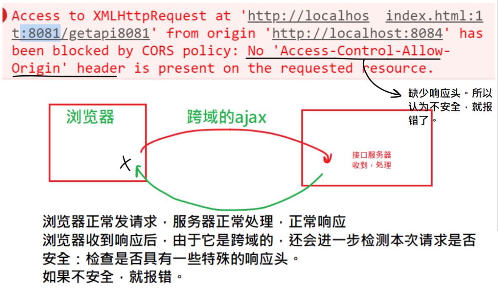
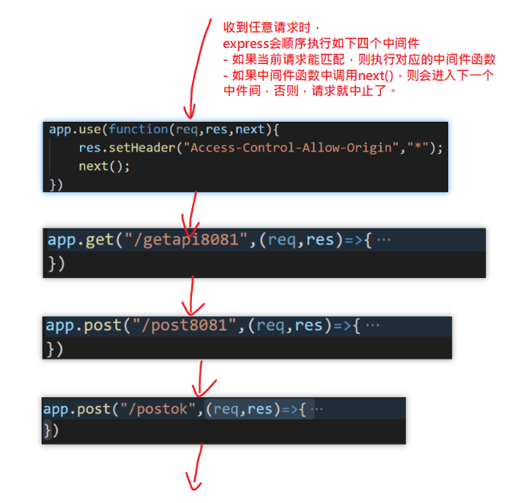
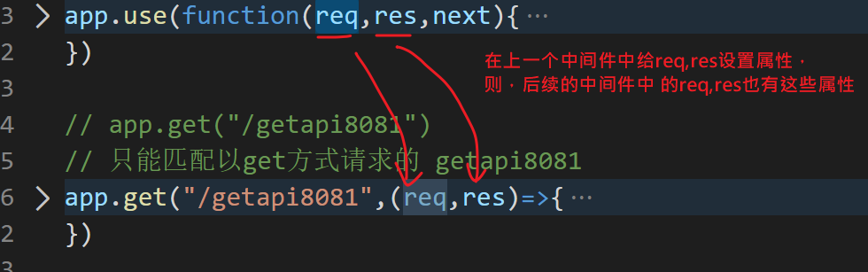
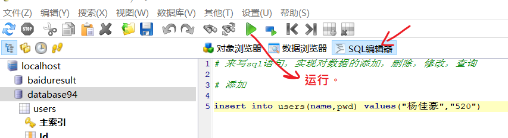
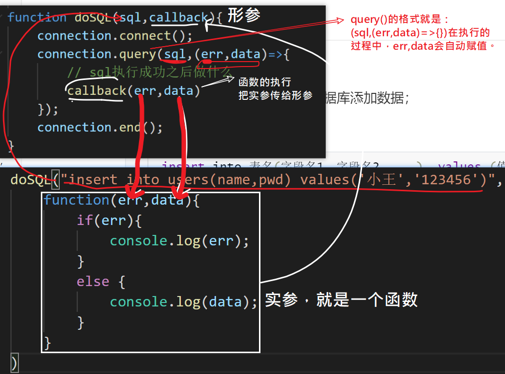
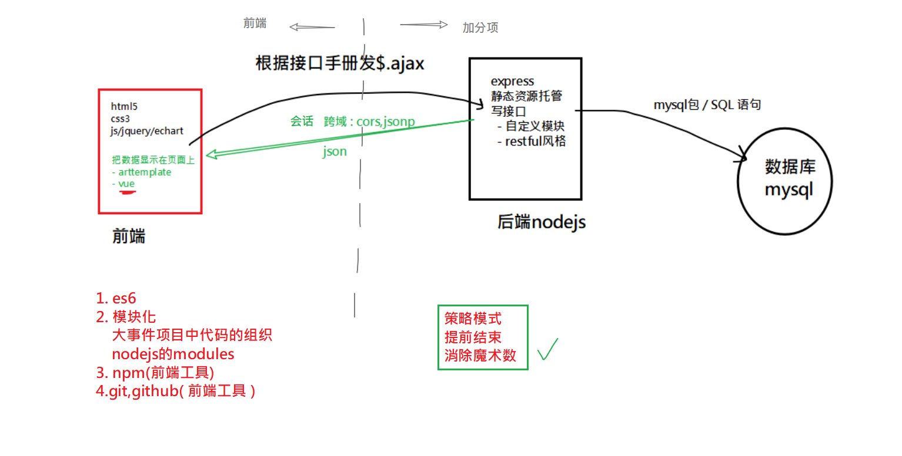

## 反馈

| 姓名 | 意见或建议                                                   |
| ---- | ------------------------------------------------------------ |
| ***  | session包里面的req.session.isLogin = true;是固定写法吗? `不是。 req.session是一个对象，我们可以向其中添加任何属性及属性值。这个过程就是设置session，理论上，你可以按你自已的需求给req.session设置任意多个你想要保存在服务器端的数据{isLogin:true}，而它也只会把sesssionId(钥匙)通过cookie写回给浏览器。` |
| ***  | Node.js阶段 没什么大问题 就是多敲多练的活 但是！我们是作什么的 还是要分清 "主次" 呦 不要太沉迷Node。js( ⓛ ω ⓛ *)`不错，有大局观！` |
| ***  | 可能是最后一次为凡老师写反馈了,感觉老师为我们的学习费了很多心,老师辛苦了,谢谢老师`谢谢，我 好人为师 ` |
| ***  | 老师，万分感谢~~~~~ 疫情后，再相逢，请你吃大龙虾~~~          |
| ***  | 对jsonp的原理理解不到位                                      |
| ***  | 感觉练习的时候不够啊`时间 与 效率 成反比`                    |
| ***  | 非常想问您问题，可是又不知道能问什么，知识点模模糊糊的， 说不会吧，也会，说会吧，又不太清楚，怎么破？`写。 写代码。 session留言板，写一遍，遇到问题再问！` |
| ***  | 基础不好 请老师推荐案例和重要知识点对以后找工作或实际工作有帮助的 像nodejs这种是不是不要把重心放在这上面 毕竟是前端 谢谢`nodejs要掌握：1.它是其它后续学习 vue框架的 工具基础。后续要学习内容都是基于nodejs的。2.会用它写接口 （未雨绸缪） 3.服务器的基础概念：ip,端口，session,跨域....` |
| ***  | 下午第一节课多提问一下吧 感觉容易犯困 最后一节课多总结一下呗 注释能多写点还是多写点吧 这么辛苦什么时候给老师加薪呀 |
| ***  | 加油＾０＾~                                                  |

## 复习jsonp

为解决ajax跨域。不同源就是跨域。同源是： 发起ajax的页面的地址 与 接口地址 要在： 协议，域名，端口要相同。

jsonp不是ajax请求，所以，它不会有ajax跨域问题。

原理：

- 前端 
  - script标签，请求 接口地址。它会把收到的响应体当作js代码来执行。
  - 准备一个回调函数。例如:`fn()`
- 后端
  - 在接口的响应体中，返回一个 标准的js 函数调用语句 ，例如：`res.send('fn(12345)')`

实践：

- jquery的实现 

  ​	`dataType:"jsonp"`

  ```javascript
  $("#btnGet8080").click(function(){
      // 跨域的
      $.ajax({
          url:"http://localhost:8080/getapi8080",
          type:'get',
          dataType:"jsonp" /*以jsonp的方式去请求*/
      }).then(function(res){
  
      })
  
  })
  ```

  

## cors

跨域真正错误：缺少需要的响应头!

跨域ajax，浏览器可以正常发出请求，服务器可以正常收到请求，并做出响应；但在浏览器收到服务器的响应后，由于它是跨域的，所以要进一步检查这个请求是否安全：就是看有没有特殊的响应头`access-control-allow-origin`，如果没有，就会解析响应回来的内容，并报错。



解决方案，就是在服务端做出响应时，补充一个特殊的**响应头**。

```javascript
app.get("/getapi8081",(req,res)=>{
	
    // 设置响应头
    res.setHeader("Access-Control-Allow-Origin","*");

    console.log('收到请求')
    res.json({
        code:200
    })
})
```


## cors与jsonp对比

- cors
  - 可以处理所有的请求类型：get,post,..... ; 
  - 它有浏览器的限制；
  - 它只要改后端代码(加响应头)，**前端不做任何改动**。

- jsonp
  - 只能处理get；          
  - 没有浏览器的限制；
  - 要改后端代码(res.jsonp)，前端要改(dataType:"jsonp")。


## express中的中间件技术

中间件技术是express框架的一个重要的特点。

它的思路是：把一个一个处理流程抽出来， 写在函数中，形成一个串，依次执行流程。


中间件的格式是：

```javascript
app.use(中间件)
// 接口本质也是中间件
app.get("/xx",中间件)
app.post("/xx",中间件)
```



app.use(function(req,res,next){

  console.log("看门大哥",req.url);

  req.abc= "10086"

  // 所有后续的中间件中的res就具有这个特殊的响应头

  res.setHeader("Access-Control-Allow-Origin","*");

  next();

  // 如果一个中间件函数中，

  // 既没有next()，： 跳出当前中间件，执行下一个中间件

  // 也没有res.end(),res.send(),res.json()

  // 整体请求就得不到响应，浏览器一直处于等待状态。

})的执行顺序

- 按书写顺序，从上到下

- 遇到中间件，匹配一下。

  - app.use() 全匹配。只要有请求，它就能匹配
  - app.get('/xxxx') 。只能匹配get方式求的/xxxx路径。

- 匹配成功要执行中间件函数

  - 遇到了next() ，则跳了当前中间件，进入下一个中间件
  - 遇到了res.end(),res.send(),res.json() 结束本次请求。后续中间件不执行
  - 如果上面两都没有，则整个请求就卡这个中间件中，浏览器就一直处于pending

  

## 中间件中req,res,具有向后的传递性

- 中间件的req,res是向后共享的：上面的中间件设置了，下面的中间件就可以使用




## cors方案的优化

用中间件技术，在所有的接口之前，添加一个app.use()中间件

```javascript
app.use(function(req,res,next){
    // 所有后续的中间件中的res就具有这个特殊的响应头
    res.setHeader("Access-Control-Allow-Origin","*");
    next();
    // 如果一个中间件函数中，
    // 既没有next()，： 跳出当前中间件，执行下一个中间件
    // 也没有res.end(),res.send(),res.json()
    // 整体请求就得不到响应，浏览器一直处于等待状态。
})
```


## sql-添加数据


它的作用通过`sql`语言向mysql数据库添加数据；

格式: 

```SPARQL
 insert into 表名(字段名1，字段名2,....)  values (值1，值2，....)
```

 注意: 

- 字段的顺序要和值的顺序是完全匹配的
- 字段列表可以不与真实数据表中的字段完全相等，
  - 可以省略一些不必要的字段
  - 顺序与不需要与定义表时的顺序一致
- 如果是字符串类型的字段，其值要加""，如果是数值类型的字符串，其值不需要加“”


## sql-查询

作用：是把数据从数据库查出来

格式: 

```
SELECT  字段名1, 字段名2, .....  FROM 表名	WHERE <条件表达式>
```

示例：

```javascript
# 查询 姓名是杨佳豪， 密码是520 的数据
# 它可以用来实现 用户登陆 确认的功能： 
# 如果这个查询能查到值，说明这个用户是已经存在的
# 如果这个查询查不到，说明用户名，密码是不对的。

select id,name,pwd from users where name="杨佳豪" and pwd="520"
```


## sql-删除

格式: 

```
 delete  from 表名  where 删除条件
```

注意：

- **不指定条件将删除所有数据**

示例：

```javascript
# 删除 

# delete from users 
delete from users where name="杨佳豪"
```


## sql-修改

格式:  

 ```
update 表名 set 字段1=值1, 字段2=值2,...  where 修改条件
 ```

注意：

	- 要修改的值使用键值对来表示 
	- 多个字段用,分隔
	- 不指定条件，将修改当前表中全部的记录

示例

```javascript
# 修改
# 把杨佳豪 的密码改成123456
update users set pwd="888",name="小豪豪" where name="杨佳豪"
```


## 在这个sql语句在哪里运行？




## 在nodejs中写代码连接mysql服务器

步骤：

1. 初始化项目

2. 安装mysql包 `npm i mysql`

3. 写代码如下:

   ```javascript
   //01.js
   // 1. 引入包
   var mysql      = require('mysql');
   
   // 2.配置
   var connection = mysql.createConnection({
     host     : 'localhost', // 你要连接的数据库服务器的地址
     user     : 'root',     // 连接数据库服务器需要的用户名
     password : 'root',     // 连接数据库服务器需要的密码
     database : 'database'     //你要连接的数据库的名字
   });
   
   // var connection = mysql.createConnection({
   //     host     : 'bdm289537170.my3w.com',   // 你要连接的数据库服务器的地址
   //     user     : 'bdm289537170',        // 连接数据库服务器需要的用户名
   //     password : 'ABCabc123',        // 连接数据库服务器需要的密码
   //     database : 'bdm289537170_db'      //你要连接的数据库的名字
   //   });
    
   // 3. 连接
   connection.connect();
    
   // 4. 执行sql
   connection.query('SELECT 1 + 1 AS solution', function (error, results, fields) {
     if (error) throw error;
     console.log('The solution is: ', results[0].solution);
   });
    
   // 5.关闭
   connection.end();
   ```

   

4. 运行代码 `node 01.js`

如果不报错，则说明你与服务器的连接是ok的。


## nodejs操作mysql的封装



```javascript
// 由于四个操作：
// 添加
// 删除
// 修改
// 查询
// 在代码上，只是sql语言不一样，其它都是一样的，
// 所以，我们打算封装一个模块： 输入sql,得到结果

var mysql      = require('mysql');

// 2.配置
var connection = mysql.createConnection({
  host     : 'localhost', // 你要连接的数据库服务器的地址
  user     : 'root',     // 连接数据库服务器需要的用户名
  password : 'root',     // 连接数据库服务器需要的密码
  database : 'database94'     //你要连接的数据库的名字
});

/**
 * 
 * @param {*} sql  要执行的sql语句
 * @param {*} callback  执行sql之后的回调
 */
function doSQL(sql,callback){
    connection.connect();
    connection.query(sql,(err,data)=>{
        // sql执行成功之后做什么
        callback(err,data)
    });
    connection.end();
}

//---------------------对doSQL函数的测试-------------------

// doSQL("select id,name from users",function(err,data){
//     if(err){
//         console.log(err);
//     }
//     else {
//         console.log(data);  
//     }
// })

// doSQL("insert into users(name,pwd) values('小王','123456')",
//     function(err,data){
//         if(err){
//             console.log(err);
//         }
//         else {
//             console.log(data);  
//         }
//     }
// )

// doSQL('delete from users where name="老王"',function(err,data){
//         if(err){
//             console.log(err);
//         }
//         else {
//             console.log(data);  
//         }
//     }
// )
// 把小王密码改成123
doSQL('update users set pwd="123" where name="小王"',function(err,data){
    if(err){
        console.log(err);
    }
    else {
        console.log(data);  
    }
})

```


## 模块化：导出操作sql的方法

sqlutils.js:自定义模块

```javascript
// 由于四个操作：
// 添加
// 删除
// 修改
// 查询
// 在代码上，只是sql语言不一样，其它都是一样的，
// 所以，我们打算封装一个模块： 输入sql,得到结果

var mysql      = require('mysql');

/**
 * 
 * @param {*} sql  要执行的sql语句
 * @param {*} callback  执行sql之后的回调
 */
function doSQL(sql,callback){
    var connection = mysql.createConnection({
        host     : 'localhost', // 你要连接的数据库服务器的地址
        user     : 'root',     // 连接数据库服务器需要的用户名
        password : 'root',     // 连接数据库服务器需要的密码
        database : 'database94'     //你要连接的数据库的名字
      });
    connection.connect();
    connection.query(sql,(err,data)=>{
        // sql执行成功之后做什么
        callback(err,data)
    });
    // connection.end();
}

// 导出模块
module.exports = {
    doSQL
}
```

index.js,测试自定义模块

```javascript
// index.js
const sqlutils = require('./sqlutil')
console.log(sqlutils);
sqlutils.doSQL("select id,name from users",(err,data)=>{
    if(err) {console.log(err)} 
    else {
        console.log(data)
    }
})
```

`node index.js` 运行测试文件


## 改成留言板项目-登陆用数据库

1. 安装mysql包
2. 引入上面封装自定义模块
3. 补充一个接口来实现通过mysql登陆的功能

app.js

```javascript
// 自定义的模块，用来操作mysql
const sqlutil = require('./utils/sqlutil')


// 用户登陆: 连接mysql数据库来做验证
// 约定:普通键值对传参
// 参数：name, pwd
// 返回值：
//  {code:200,msg:'登陆成功'}
//  {code:400,msg:'用户名密码错误'}


app.post('/user_login_sql',(req,res)=>{
    // 1. 获取通过post传过来的用户参数：name,pwd
    let {name,pwd} = req.body; 
    // 2. 根据 name,pwd去数据库中进行搜索，如果找到这个人
    // 就是登陆成功。
    let sqlStr = `select id,name,pwd from users where name="${name}" and pwd="${pwd}"`
    console.log(sqlStr);
    sqlutil.doSQL(sqlStr,(err,data)=>{
        if(err){
            // 执行sql出错
            res.send( {
                code:500,
                msg:"服务器停止工作了"
            })
        }
        else {
            console.log(data)
            if(data.length > 0) {
                // 登陆成功
                // 用通过session 发凭证
                req.session.isLogin = true;
                req.session.name = name

                // 会给浏览器设置cookie,cookie的值就是sessionID

                res.send( {
                    code:200,
                    msg:"登陆成功"
                })  
            } else {
                res.send( {
                    code:400,
                    msg:"登陆失败"
                })
            }
        }
    } )
})
```

在页面上调用接口时，就用这个新接口。

## 改造留言板项目-注册也用数据库

补充一个新接口

```javascript

app.post('/user_add_sql',upload.single("avatar"),(req,res)=>{
    // console.log(req.file)
    // console.log(req.body)
    let {name, pwd} = req.body;
    let avatarUrl = req.file.path;

    //调用自定义模块，实现添加方法
    // user.add(name,pwd,avatarUrl)
    // 添加一个用户的sql
    let sqlStr = `insert into users(name,pwd) values("${name}","${pwd}")`
    sqlutil.doSQL(sqlStr,(err,data)=>{
        if(err){
            res.send({
                code: 500,
                msg: "服务器开小差了"
            })
        }else {
            // console.log(data)
            if(data.affectedRows === 1){
                res.send({
                    code: 200,
                    msg: "用户注册成功"
                })
            } else {
                res.send({
                    code: 400,
                    msg: "用户注册失败"
                })
            }
        }
    })

    
})
```


## RESTFUL

一种设计接口的方式。

restful接口

- 通过URL设计资源。接口名一般都是名词，不包含动词。
- 请求方法决定资源的操作类型(增加，删除，修改，查询)
  - get : 查询
  - post :增加
  - put: 修改
  - delete: 删除

```javascript

// ---restful接口------

// - 通过URL设计资源。接口名一般都是名词，不包含动词。
// - 请求方法决定资源的操作类型(增加，删除，修改，查询)
// - get : 查询
// - post :增加
// - put: 修改
// - delete: 删除
app.get('/articles',(req,res)=>{
    res.send('获取')
})

app.post('/articles',(req,res)=>{
    res.send('添加')
})

app.delete('/articles',(req,res)=>{
    res.send('删除')
})
app.put('/articles',(req,res)=>{
    res.send('编辑')
})
```


## 总结




