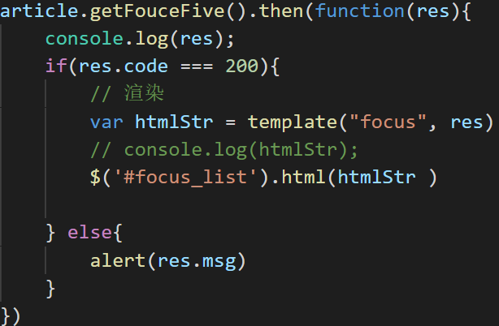
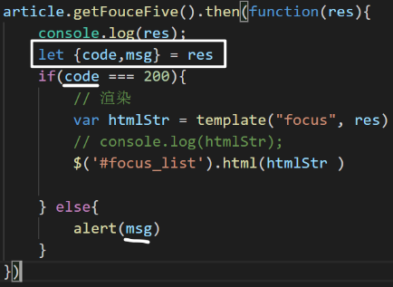

# 解构赋值

ES 6 允许按照一定**模式**，从数组和对象中提取值，对变量进行赋值，这被称为解构（Destructuring）。

它有两个动作：

	- 解构：意思是把有结构的数据分解开成为一个一个的值
	- 赋值：把解构之后的值保存到变量

在js中有一定结构的数据一般是指：

- 数组
- 对象

## 数组解构赋值

它能够快速从数组中取出值保存到变量中。它的本质是给变量赋值。

内容：

- 语法格式及解构规则
- 常规使用:变量个数等于数组长值
- 非常规使用
  - 变量个数大于数组长度
  - 变量个数小于数组长度
- 高级使用
  - 用空跳过不需要的值
  - 剩余值
  - 复杂嵌套场景
- 小面试题

### 引入

```javascript
let arr = [1,2,3,4];
// 需求，快速地从数组中取出值来赋值给变量a,b,c,d
let a = arr[0];
let c = arr[1];
console.log(a,b,c,d)
```


### 语法格式及解构规则

格式

```javascript
let [变量1=默认值1,变量2=默认值2, 变量n=默认值n] = [数组元素1，数组元素2,数组元素n]
```

- 默认值是可选的：可以设置，也可以不设置；

目标： 给左边的数组中的变量赋值。

规则：

- 赋值符号左右两边都是数组，把右边的数组按下标从小到大取出来，放入左边的数组中。
- 如果左边的变量并没有分配到某一个值：
  - 有默认值，使用其默认值。
  - 无默认值，其值是undefined

### 基本示例

```js
//最简单的场景： 变量个数和数组中元素的是相等的
let arr = [5, 9, 10];
let [a, b, c] = arr;
console.log(a, b, c); // 输出 5 9 10
// 等价于：
let a = arr[0];
let b = arr[1];
let c = arr[2];
```

注意：

- ​	“=”左右两边的格式要统一。

### 闯关练习

我们可以通过如下练习来掌握数组的解构赋值。

```javascript
// 变量多，值少
let arr = [5, 9, 10];
let [a, b, c, d] = arr;
console.log(a, b, c, d); 
// 结论：没有匹配上的值是undefined

// 默认值
let arr = [5, 9];
let [a, b, c, d=4] = arr;
console.log(a, b, c, d); 
// 结论：对于没有匹配上的变量，有默认值就使用默认值，否则就是 undefined，

// 变量少，值多
let arr = [5, 9, 10, 8, 3, 2];
let [a, b] = arr;
console.log(a, b); 
// 结论：多余的忽略

// 用空跳过不需要的值
let arr = [5, 9, 10, 8, 3, 2];
let [, , a, , b] = arr; 
console.log(a, b); 
// 结论：不需要用变量接收的值，用空位占位

// 复杂的场景，只要符合模式，即可解构
let arr = ['zhangsan', 18, ['175cm', '65kg']];
// 如何让a的值是175cm,b的值是65kg
console.log(a, b); // 175cm 65kg

```


### 剩余值(三个点)

在解析过程中，把多余的值收集起来放在一个数组中。

```js
let arr = [5, 9, 10, 8, 3, 2];
let [a, b, ...c] = arr; // ...c 接收剩余的其他值，得到的c是一个数组
console.log(a, b, c); 
// 结果：
// a = 5, 
// b = 9, 
// c = [10, 8, 3, 2]
```

注意：

1. ...  只能写在最后一个变量的前面。

2. 这个变量是一个数组。

3. 在解构赋值的过程中：

   - 如果有出现数组元素个数大于变量个数的情况，它将会把多余的参数起来，保存在这个数组；

   - 如果收集不到多余的，它就是一个空数组。

### 一个小面试题

交换两个变量的值？

```javascript
let a = 1, b = 2;
// 写代码,实现互换a,b的值
// ???? 

console.info(a,b); // 要求输出 2, 1
```


## 对象解构赋值

作用：快速从对象中获取值(属性值)保存到变量中。它的本质是给变量赋值。

### 使用格式及规则

`完整格式`

```javascript
let {"属性名1"：变量名1=默认值1, "属性名2"：变量名2=默认值2,... } = {"属性名1"：属性值1,"属性名2"：属性值2,...}
```

- 默认值是可选的。你可以指定默认值，也可以不指定。

解析规则：对于左边的变量名

- 如果在右边的对象中能找出与左边属性名相同的项，则把右边的属性值赋值给左边的变量名。

- 如果找不到，则看是否有使用默认值，有默认值就使用默认值，没有就是undefined。

`精简格式`

如果左侧对象中属性名与变量名相同，则可左侧合并：

```javascript
let {变量名1=默认值1，变量名2=默认值2} = {"属性名1"：属性值1,"属性名2"：属性值2,...}
```


#### 基本使用

场景1，变量名和属性名一样

```js
let { nickname, age } = {age: 27, nickname: '阳明'};
console.log(nickname, age); 

let {a, c} = {a: 'hello', b: 'world'};
console.log(a, c); // hello, undefined
```

注意：

- “=” 左右两边的格式一致。
- 对象是属性的无序集合，所以不需要管顺序

场景2，变量改名

```js
// 场景2，可以通过:为变量改名
let {b, nickname:a} = {nickname: '王阳明'};
console.log(b, a); 
```

### 闯关练习

```javascript
// 默认值
var {b=1, nickname:a,age:b=1 } = {nickname: '王阳明'};
console.log(b, a,nickname); 


// 复杂的嵌套，只要符合模式，即可解构
let obj = {
    nickname: 'zhangsan',
    age: 22,
    dog: {
        nickname: '毛毛',
        age: 3
    }
}; // obj.dog.nickname; obj.dog.age
// 如何才能把age和nickname解析出来
let {dog: {nickname, age}} = obj;
console.log(nickname, age); // 毛毛 3


// 假设从服务器上获取的数据如下
let res = {
    data: ['a', 'b', 'c'],
    meta: {
        code: 200,
        msg: '获取数据成功'
    }
}
// 如何获取到 code 和 msg
let { meta: { code, msg } } = res;
console.log(code, msg); // 200, 获取数据成功


let {max,min,PI} = Math;
```


### 剩余值

```js
// 把其它的属性全收集起来放在一个对象 
        //  1. 如果收不到剩余的，则它是一个空对象。
        //  2.只能出现在最后一个元素前
let obj = {nickname:'zs', age:20, gender:'男'};
let {nickname, ...a} = obj;
console.log(nickname, a);
// 结果：
// nickname = zs
// a = {age: 20, gender: "男"};
```


### 作业

把大事件中，可以使用解构赋值来优化代码的地方都用 上。



优化后：

