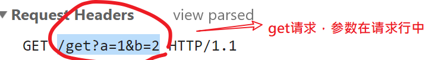

http模块-实现接口功能

在前面学习ajax时，我们说接口是后端同学写好的，我们前端同学只需要调用即可。现在，我们学习了nodejs，我们就可以客串一把后端同学的角色，来试着写写接口了。

## 写一个接口试试

get类型的接口-无参数

现在假设我们自己就是一名后端程序员，现在要实现一个**get**类型的接口。具体要求如下：

地址：http://localhost:8083/getmsg

功能：以json字符串格式返回`message.json`的内容。

**要使用postman软件进行测试。**


参考代码：

```javascript
const http = require('http');
const app = http.createServer((req, res) => {
  if (req.url === '/getmsg' && req.method=== 'GET') {
    let obj = {_t : Date.now()}
    res.end(JSON.stringify(obj));//  把对象转成字符串之后再返回
  } else {
    res.end('error');
  }
});
app.listen(8083, () => {
  console.log(8083);
});
```

说明：

- 注意：**类型**
- req.method 可以判断请求的类型
- res.end()的参数只能是字符串（或者是buffer），而不能是对象
- res.end( JSON.stringify(对象) )

## 理解接口与静态资源的区别


服务器上有很多的资源，每个资源都有自己的url。客户端浏览器想要访问某个资源就要向服务器发起对应的请求。

资源的分类：

- 静态资源。
  - 它们一般表现为一个一个的文件。例如index.html, style.css, index.js。
  - 处理请求静态资源时，服务器一般就直接读出资源的内容，再返回给客户端浏览器
- 动态资源：接口
  - 它们不是以某个具体的文件存在的，而是服务器上的**一段代码**，访问接口时，服务器会执行这段代码，然后把代码的执行结果返回给客户端浏览器。

目前学习过的发送请求有两种途径：

- 在地址栏中直接访问这个url
- 通过某个a标签进行进行跳转
- 通过表单进行提交
- 通过ajax技术访问这个url。

发送请求有很多类型：

- get
  - 在地址栏中直接访问这个url就是get方式
- post
  - 通过表单提交，可以设置form的method为post
- delete
- ....


url的作用是确定用户要访问的资源的位置，在地址栏中输入回车之后，这个请求会到web服务器中来，然后由web服务器来决定此时返回什么数据给用户。但是，我们能够根据url来推测服务器会返回什么信息吗？

```javascript
url:http://nodejs.cn/api/querystring.html
请求一个页面，名是querystring.html

url:http://oa.itcast.cn/seeyon/main.do?method=main

url:https://mail.qq.com/cgi-bin/frame_html?sid=aLqnlljMxF54DgtW&r=d281ced83329f34caae9786fcb5d4934
```

显然，不能，你能从服务器上获得什么，完全是由服务器决定的。

## 理解url

全称：Uniform Resource Locator，统一资源定位符。

作用： 定位资源(css,html,js,png, avi，接口......)。

格式：`协议://主机地址[:端口]/路径?查询字符串#锚点`

- 协议
  - http
  - https
- 主机地址
  - IP地址 或者 域名
- 端口
  - http请求，默认端口80
  - https请求，默认端口443
  - MySQL默认端口3306
- 路径
  - 服务器文件夹上的资源。（.html/.css/.images/.js/接口）
- 参数（查询字符串）
  - ? 后面的部分，是键值对的形式
- 锚点
  - 网页内部的锚点链接

例如：http://itcast.cn:80/schools/students?id=18&name=zs#photo

经典用法：访问文件时传递参数。

```html
// index.html
<a href='detail.html?id=1'>新闻1</a>
<a href='detail.html?id=2'>新闻2</a>
```


```html
// detail.html
<script>
// 1. 获取id
// 2. 根据id值去获取这个新闻的详情 
</script>
```


## nodejs中的url模块

作用:url模块用来对url（例如：http://itcast.cn:80/schools/students?id=18&name=zs#photo）进行解析，进而得到各种信息。

手册地址：http://nodejs.cn/api/url.html

步骤：

- 引入

  `const url = require('url');`

- 使用它的方法

  - obj = url.parse(地址栏中输入的url)

  > ```javascript
  > let urlobj = url.parse(req.url); // urlobj对象中，就有我们需要的信息
  > urlobj.pathname :获取用户输入的url的路径名 ('/schools/students')
  > urlobj.search: '?id=18&name=zs',
  > urlobj.query: 获取用户输入的url中的查询字符串( 'id=18&name=zs' )
  > urlobj.path: '/schools/students?id=18&name=zs',
  > urlobj.href: '/schools/students?id=18&name=zs' 
  > ```

上面urlobj.query只是获得了传递的全部参数，我们一般还需从地址栏中分析传递的数据。即从 `http://itcast.cn:80/schools/students?id=18&name=zs#phot`中分析出id和name的值来。这个操作是如何实现的呢？

## nodejs中的querystring模块

用来对url中的查询字符串这部分进行处理。nodejs中提供了querystring这个核心模块来帮助我们处理这个需求。

[地址](https://nodejs.org/api/querystring.html#querystring_querystring_parse_str_sep_eq_options)

示例

```javascript
const qs= require('querystring');
let obj = qs.parse('id=18&name=zs');
console.log(obj) // {id:18, name:"zs"}
```


## get类型的接口-带参数

现在假设我们自己就是一名后端程序员，现在要实现一个get类型的接口。具体要求如下：

> 地址：localhost:8080/getmsg?id=2&name=ammey
>
> 功能：获取用户传入的参数，并以json字符串格式返回
>
> 示例：
>
> ```javascript
> 1.不加参数
> 输入:localhost:8080/get;
> 返回:{_t:1563265441778}
> 2.带参数
> 输入:localhost:8080/get?name=filex&age=30;
> 返回:{name:filex,age:30,_t:1563265441778}
> ```
>
> 要求：能通过postman软件的测试。


分析：get请求的参数附加在url中，我们可以使用url模块来取出用户url中的参数部分，再使用querystring模块取出具体的参数值。




这里我们直接使用两个核心模块`url`和`querystring`来实现上述的需求。

```javascript
const http = require('http');
const queryString = require('querystring');
const url = require('url');

const server = http.createServer(function(req, res) {
  var { pathname, query } = url.parse(req.url);
  var obj = queryString.parse(query);

  console.log(p, url.parse(req.url));
  if (pathname === '/get' && req.method === 'GET') {
    res.setHeader('content-type', 'application/json');
    obj.d: Date.now() };
    res.end(JSON.stringify(str));
  } else {
    res.setHeader('content-type', 'text/html;charset=utf-8');
    res.end('大家好');
  }
});
server.listen(8088, function() {
  console.log('success', 8088);
});
```

注意：

- get类型的接口，参数是从req.url中传入的，对应的是请求行。
- 在设置响应时，如果补上`res.setHeader('content-type', 'application/json');`则就是告诉浏览器，本次返回的数据就是json数据


## post接口

假设我们自己就是一名后端程序员，现在要实现一个post类型的接口。具体要求如下：

> 地址：localhost:8080/addmsg
>
> 功能：获取用户传入的参数，并以json字符串格式返回，在返回的信息中要加上时间戳.
>
> 示例：
>
> ```
> 接口地址:localhost:8080/addmsg
> 参数：name=filex&age=30;
> 返回:{name:filex,age:30,_t:1563265441778}
> ```
>
> 要求：通过postman软件的测试。

### 预备知识

post类型与get类型的接口区别较大，主要在两个方面：

1. 类型不同

   对于类型不同还比较好判断，我们可以通过 req.method 来获取（GET,POST）

2. 传参不同

   - get请求参数在请求行中（附加在url后面）,内容比较少。
   - post请求参数在`请求体`中。内容比较大。

对于获取post参数就相对复杂一些。它的特点是：

1. 参数在请求体中发给后端
2. 后端是一段一段接收数据的，并不像get在请求行中传递的数据：直接写在url中的查询字符串内，可以立即通过req.url来解析出来。
3. 在接收参数的过程中，会涉及req对象的两个事件`data`,`end`。
   - data事件，每次收到一部分参数数据就会触发一次这个事件。
   - end事件，全部的参数数据接收完成之后会执行一次。


### 基本流程

基本流程是：

1. 定义一个空容器result来装参数。
2. 在req对象上监听data事件。这个事件触发一次，就把当次收到的数据向result中填充一些。
3. 在req对象上监听end事件。这个事件触发时，就表示整个参数数据接收完成，此时取出容器result中的内容，进行解析，以取出参数。


### 参考代码

queryString

```javascript
// 实现post接口
// XXX.onclick = functon(){}
const http = require('http');

const qs = require('querystring')

const server = http.createServer((req,res)=>{
    if(req.url === '/post' && req.method === "POST"){
        // data事件
        // 当收到一部分数据之后，就会执行一次回调函数，可能会执行多次
        // 并且回调中的参数就是本身收到的这一部分数据（buffer格式）
        let result = "";

        req.on('data',function(rs){
            console.log('服务器收到了post的一部分数据:');
            console.log(rs);
            result += rs; // 会自动把buffer转成字符串
        })

        // end事件
        // 服务器接收post参数完毕之后，就会执行回调函数，
        req.on('end',function(){
            console.log('服务器接收post参数完毕');
            // 最终得到的是一个查询字符串 a=1&b=2
            // 把查询字符串转成对象？使用queryString模块
            let obj = qs.parse( result );
            console.log(result ,obj); 

            // 根据接口要求，补上时间戳
            obj._t = Date.now();

            // 返回obj.把对象转成json字符串
            res.setHeader('content-type', 'application/json')
            res.end( JSON.stringify(obj) ) ;
        })

    } else {
        res.end('error')
    }
})

server.listen(8000,()=>{
    console.log(8000);
})
```

在发post请求时，传递的数据会在请求体中，它也是字符串格式，并且是一点一点上传到web服务器的（是积小成多，而不是一蹴而就）每上传一部分就会触发data事件，而最后全部上传完成之后，会触发end事件。

下面是一个示例代码，用来模拟使用post请求发送大量的数据，以观察req.on('data', chunk => {})多次触发的现象。

```javascript
var xhr =new XMLHttpRequest();
xhr.open('post','http://localhost:8080/post');
xhr.setRequestHeader('content-type','application/x-www-form-urlencoded');
xhr.send("name="+"imissyou".repeat(100000));
```

