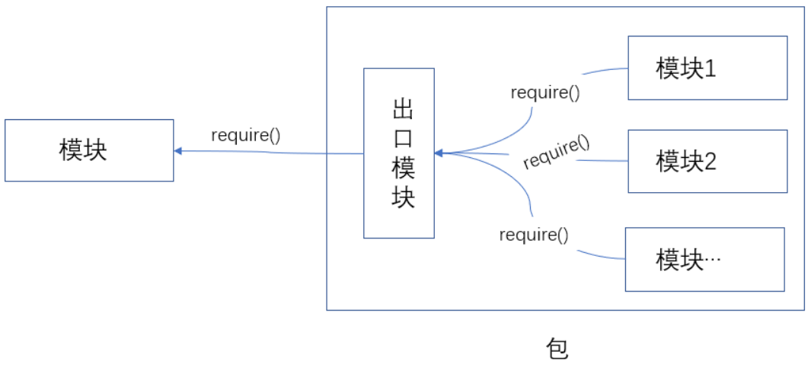
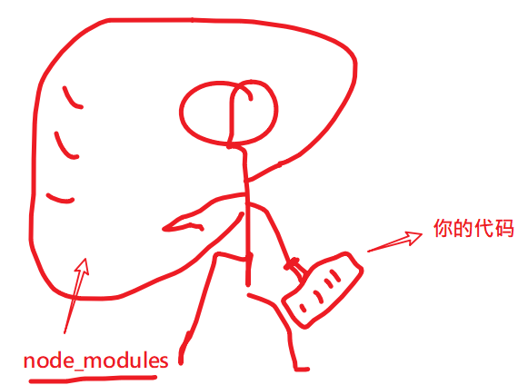
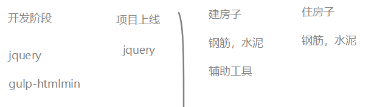

目标：会用npm

## 用npm管理第三方模块

node中的模块：

- 核心模块。http,fs,path,url,querystring
- 自定义模块。
- 第三方模块。

所谓第三方模块，顾名思义，就是别人写的模块（不是自己写的，也不是nodejs自带的）。这一点和在浏览器环境中使用使用第三方函数或者是库非常类似 。


在浏览器中使用额外的js库，一般有两步：

1. 去官网下载js文件。
2. 在自己的html页面中引入。

以jquery为例

1. 去jquery官网中下载jquery.js文件。
2. 在html页面中使用 script 标签引入这个js文件
3. 开始使用啦

这个过程中很容易，但这种使用方式是有问题的：

- 随着引入的第三方库越来越多，你得每一个库都去他们各自的官网上下载，引入10个库，都得下载10次
- 各个库的版本号在升级更新时，你也无法准确得知。

> 阿爷无大儿，*木兰*无长兄，愿为市鞍马，从此替爷征。
> 东市买骏马，西市买鞍鞯，南市买辔头，北市买长鞭。旦*辞*爷娘去，暮宿黄河边，不闻爷娘唤女声，但闻黄河流水鸣溅溅。旦*辞*黄河去，暮至黑山头，不闻爷娘唤女声，但闻燕山胡骑鸣啾啾。

木兰词中所述的场景：木兰替父从军，要买参战装备要四处奔走。我们做个效果，要实现某个功能，要四处下载包，难道就没有一个类似于京东超市一样的地方，可以实现一站式配齐吗？

有，这个超市就是 大名鼎鼎的 `npm`。 在node中，我们通过npm来解决下载、使用、管理第三方模块的问题。

所以，在学习使用第三方模块时，我们先要学习npm的使用。

## 基本概念

### npm

- `npm` 全称 `Node Package Manager`(node 包管理器)，它的诞生是为了解决 Node 中第三方包共享的问题。
- `npm` 不需要单独安装。在安装Node的时候，会连带一起安装`npm`。
- `npm -v`检查安装的情况。
- [官网](https://www.npmjs.com/)

当我们谈到npm时，我们在说两个东西： 

- 命令行工具。这个工具在安装node时，已经自动安装过了。
- npm网站。这是一个第三方模块的"超市"，我们可以自由地下载，上传模块。

### 包（package）与模块关系

npm网站上去下载我们的需要的代码时，它们是以"包"这种结构放在npm网站上的。先来了解下包和模块的关系。





- nodejs中一个模块就是一个单独的js文件
- 包是多个模块的集合。一个模块的功能比较单一，所以一个包一般会包含多个模块。
- npm 管理的单位是包。类似于网站和网页的区别：一个网站一般会包含多个网页。

## npm下载使用包

分成三步：

- 初始化项目。**npm init** 如果之前已经初始化，则可以省略。
- 安装包。 **npm install** 包名。
- 引入模块，使用。

> 保持联网的状态哈。

### 第一步：初始化项目

这里提到的项目并不是某个具体的功能，只是要创建一个空文件夹即可（注意，不要起中文名字哈）。

进入到项目所在的**根目录**下，**启动小黑窗**（按下shift键，点击右键，在弹出的菜单中选择 “在此处打开命令行”）

输入如下命令：

```javascript
npm init --yes
// --与yes之间没有空格， -- 与init之间有空格
// 或者是 npm init -y
```

init命令用来在根目录下生成一个package.json文件，这个文件中记录了我们当前项目的基本信息，它是一切工作的开始。


### 第二步：安装包

> npm 这个超市上有好的代码，我们想下载来用 ------  安装包

生成了package.json文件之后，我们就可以来安装第三方包了。在npm官网中，有上百万个包，供我们使用（你需要在npm网上注册帐号，登陆上去，才可以看到如下的数据，如果只是下载安装包，则并不需要注册）。


根据我们遇到的实际问题，我们来引入相应的包来解决它们。例如，我们在开发一个项目，其中涉及一些对日期时间的处理可以安装dayjs包。

#### 安装day.js包

[参考]( https://www.npmjs.com/package/dayjs )

```
npm install dayjs
```

### 第三包：使用包

当我们已经下载好一个包之后，就可以像使用核心模块一样去使用它。

格式是：`const 常量名 = require('包名')` 这个格式与引入核心模块的格式是一样的。

```javascript
// 从npm下载 别人写的好代码，在本地引入，并使用
const dayjs = require('dayjs')

console.log( dayjs()
.startOf('month')
.add(1, 'day')
.set('year', 2018)
.format('YYYY-MM-DD HH:mm:ss') );

console.log(dayjs);
```


> 思考：
>
> 如何以今天的日期为中心，生成一个前后n天，共2n+1的数组？
>
> 假如今天是：2000-10-15日，前后2天，则应该得到 的数组是["2000-10-13","2000-10-14","2000-10-15","2000-10-16","2000-10-17"]

## npm init 命令

在某个目录下开启小黑窗，输入如下命令：

```
npm init 
```

它会启动一个交互式的程序，让你填入一些关于本项目的信息，最后生成一个**package.json文件**。

如果你希望直接采用默认信息，可以使用:

```javascript
npm init --yes
// 或者是 npm init -y
```

说明：

- 这个命令只需要运行一次，它的目的仅仅是生成一个package.json文件。
- 如果项目根目录下已经有了package.json文件，就不需要再去运行这个命令了。
- 这个package.json文件后期是可以手动修改的。

## package.json文件

它的整体内容是一个json字符串，用来对当前项目进行整体描述。其中最外层可以看作是一个js的对象（每一个属性名都加了""，这就是一个典型的json标记）。这个文件中有非常多的内容，我们目前学习如下几个：

- name

  表示这个项目的名字。如是它是一个第三方包的话，它就决定了我们在require()时应该要写什么内容。

- version

  版本号

- keywords：关键字

- author: 作者

- descrption: 描述

其它可参考

1.http://javascript.ruanyifeng.com/nodejs/packagejson.html

2.http://caibaojian.com/npm/files/package.json.html

## node_modules文件夹




这个文件夹中保存着我们从npm中下载来的第三方包。

在使用npm install 命令时，会修改这个文件夹中的内容（把包下载到这个文件夹中）。


当键入`npm install XXX`之后（这里假设这个XXX包是存在的，也没有出现任何的网络错误）：

1. 如果有package.json

   (1) 修改package.json文件。根据开发依赖和生产依赖的不同，决定把这句记录在加在devDependencies或者是dependencies列表中。

   (2) 修改node_modules文件夹

   1. 如果有node_modules文件夹，则直接在下面新建名为XXX的文件夹，并从npm中下来这个包。如果这个包还有其它的依赖，则也会下载下来。
   2. 如果没有node_modules，则先创建这个文件夹，再去下载相应的包

2. 如果没有package.json。会给一个警告信息。

说明：

- 建议先用init命令创建package.json之后，再去install

- 在分享代码时，我们一般不需要把node_modules也给别人（就像你不需要把jquery.js给别人，因为他们可以自己去下载）。对方拿到我们的代码之后，先运行`npm install`(后面不接任何的包名)，自己去安装这些个依赖包。
- 在module.paths命令中可以看到搜索路径中包含node_modules这个文件夹


## 全局安装包和本地安装包

我们通过`npm install` 命令来安装包，简单说就是把包从npm的官网（或者是指定的镜像源）下载到我们自己的电脑中。那具体这个包下载到哪里了，还是有一点讲究的。

分成两类：

- 全局安装: 包被安装到了系统目录（一般在系统盘的node_modules中）。

  - 命令：`npm install -g 包名` 或者  `npm install 包名 -g`

  - 辅助提示：

    - ```
      npm root -g // 查看全局包的安装目录
      npm list -g --depth 0 //查看全局安装过的包
      ```

- 局部安装（或者叫本地安装)，包安装在当前项目的根目录下（与package.json同级）的node_modules中。

  - ​	命令：`npm install 包名`


### 全局包与本地包的区别

- 全局安装的包一般可提供直接执行的命令。我们通过对一些工具类的包采用这种方式安装，如：

  gulp, nodemon, live-server,nrm等。

- 本地安装的包是与具体的项目有关的， 我们需要在开发过程中使用这些具体的功能。


一个经验法则：

- 要用到该包的命令执行任务的就需要全局安装。
- 要通过**require**引入使用的就需要本地安装。


## 全局安装nrm包

因为下载包时，默认是从npm官网（国外的网站）下载，速度可能会比较慢，我们可以手动去切换安装来源。

> 在npm超市里有一个工具可以来手动设置从哪里去下载包。这个工具就是`nrm`。

nrm 这个工具是帮助我们切换安装包的来源的，不应该只限于某个具体的项目，所以我们采用全局安装的方式来安装它。

nrm包的地址：<https://www.npmjs.com/package/nrm>

nrm的使用方法

共三步：

```javascript
// 第一步： 全局安装 
npm install nrm -g

// 第二步：列出所有的源信息
// （*）标注的就是当前使用的源
nrm ls

// 第三步：根据需要切换源 
// 例如：指定使用taobao源
nrm use taotao

// 接下来，正常安装你需要的包
```


## 全局安装nodemon包

我们每次修改了代码，要想代码生效都需要重启http服务器:

1. 进入小黑窗
2. 按下ctrl+c，停止已有http服务器。
3. 手动运行：node index.js 来重启服务器。

这有点麻烦哈。

有没有一个工具会自动检测到我们的修改并自动重新运行我们的代码呢？有，它叫nodemon。[地址](https://www.npmjs.com/package/nodemon)

### 安装 nodemon

通过npm包管理工具来进行安装。

步骤：

在任意位置 打开一个小黑窗，输入如下命令

```bash
npm install -g nodemon
```

回车。

此操作`需要联网`，根据网络速度所耗时间不同。如果这个命令执行完成并没有报错，就是说明安装成功了。

对上面的命令说明如下：

- npm是一个工具，用来管理node代码中要使用的第三方模块。它是随着node的安装而自动安装的：如果你安装node，则npm也已经安装过了，你可以直接使用。

- -g 表示全局安装。它也可以写在nodemon后面。即`npm install nodemon -g`。

  

### 使用nodemon

等待安装成功之后，使用方法也非常简单：在命令中，`使用nodemon来代替node`。

例如,原来是：

```bash
node server.js  
```

现在是：

```
// 改成 nodemon server.js
nodemon server.js
```


它的好处在于会自动监听server.js这个文件的变化，如果变化了，就会重新自动再去运行。相当于是：

```bash
while(server.js 变化了){
  node server.js
}
```

说明：

- 它是一个第三方的包（其它程序员写的工具）

- 之前的node server.js还是可以用的。

  

## 开发依赖和生产依赖(了解)

在本地安装包时，表示我们这个项目要用到这个包，换句话说，我们这个项目要想成功运行，要依赖于这些个包。

但在，具体在项目进行的哪一阶段依赖于这些包呢？也有具体的差异。

### 理解

举个生活中建房子的场景：

在建房子时，我们依赖：

- 辅助工具：尺子，水平仪，脚手架
- 原材料：钢筋，水泥

在住房子时，我们依赖：

- 原材料：钢筋，水泥

在房子进入到了使用阶段时，我们就不再需要尺子，水平仪，脚手架等这些个辅助工具了。我们买一所房子时，也不应该支付巨型脚手架的费用。  在开发前端项目的过程中也存在类似的问题：我们的开发过程和使用过程是分开的，开发项目时需要用到的包可能在使用项目时就不需要用到了。

假设有这么两个包：

- gulp-htmlmin。这个工具是用来把html代码进行压缩的（去掉空格，换行等），我们需要在开发时使用它，而项目一旦上线，我们就不再需要它了。，因此将它归类为"开发依赖"。
- jquery。在开发时参与源码编写，在发布上线的生产环境中也是需要它的。不仅在开发环境编写代码时要依赖它、线上环境也要依赖它，因此将它归类为"生产依赖"。




这个差异就表现在，我们在打包项目时，就不需要打包“开发依赖”的包，这样减少成本。


### 操作

这两种依赖关系，在具体操作的过程中，有如下区别

1. 保存到开发依赖(devDependencies)

```javascript
npm install 包名 --save-dev
// 或者 npm install 包名 -D
```

通过这种方式安装的包出会现在package.json文件中的`devDependencies`字段中。

2. 保存到生产依赖(dependencies): 

```javascript
npm install 包名 --save
// 或者 npm install 包名
// 或者 npm install 包名 -S

```


## 附:npm 常用命令

- 查看

  ```bash
  npm -v  			    // 查看npm 版本
  where node   			// 查看node的安装目录
  where npm   			// 查看npm的安装目录
  npm root -g 			// 查看全局包的安装目录
  npm list -g --depth 0   // 查看全局安装过的包
  ```

- 升级 npm

  ```bash
  npm install npm --global
  npm install npm -g
  ```

- 初始化 `package.json`

  ```bash
  npm init -y // 或者是npm init --yes
  ```

- 安装第三方包

  ```javascript
  // 安装当前目录下package.json中列出的所有的包
  // 如果之前安装了包，又在package.json中手动删除依赖
  // 它相当是删除包
  npm install
  
  // 全局安装
  npm install 包名 -g  // npm install -g 包名 
  
  // 本地安装，没有指定版本，默认安装最新的版本
  npm install 包名
  
  // 一次安装多个包,空格隔开
  npm install 包名1 包名2 包名3
  
  // 安装指定版本的包
  npm install 包名@版本号
  
  // 简写。把install简写成 i
  npm i 包名
  ```

- 删除已安装的包 

  ```bash
  npm uninstall 本地安装的包名
  npm uninstall -g 全局安装的包名
  ```

- 设置npm的register

  如果你不想用 `nrm` ，下面这个原生的命令也可以切换镜像源。

  ```bash
  npm config set registry https://registry.npm.taobao.org
  
  ## 所有npm i 包 都会从taobao的镜像去下载。
  ## 配置后可通过下面方式来验证是否成功
  npm config get registry 
  ```

[参考](https://www.npmjs.cn/getting-started/what-is-npm/ )


