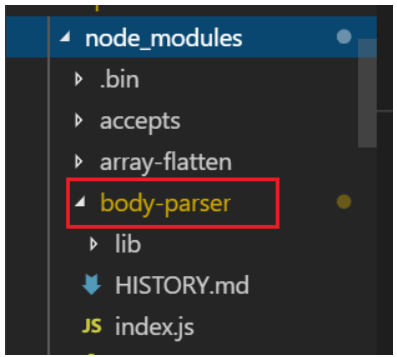
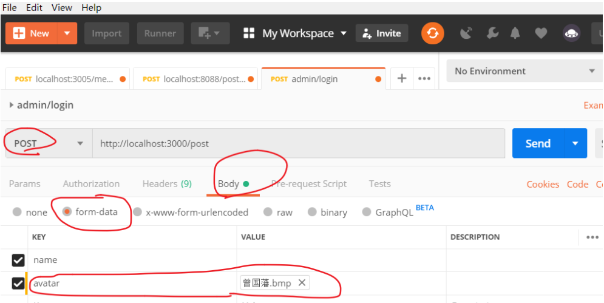
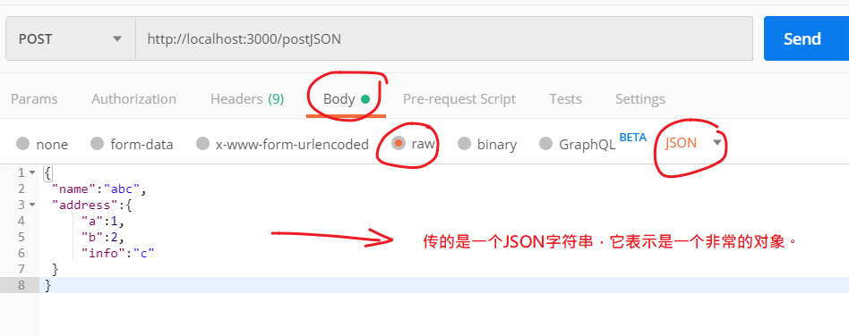
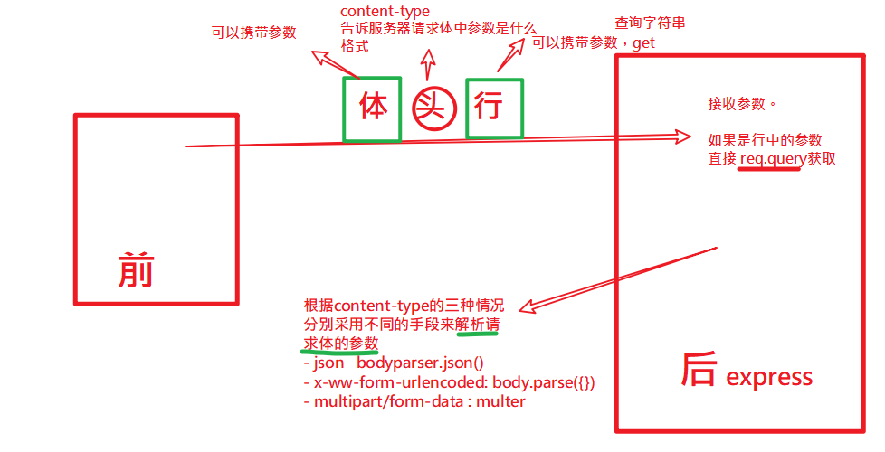
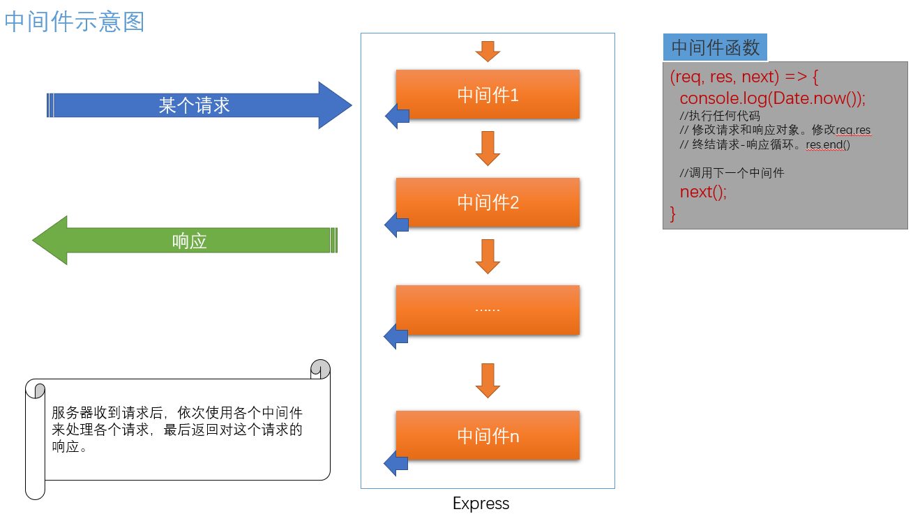
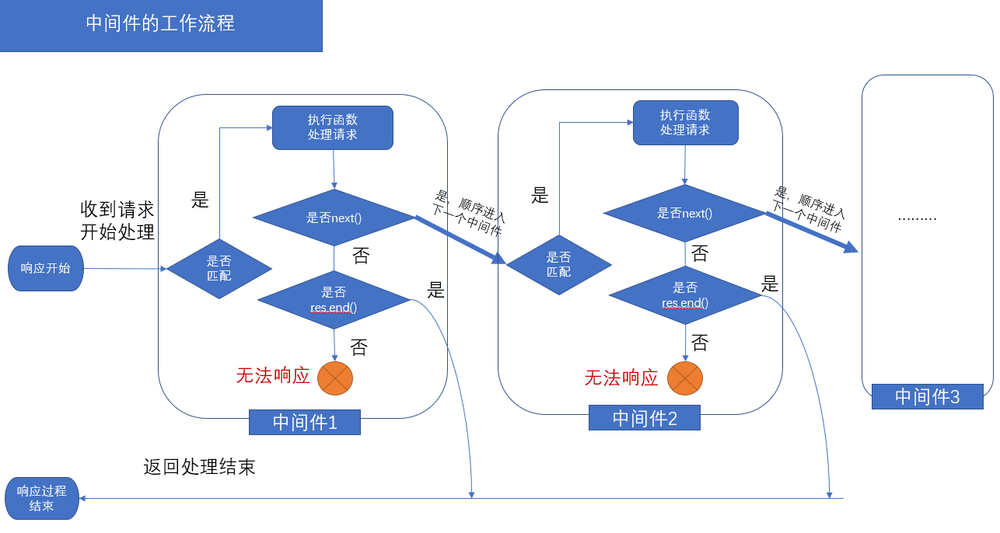

express框架

## 基本介绍 

### Express 介绍

- Express 是一个基于 Node.js 平台，快速、开放、极简的 **web 开发框架**
- Express 是一个第三方模块，有丰富的 API 支持，强大而灵活的**中间件**特性
- Express 不对 Node.js 已有的特性进行二次抽象，只是在它之上扩展了 Web 应用所需的基本功能
- 参考链接
  - [Express 官网](http://expressjs.com/)
  - [Express 中文文档（非官方）](http://www.expressjs.com.cn/)
  - [Express GitHub仓库](https://github.com/expressjs/express)

### 运行第一个express程序

由于它是第三方包，我们需要先下载它。

#### 下载express包

> 参考文档：http://expressjs.com/en/starter/installing.html

```shell
# 在你的项目根目录下，打开小黑窗

# 1. 初始化 package.json 文件
npm init -y

# 2. 本地安装 express 到项目中
# npm install express
npm i express

```

注意：

- 项目目录名字不要取中文，也不要取`express`
- 如果安装不成功
  - 换个网络环境
  - 运行下`npm cache clean -f`，再重新运行下载命令试试

#### 使用

> 参考文档：http://expressjs.com/en/starter/hello-world.html


在项目根目录下新建一个js文件，例如app.js，其中输入代码如下：

```javascript
// 0. 加载 Express
const express = require('express')

// 1. 调用 express() 得到一个 app
//    类似于 http.createServer()
const app = express()

// 2. 设置请求对应的处理函数
//    当客户端以 GET 方法请求 / 的时候就会调用第二个参数：请求处理函数
app.get('/', (req, res) => {
  res.send('hello world')
})

// 3. 监听端口号，启动 Web 服务
app.listen(3000, () => console.log('app listening on port 3000!'))
```

说明：

- app.get('/')相当于添加个事件监听：当用户以get方式求"/"时，它后面的回调函数会执行，其回调函数中的req,res与前面所学http模块保持一致。
- res.send()是exprss框架给res对象补充提供的方法（http模块中的res是没有这个方法的。），用于结束本次请求。类似的还有res.json(),res.sendFile() 。
- express 框架会增强req,res的功能


## 托管静态资源

参考文档：http://expressjs.com/en/starter/static-files.html

让用户直接访问静态资源是一个web服务器最基本的功能。

```javascript
http://localhost:3000/1.png
http://localhost:3000/css/style.css
http://localhost:3000/js/index.js
```

例如，如上url分别是请求一张图片，一份样式文件，一份js代码。我们实现的web服务器需要能够直接返回这些文件的内容给客户端浏览器。


在前面学习http模块时，我们已经实现了这些功能了，但是要写很多代码，现在使用express框架，只需一句代码就可以搞定了，这句代码是  `express.static('public')`

### 忽略前缀

```javascript
// 加载 Express
const express = require('express')

// 1. 调用 express() 得到一个 app
//    类似于 http.createServer()
const app = express();

// 2. 设置请求对应的处理函数
app.use(express.static('public'))


// 3. 监听端口号，启动 Web 服务
app.listen(3000, () => console.log('app listening on port 3000!'))
```

此时，所有放在public下的内容可以直接访问，注意，此时在url中并不需要出现public这级目录

- 在public下新建index.html，可以直接访问到。

### 限制前缀

```
// 限制访问前缀
app.use('/public', express.static('public'))
```

这意味着想要访问public下的内容，必须要在请求url中加上/public

## 路由

参考文档：http://expressjs.com/en/starter/basic-routing.html

路由（**Routing**）是由一个 **URL**（或者叫路径标识）和一个特定的 **HTTP 方法**（GET、POST 等）组成的，涉及到应用如何处理响应客户端请求。每一个路由都可以有一个或者多个处理器函数，当匹配到路由时，这些个函数将被执行。

### 格式

```javascript
const app = express();
app.METHOD(PATH, HANDLER)
```

其中：

- `app` 是 express 实例 。（const app = express（））

- `METHOD` 是一个 [HTTP 请求方法](https://en.wikipedia.org/wiki/Hypertext_Transfer_Protocol#Request_methods)。 全小写格式。如：post,get,delete等

- `PATH` 是请求路径（相当于在http模块中用到过的 `url.parse(req.url).pathname`）

  | 浏览器url                                 | 服务端路径           |
  | ----------------------------------------- | -------------------- |
  | http://localhost:8080                     | /                    |
  | http://localhost:8080/public/a/index.html | /public/a/index.html |
  | http://localhost:8080/index.html?a=1&b=2  | /index.html          |

- `HANDLER` 是当路由匹配到时需要执行的处理函数。`（req,res）=>{   }`

### 写get接口

#### get无参数

```javascript
const express = require('express');
const app = express();
app.get('/get', function(req, res) {
  // 直接返回对象
  res.json({ name: 'abc' });
});
app.listen('8088', () => {
  console.log('8088');
});

```

注意:

- res.json()是express提供的方法。

#### get有参数

express框架会自动收集get参数，并保存在req对象的`query`属性中。我们直接来获取即可。

```javascript
const express = require('express');
const app = express();
app.get('/get', function(req, res) {
  // 直接返回对象
  console.log(req.query);
  
  res.send({ name: 'abc' });
});
app.listen('8088', () => {
  console.log('8088');
});
```

注意：

- req.query属性是express框架额外提供的属性。

### 写post接口

post接口与get请求不同在于：它的参数一般是通过请求体来传递的。根据传递的参数的格式不同，分成三种情况来说

- 传递普通键值对
- 传递form表单（涉及文件上传）
- 传递json

#### 普通键值对参数

获取post普通键值对数据，要通过第三方模块`body-parser`来解析。

具体来说当content-type为x-www-form-urlencoded时，表示上传的普通简单键值对 。如果通过postman测试的话，对应的设置如下：


一般要先下载body-parser这个包。

```javascript
npm install body-parser
```

在 express4中，已经预先下载安装过了（在npm install exprss 时，就已经安装了body-parser，你可以在node_modules中查看到），这样就可以直接使用了



##### 步骤

```javascript
// 1. 引入包
const bodyParser = require('body-parser');

// 2. 使用包
app.use(bodyParser.urlencoded({extended:false}));

app.post("/add",function(req,res){
    //3. 可以通过req.body来获取post传递的键值对	
    res.json(req.body)

})
```

注意：

- app.use(....)之后，在res.body中就会多出一个属性res.body。

- `extended: false`：表示使用系统模块querystring来处理传入的参数，也是官方推荐的
- `extended: true`：表示使用第三方模块qs来处理传入的参数.

#### form-data文件上传

如果post涉及文件上传操作，则会要额外使用第三方`multer`这个包（不属于express）来获取上传的信息。

 Multer 是一个 node.js 中间件，用于处理 `multipart/form-data` 类型的表单数据，它主要用于上传文件。 

```html
enctype="multipart/form-data"
```

对应postman的操作如下：



##### 步骤

1.安装

```javascript
npm install multer
```

2.使用

```javascript
// 1. 引入包
const multer = require('multer');
// 2. 配置
const upload = multer({dest:'uploads/'}) // 上传的文件会保存在这个目录下
// uploads表示一个目录名，你也可以设置成其它的

// 3. 使用
// 这个路由使用第二个参数 .upload.single表示单文件上传， 'cover' 表示要上传的文件在本次上次数据中的键名。对应于前端页面上的：
//  <input type="file" name='cover'/>

app.post("postfile",upload.single('cover'), function(req,res){
    // req.file 记录了文件上传的信息
    // req.body 记录了其它普通参数（非文件）的信息
	// 其它操作
})
```

说明：

- 如果当前目录下没有uploads，它会自动创建uploads这个文件夹
- `upload.single`只是处理了文件的上传。你仍可以通过req.body来获取其它参数


#### json

在post传递参数时，如果要传入的参数比较复杂，则可以使用json格式上传。

```javascript
var data = {
 name:"abc",
 address:{
     "a":1,
     "b":2,
     "info":"c"
 }
}
```





后端

```javascript
const bodyParser = require('body-parser')
// 使用包. 则在后续的post请求中
// 会自动加入req.body属性，这个属性中就包含了post请求所传入的参数

// 处理JSON格式
app.use(bodyParser.json())

// 用来处理JSON格式的数据
app.post('/postJSON',(req,res)=>{
    // 后端收到post传参
    console.log(req.body);
    
    res.send('/postJSON')
})
```


## 接口传参

### 理论

我们一般使用ajax技术向接口传参，请求有三个部分：

- 请求行： 保存了请求方式，地址，可以以查询字符串的格式附加一部分数据。

- 请求头：它可以附加很多信息，其中content-type用来约定请求体中保存的数据格式。

  - 常见有三种取值：

    | content-type的值                 | 表示请求体的数据格式 | 示例          |
    | -------------------------------- | -------------------- | ------------- |
    | application/x-www-form-urlencode | 普通键值对象         | a=2&c=1       |
    | application/json                 | json对象             | {a:1,b:{c:1}} |
    | multipart/form-data              | 上传文件             | file          |

- 请求体:  本次请求携带的参数。至于这参数到了后端应该如何解析出来，由content-type来决定。




接口的规则是由后端来定的，它会约定接口的名字，参数，格式，方式。

名字: /api

参数：name: 用户名，pwd:密码，avatar头像文件。

格式：formdata.

方式：post


名字: /api2

参数：name: 用户名，pwd:密码

格式：application/x-www-form-encoded (普通键值对)

方式：post


名字: /api3

参数：name: 用户名，pwd:密码

格式：application/json

方式：post


从前端向后端接口传参数，有两种途径：

- 方法一：请求行。常见方式如下：
  - 使用ajax技术，通过get方式传参。
  - 在浏览器地址栏中输入接口地址并补充上查询字符串。
- 方法二：请求体
  - ajax中的post,put,delete可以从请求体中进行传参。

另外，请求头中的**content-type**用来告之服务器应该以何种方式去解析请求体中的数据。


 从请求行中传参 总结如下：

| 传参方式 | 前端 content-type                | 后端框架express                                              |
| -------- | -------------------------------- | ------------------------------------------------------------ |
| 请求行   | get方式                          | req.query                                                    |
| 请求体   | application/x-www-form-urlencode | app.use(**bodyParser.urlendcode()**); req.body               |
| 请求体   | application/json                 | app.use(**bodyParser.json()**); req.body                     |
| 请求体   | multipart/form-data              | 1. 引入包  const multer = require('multer'); <br> 2. 配置app.post('/apiname', **upload.single()**, **req.body**) |


### 示例 

#### 前端

用jquery的ajax来发请求


```html
 <!DOCTYPE html>
 <html lang="en">
 <head>
     <meta charset="UTF-8">
     <meta name="viewport" content="width=device-width, initial-scale=1.0">
     <meta http-equiv="X-UA-Compatible" content="ie=edge">
     <title>Document</title>
 </head>
 <body>
     <button id="btn_keyvalue"> post-普通键值对</button>
     <br>
     <button id="btn_json"> post-json</button>
     <form id="myform">
         <input type="text" name="title">
         <input type="file" name="cover">
     </form>
     <button id="btn_formdata"> post-formdata</button>
     <script src="./jquery-1.8.1.js"></script>

     <script>
         $('#btn_keyvalue').click(function(){
            $.ajax({
                type:'post',
                url:'http://localhost:3000/post',
                data:{a:1,b:2},
                // data:{
                //     name:"abc",
                //     address:{
                //         "a":1,
                //         "b":2,
                //         "info":"c"
                //     }
                // },
                success(res){
                    console.log(res);
                    
                }
            })

        })
        var obj = {
                    name:"abc",
                    address:{
                        "a":1,
                        "b":2,
                        "info":"c"
                    }
                }
        $('#btn_json').click(function(){
            $.ajax({
                type:'post',
                url:'http://localhost:3000/postJSON',
                // contentType: false,
                contentType: "application/json; charset=UTF-8",
                data:JSON.stringify(obj),
                success(res){
                    console.log(res);
                    
                }
            })

        })
        $('#btn_formdata').click(function(){
            var fd= new FormData(document.getElementById('myform'));
            $.ajax({
                type:'post',
                url:'http://localhost:3000/admin/article_publish',
                contentType: false,
                processData:false,
                data:fd,
                success(res){
                    console.log(res);
                    
                }
            })

        })
     </script>
 </body>
 </html>
```


#### 后端

```
// 实现get接口

const express = require('express')
const app = express();

app.use(express.static('public'))
// 引入bodyParse包
const bodyParser = require('body-parser')
// 使用包. 则在后续的post请求中
// 会自动加入req.body属性，这个属性中就包含了post请求所传入的参数
// 处理普通的键值对格式
// Content-Type: application/x-www-form-urlencoded
app.use(bodyParser.urlencoded({extended:false}))

// 处理JSON格式
// Content-Type: application/json;
app.use(bodyParser.json())

// 引入multer包
const multer = require('multer');

// 配置一下multer
// 如果本次post请求涉及文件上传，则上传到uploads这个文件夹下
// Content-Type: multipart/form-data;
var upload = multer({ dest: 'uploads/' })

// formDate
app.post('/admin/article_publish',upload.single('cover'),(req,res)=>{
    
    //upload.single('cover')
    // 这里的cover就是在页面中表单元素中的name
    // <input type="file" name="cover" />
    // 把要上传文件放在指定的目录
    console.log(req.file);
    // 其它参数，还是在req.body中找
    console.log(req.body);

    res.json({code:200,msg:'上传成功',info:req.file.path})

    
})

// 普通post 键值对
app.post('/post',(req,res)=>{
    // 希望在后端收到post传参
    console.log(req.body);

    let obj = req.body
    obj._t = Date.now();
    
    res.json(obj)
})

// 用来JSON格式的数据
// Content-Type: application/json;
app.post('/postJSON',(req,res)=>{
    // 希望在后端收到post传参
    console.log(req.body);
    
    // res.send('/postJSON')
    res.json( req.body )
})

// 实现接口，返回所传入的参数，并附上上时间戳
app.get('/getapi',(req,res)=>{
    // 通过 req.query快速获取传入的参数
    console.log(req.query);
    let obj = req.query
    
    obj._t = Date.now(); 
    res.json( obj )
})


app.listen(3000,()=>{
    console.log(3000);
    
})
```


## RESTful接口

网络应用程序，分为前端和后端两个部分。当前的发展趋势，就是前端设备层出不穷（手机、平板、桌面电脑、其他专用设备…）。因此，必须有一种统一的机制，方便不同的前端设备与后端进行通信。这导致API构架的流行，甚至出现"APIFirst"的设计思想。RESTful API是目前比较成熟的一套互联网应用程序的API设计理论。

REST（Representational State Transfer）表述性状态转换，REST指的是一组架构约束条件和原则。 如果一个架构符合REST的约束条件和原则，我们就称它为RESTful架构。REST本身并没有创造新的技术、组件或服务，而隐藏在RESTful背后的理念就是使用Web的现有特征和能力， 更好地使用现有Web标准中的一些准则和约束。

符合REST规范的设计，我们称之为RESTful设计。 它的设计哲学是将服务器端提供的内容实体看作一个资源，并表现在url上。


### 普通接口设计

例如：
接口名：localhost:8080/getarticle
类型：get
功能：获取文章信息

接口名：localhost:8080/addarticle
类型：post
功能：添加新文章

接口名：localhost:8080/delarticle
类型：post
功能：删除文章

接口名：localhost:8080/updatearticle
类型：post
功能：编辑文章

### RESTful接口设计

区别上述功能,主要依靠接口名称和请求类型而在restful设计中，它们应该是这样的：
接口名：localhost:8080/articles
类型：get
功能：获取文章信息

接口名：localhost:8080/articles
类型：post
功能：添加新文章

接口名：localhost:8080/articles
类型：delete
功能：删除文章

接口名：localhost:8080/articles
类型：put
功能：编辑文章

RESTful设计是：

- 通过URL设计资源。接口名一般都是名词，不包含动词。
- 请求方法决定资源的操作类型


参考代码

```javascript
const express = require('express')

const app = express();

app.get('/articles',(req,res)=>{
    res.send('获取')
})

app.post('/articles',(req,res)=>{
    res.send('添加')
})

app.delete('/articles',(req,res)=>{
    res.send('删除')
})
app.put('/articles',(req,res)=>{
    res.send('编辑')
})

//---------------------------

app.get('/getarticle',(req,res)=>{
    res.send('获取')
})

app.post('/addarticle',(req,res)=>{
    res.send('添加')
})

app.post('/delarticle',(req,res)=>{
    res.send('删除')
})
app.post('/updatearticle',(req,res)=>{
    res.send('编辑')
})

app.listen(8080,()=>{
    console.log(8080);
    
})

```

1

## 中间件技术

对express而言，中间件是它的一个非常重要的概念，掌握中间件的思想对于理解学习express，提升编程水平都有很大的帮助。

### 生活中的中间件

一道复杂的任务拆分成几个小步骤：

- 步骤1
- 步骤2
- 步骤3

我们可以称其中的每一个处理环节就是一个中间件。


招程序员的生命周期

- 面试
  - hr
  - 技术
  - 综合
- 背调（背景调查）。委托第三方的公司去做背调。
- 发offer
- 体检
- 入职-签合同
- 转正
- 离职


### express中间件

中间件**是**一个特殊的url地址处理**函数**

- 中间件是 express 的最大特色，也是最重要的一个设计。`Express是一个自身功能极简，完全是路由和中间件构成一个web开发框架：从本质上来说，一个Express应用就是在调用各种中间件。`

- 一个 express 应用，就是由许许多多的中间件来完成的

  

作用

- 执行任何代码。
- 修改请求和响应对象。
- 终结请求-响应循环（结束请求）。
- 调用堆栈中的下一个中间件 



分类

- 应用级中间件

- 路由级中间件

- 错误处理中间件

- 内置中间件

  - app.use(express.static('public'))

- 第三方中间件 

  - const bodyParser = require('body-parser');

    // app.use(bodyParser.urlencoded({extended:false}))

    app.use(bodyParser.json())

### 格式及基本示例

#### 格式

```javascript
// 具名函数格式：
const handler1 = (req, res, next) => {
  console.log(Date.now());
  next();
}
app.use(handler1);

// 匿名函数格式：
app.use((req, res, next) => {
  console.log(Date.now());
  next();
});

```

- 中间件本质就是一个函数，它被当作 `app.use(中间件函数)` 的参数来使用，或者是某个路由处理函数中使用。
- 中间件函数中有三个基本参数， req、res、**next**
  - req就是请求相关的对象，它和下一个中间件函数中的req对象是一个对象
  - res就是响应相关的对象，它和下一个中间件函数中的res对象是一个对象
  - next：它是一个函数，调用它将会跳出当前的中间件函数，执行后续中间件；如果不调用next，则整个请求都会在当前中间件卡住。


#### 示例

```javascript
app.use((req, res, next) => {
  console.log("第1个中间件");
  req.a1 = 100;
  next();
});

app.use((req, res, next) => {
  console.log("第2个中间件");
  res.setHeader('content-type', 'text/html;charset=utf8');
  res.a2 = 200;
  next();
});

app.use((req, res, next) => {
  console.log("第3个中间件");
  req.a3 = 300;
  console.log(req.a1,req.a2)
  res.end('中间件');
});

```

- 多个中间件先后顺序。
- 注意通过req来附加额外的信息。
- 如果不用next()，则不会进入下一个中间件。


### 中间件的执行流程及匹配



四种匹配规则:

- app.use(中间件)是应用级中间件，所有的请求都能匹配。

- app.use('/abc',中间件) 。只能匹配请求路径是/abc的请求。

- app.get('/abc',中间件) 。只能匹配get类型并且请求路径是/abc的请求，就是我们前面说的路由。

- app.get('/abc',中间件1，中间件2) 。一个路由中使用。

### 中间件的应用

模拟body-parser

```javascript
let qs = require('querystring')
app.use((req, res, next) => {
  if (req.method === 'POST') {
    let bodyStr = '';
    req.on('data', chunck => {
      bodyStr += chunck;
    });
    req.on('end', () => {
      req.body = qs.parse(bodyStr);
      next();
    });
  }else{
      next()
  }
});
```


### 路由级中间件

#### 使用场景

接口数量较多时，代码不好管理。以大事件的代码为例，我们定义了管理员角色的接口和普通游客的接口，这些接口如果全写在一个入口文件中(如下只是显示了4个接口，如果是40个接口，就会很难读了)，也不好维护的。

```javascript
const express = require('express');

const app = express();
// 两种用户的操作，对应不同的接口
app.get('/getfrontdetail', (req, res) => {
  res.send('获取游客详情');
});

app.get('/getfrontinfo', (req, res) => {
  res.send('获取游客信息');
});

// 两种用户的操作，对应不同的接口
app.get('/getadmincate', (req, res) => {
  res.send('管理员获文章类别信息');
});

app.get('/getadmininfo', (req, res) => {
  res.send('获取管理员信息');
});

app.listen(3000, () => {
  console.log(3000);
});
```

我们的目标就是把它们拆开到不同的文件中，以便于管理。

#### 思路

1. 整理接口名。对众多的接口名进行整理和分类，以一级目录，二级目录这样的方式进行。例如：

   ​	/admin/getcate 

   ​	/admin/getinfo

   ​	/front/getinfo

   ​	/front/getdetail

2.通过nodejs的模块化，分模块定义路由中间件，并导出

3.在主文件中，导入并使用路由中间件。


#### 步骤

具体做法是

第一步：定义两个模块。分别保存不同的分类的接口。

- front.js
- server.js

```javascript
// ./router/front.js
const express = require('express');
const router = express.Router();
router.get('/getinfo', function(req, res) {
  res.send('getinfo');
});
router.get('/getdetail', function(req, res) {
  res.send('getdetail');
});
module.exports = router;

```

注意： 上面epxress.Router()的用法。

```javascript
// ./router/server.js
const express = require('express');
const router = express.Router();

router.get('/getinfo', function(req, res) {
  res.send('管理员getinfo');
});
router.get('/getdetail', function(req, res) {
  res.send('管理员getdetail');
});
module.exports = router;
```

第二步：在主入口文件中使用它们

```javascript
const express = require('express');
const app = express();

const frontRouter = require('./router/front');
const serverRouter = require('./router/admin');

app.use('/front', frontRouter);
app.use('/server', serverRouter);
```


### 扩展：中间件实现原理

下面的代码简单模拟了中间件的实现。可以了解一下。

```javascript
const http = require('http');

// 模拟express框架中的use
function express() {
  let fnList = [];
  let app = http.createServer((req, res) => {
    let i = 0;
    let next = function() {
      let f = fnList[i++];
      f && f(req, res, next);
    };
    next();
  });
  app.use = function(f) {
    fnList.push(f);
  };
  return app;
}
const app = express();
app.use(function(req, res, next) {
  console.log('a');
  next();
});
app.use(function(req, res, next) {
  console.log('b');
  next();
});
app.use(function(req, res) {
  res.end('ok');
});
app.listen(3001, () => {
  console.log('ok');
});

```


