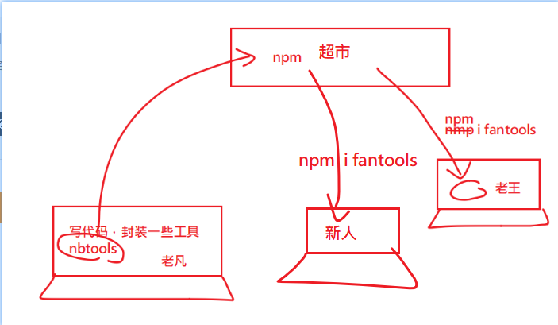
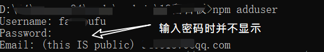

# npm包从创建到发布





> 在工作中我们积累了一些自己的功能代码。这些功能代码可以在其它项目中重复使用，此时我们就可以选择把代码打包放在[npm]上,在需要要使用的项目中，通过npm install去下载下来。


## npm项目初始化

在本地磁盘上创建一个空项目，取文件夹名为`myNpm`。注意请先去npm网官去确定一下，这个项目名是否已经被占用了。（如果这个名字已经被占用了，则你是无法向npm上上传的）。

检查方式

```bash
npm view 包名
# 这个命令用来查看 某个包的信息
# 如果返回404，说明这个项目名在npm官网上找不到，此时你就可以使用。
# 否则，说明不可用。
```


> 很确定地告诉你，myNpm这个包已经被别人占用了，你需要去自己用另一个名字哈。


```
npm init --yes
```
命令来创建一个package.json文件，对你项目myNpm信息进行设置。

## 完成功能

正常开发，完成你的代码。在默认情况下，index.js是这个项目的入口文件。

下面是一个最简单的示例： 
```
// index.js是在package.json中声明的，它是整个包的入口

const add = (a,b) => a + b;

const sub = (a, b) => a - b;


// 导出两个工具
module.exports = {
    add,
    sub
}
```

## 切换当前npm源到官网

由于我们需要把包上传到npm上，所以要先确保当前的npm源是npmjs.org。与之相关的命令有如下两条。

查看当前的npm的registry配置.
```bash
npm config get registry 
# 查看当前的npm的registry配置，确保是https://registry.npmjs.org

# 如果不是，可以通过如下命令来设置
npm config set registry https://registry.npmjs.org 
# 手动设置registry
```
或者使用nrm工具来设置。

## 连接npm

```
npm adduser  
```
这个命令需要输入三个信息以供连接上npmjs。用户名，密码，邮箱（是你在npmjs官网上注册时使用的信息）。如果你已经不是第一次连接了，这一步是可以省略的。



你也可以通过如下命令检查自己是否连接成功了。
```bash
npm who am i
```

如果成功了，则可以进行最最后一步了：publish 

如果想退出:

```bash
npm logout
```

##  把包上传到npm

```
 npm publish 
```

出错的可能是：
- 这个包名被别人先用了。
- 包的版本号不对：每次publish时，包的版本号都应该要大于之前的版本号。
- 文件过大。你可能需要创建`.npmignore`文件来设置在打包时要忽略哪些文件。如下是一个demo.

```.npmignore
/node_modules
npm-debug.log
/src
/examples
/build
```

如果没有报错，则表示一切ok，你可以用你的帐号密码登陆npm，去查看你名下的package是否有了myNpm

## 下载使用

通过`npm install myNpm`即可来安装包。 然后，告诉你的小伙伴们去下载使用吧。

## 删除包

```cpp
npm unpublish --force //强制删除
```

如果你的包没有什么用处，建议删除掉，以节约公共资源。

## 更新包

1. 修改代码，保存。
2. 更新版本号。可直接在package.json中修改：只能改大，不能改小。
3. 重新publish