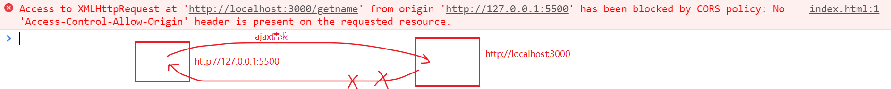

## 跨域访问接口

跨域问题是我们前端开发中经常会遇到的问题，也是面试中的高频题目。通过这一节的学习，我们就能解决这类问题啦。


## 问题演示


步骤：

- 使用express改造前面完成的“模块化的留言板案例”，在服务器端采用localhost：8000方式启动，并不会报错。

  后端

  ```javascript
  const express = require('express')
  const bodyParser = require('body-parser')
  
  // 引入自定义模块
  const message = require('./message.js')
  
  const app = express();
  
  app.use(bodyParser.urlencoded({extended:false}))
  
  // 做静态资源托管
  app.use(express.static('public'))
  
  app.get('/getmsg',(req,res)=>{
      let msgArr =  message.get();
      let obj = {code:200, msg:'获取成功',data: msgArr }
  
      res.json(obj)
  })
  
  app.post('/addmsg',(req,res)=>{
      let  obj = req.body
      obj.dt = Date.now();
  
      message.add(obj)
      res.json({code:200,msg:'添加成功', data:obj })
  })
  
  app.listen(8000,()=>{
      console.log(8000);
  })
  ```

  

  

- 把留言板前端代码单独取来，就会报错了。

  


下图是跨域错误的说明




## ajax跨域错误原因

 跨域错误:`不同源`的`ajax请求`


浏览器向web服务器发起http请求时 ，如果同时满足以下`三个条件`时，就会出现跨域问题，从而导致ajax请求失败：

- 你的浏览器多管闲事了。跨域问题出现的基本原因是浏览器出于安全性的考虑------同源策略：ajax请求必须是同源，封杀了你跨域请求。可以安装一个浏览器插件`allow-control-allow-origin`来测试一下。 如果使用postman软件（它不是浏览器）来发请求，就不会有这个问题了。

- 你的请求是xhr请求。就是常说的ajax请求。浏览器请求图片资源，js文件,css文件是可以跨域的（不是ajax请求）

- 发出请求不符合同源策略要求。

  - 同源是指：`协议相同`，`域名相同`，`端口相同`。即发ajax请求的所在的页面 与 所请求的接口的url必须是同源的。

    以下就是不同源的：

    从` http://127.0.0.1:5500/message_front/index.html ` 请求` http://localhost:8080/getmsg `

  - 在前后端分离开发的场景下，前端的页面和后端的服务经常是分开部署的，所以跨域访问的情况是比较常见的。

    

  注意，错误是发生在浏览器端的。请求是可以正常从浏览器发到服务器端，服务器也可以处理请求，只是返回到浏览器端时出错了。

## JSONP

### JSONP简介

**JSON** with **P**adding，是一种借助于 `script` 标签发送跨域请求的技巧。

原理:

- script的src标签可以请求外部的js文件，它是可以发跨域请求的。
- 借助 `script` 标签src请求服务端上的接口。
- 服务端的接口返回JavaScript 脚本，并附上要返回的数据。

它其实并**不是ajax请求**。


### 实现步骤


- 创建script并让src指向接口地址，并让接口返回函数调用，并在前端准备函数

- 向接口地址传递函数名
- 后端回传数据


#### 让script标签的src指向接口

> 前端：让script标签的src指向一个后端接口的地址；
>
> 后端：接口的返回值是一个js函数调用语句

前端页面

```html
<html>
    <script src="http://localhost:3000/getmsg"></script>
</html>
```

注意：

- script标签中的src会指向一个后端接口的地址。由于script标签并不会导致跨域问题，所以这里的请求是可以正常发送和接收的。
- 与我们之前理解的src指向某个具体的.js文件不同，我们只需要确保src所指向的地址的返回内容是js代码就行了，而不必要一定是.js文件。
- 接口地址中返回的内容将会作为script标签的主体。

后端接口

```bash
const express = require('express');
const app = express();
app.get('/getmsg', (req, res) => {
  res.end(`alert(1)`);
})
app.listen(3000, () => {
  console.log('你可以通过http://localhost:3000来访问...');
});
```

注意：

- 后端接口的返回值是一个特殊的字符串： 一个刻意拼写的js函数调用语句。


#### 传递函数名到后端

> 前端：让script标签的src指向一个后端接口的地址，并附加函数名；
>
> 后端：接口的返回值是一个js函数调用语句
>
> 目标：当请求成功时，执行前端指定的函数

`前端页面`

```html
<script>
	function fn(){
        console.log()
    }
</script>
<script src="http://localhost:3000/gettime?callback=fn"></script>

```

注意：

- 在前端自己定义一个函数，把函数名传给后端
- 使用get方式传参，并且参数名是callback。这个参数名要与后端保持一致。

`后端接口`

```bash
const express = require('express');
const app = express();
app.get('/gettime', (req, res) => {
  let { callback } = req.query;
  res.end(`${callback}()`);
})
app.listen(3000, () => {
  console.log('你可以通过http://localhost:3000来访问...');
});
```

注意：

- 后端接口接收函数名，并返回一个字符串，其内容是`函数调用语句`

#### 后端回传数据

> 前端：让script标签的src指向一个后端接口的地址，并附加函数名；
>
> 后端：接口的返回值是一个js函数调用语句,并附加实参；
>
> 目标：当请求成功时，执行前端指定的函数

前端页面

```html
<script>
    function dosomething(rs) {
        console.log(rs);
    }
</script>
<script src="http://localhost:3000/getTime?callback=dosomething"></script>
```

注意：

- script标签中的src会指向一个后端接口的地址。由于script标签并不会导致跨域问题，所以这里的请求是可以常发送的。
- 把前端的函数名传给后端

后端接口

```javascript
const express = require('express');
const app = express();
app.get('/gettime', (req, res) => {
  let { callback } = req.query;
  let data = JSON.stringfy( {a:1,b:2} )
  res.end(`${callback}(${data})`);
})
app.listen(3000, () => {
  console.log('你可以通过http://localhost:3000来访问...');
});
```

注意：

- 接收函数名，组装一个特殊的字符串：`函数调用语名`
- 把要回传的参数转成字符串，并嵌入返回值，当作函数的实参。


### jQuery封装的jsonp

jquery中的ajax已经封装好了的jsonp方式，你可以直接使用。具体来说就是给ajax请求添加一个dataType属性，其值为"jsonp"。注意前后端都需要改动代码。示例如下：

前端页面：`加上dataType属性`

```javascript
$.ajax({
   type: 'GET',
   url: 'http://localhost:4000/getTime', 
   success: function (result) {
      console.log(result);
   },
   dataType: 'jsonp' // 必须要指定dataType为jsonp
});
```


后端接口:

```javascript
const express = require('express');
const app = express();
app.get('/gettime', (req, res) => {
  let { callback } = req.query;
  let data = JSON.stringfy( {a:1,b:2} )
  res.end(`${callback}(${data})`)
})
    
app.listen(3000, () => {
  console.log('你可以通过http://localhost:3000来访问...');
});
```

当然了，后端框架中也有现成的解决方案，不要需要写的这么复杂。express框架已经提供了一个名为jsonp的方法来处理jsonp请求:

```javascript
const express = require('express');
const app = express();
app.get('/getmsg', (req, res) => {
  let data = {a:1,b:2}
  res.jsonp(data)
})
app.listen(3000, () => {
  console.log('你可以通过http://localhost:3000来访问...');
});
```

 原来是res.json,要改成res.jsonp


### jquery封装的jsonp原理分析

第一步：产生一个随机函数名；并创建这个函数(jQuery34109553463653123275_1565234364495)；

第二步：动态创建script标签，其src就是拼接的后端接口地址及callback值，如果有其它参数，则正常传递

第三步：请求成功返回之后，执行第一步中创建的函数(jQuery34109553463653123275_1565234364495)。这个函数最终会指向$.ajax({success:function(){}}) 中的success

第四步：`销毁` 第一步中创建的函数及第二步中创建的script标签

- 添加断点调试 。在jquery源码中，寻找`return jqXHR`，加断点。


### 附送一段模拟代码(面试，手写jsonp)

```html
<!DOCTYPE html>
<html>
  <head>
    <meta charset="UTF-8" />
    <meta name="viewport" content="width=device-width, initial-scale=1.0" />
    <meta http-equiv="X-UA-Compatible" content="ie=edge" />
    <title>html页面</title>
  </head>
  <body>
    <div class="container">
      <h1>jsonp</h1>
      <div>需要后端接口的配合：http://localhost:3005/jsonp</div>
      <pre>
        //--后端测试代码如下
          const express = require('express');
          const app = express()
          
          // 留言板接口 -- 获取所有数据
          app.get('/jsonp', (req, res) => {
            var { callback } = req.query;
          
            res.setHeader('content-type', 'application/javascript');
          
            res.end(callback + '({a:1,b:2})');
          });
          
          app.listen(3000,()=>{})
      </pre>
    </div>
    <script>
      function buildCallBackFunction(options, callbackFunName) {
        window[callbackFunName] = function(result) {
          options.success(result);
          window[callbackFunName] = null;
          delete window[callbackFunName];
        };
      }
      function buildParam(options) {
        var params = options.params;
        if (!params) {
          return '';
        }
        if (typeof params === 'object') {
          var arr = [];
          for (var p in params) {
            arr.push(`p=${params[p]}`);
          }
          return arr.join('&');
        } else if (typeof params === 'string') {
          return params;
        } else {
          return '';
        }
      }
        
      function buildScript(url) {
        var script = document.createElement('script');
        script.setAttribute('src', url);
        script.onload = function() {
          document.getElementsByTagName('head')[0].removeChild(script);
        };
        document.getElementsByTagName('head')[0].appendChild(script);
      }
        
      function json(options) {
        var { url, params, success } = options;
        var callbackFunName = 'callback_' + Date.now();
        var params = buildParam(options);
        params += !params ? 'callback=' + callbackFunName : '&callback=' + callbackFunName;
        url += '?' + params;
        buildCallBackFunction(options, callbackFunName);
        buildScript(url);
      }

      json({
        url: 'http://localhost:3005/jsonp/jsonp',
        // params: 'a=1&b=2',
        params: { a: 1, b: 2 },
        success: function(result) {
          console.log(result);
        }
      });
    </script>
  </body>
</html>
```


## CORS


CORS是一个W3C标准，全称是"跨域资源共享"（Cross-origin resource sharing）。它允许浏览器向跨源服务器，发出[`XMLHttpRequest`](http://www.ruanyifeng.com/blog/2012/09/xmlhttprequest_level_2.html)请求，从而克服了AJAX只能[同源](http://www.ruanyifeng.com/blog/2016/04/same-origin-policy.html)使用的限制。CORS需要浏览器和服务器同时支持。目前，所有浏览器都支持该功能，IE浏览器不能低于IE10(ie8通过XDomainRequest能支持CORS)。

[参考](https://developer.mozilla.org/zh-CN/docs/Web/HTTP/Access_control_CORS)

### 手写实现

通过在**被请求的路由中**设置header头，可以实现跨域。

```javascript
app.get('/getmsg', (req, res) => {
  // *表示允许任何域名来访问，不安全
  // res.setHeader('Access-Control-Allow-Origin', '*')
  // 允许指定源访问
  res.setHeader('Access-Control-Allow-Origin', 'http://www.xxx.com')
  res.send(Date.now().toString())
})
```

- 这种方案无需客户端作出任何变化（客户端不用改代码），就当跨域问题不存在一样。
- 服务端响应的时候添加一个 `Access-Control-Allow-Origin` 的响应头
- 如果ajax请求中还附加了cookie，则还需要设置一句：`res.setHeader('Access-Control-Allow-Credentials', 'true');`


### 使用cors

自行下载使用 npm cors https://www.npmjs.com/package/cors

```javascript
var cors = require('cors')
app.use(cors({
    origin: 'http://localhost:8080', 
    optionsSuccessStatus: 200 ,
    methods:['GET','POST','OPTIONS'],
    headers:['Conten-Type', 'Authorization'],
    credentials: true,
}))
```


### jsonp vs cors 对比

jsonp：

- 不是ajax
- 只能使用`get方式`传参
- 兼容性好 

cors:

- 就是ajax
- 支持各种方式的请求(post,get....)
- 浏览器的支持不好（标准浏览器都支持）


## 前后端分离+跨域问题的留言板

后端

```
const express = require('express')
const bodyParser = require('body-parser')

// 引入自定义模块
const message = require('./message.js')

const app = express();

app.use(bodyParser.urlencoded({extended:false}))

// 做静态资源托管
app.use(express.static('public'))

app.use((req,res,next)=>{
    res.header('Access-Control-Allow-Origin', req.headers.origin); //需要显示设置来源
    res.header('Access-Control-Allow-Headers', 'Origin, X-Requested-With, Content-Type, Accept');
    res.header('Access-Control-Allow-Methods', 'PUT,POST,GET,DELETE,OPTIONS');
    res.header('Access-Control-Allow-Credentials', true); //带cookies
    next();
})

app.get('/getmsg',(req,res)=>{
    let msgArr =  message.get();
    let obj = {code:200, msg:'获取成功',data: msgArr }
    
    res.json(obj)
})

app.post('/addmsg',(req,res)=>{
    let  obj = req.body
    obj.dt = Date.now();

    message.add(obj)
    res.json({code:200,msg:'添加成功', data:obj })
})

app.listen(8000,()=>{
    console.log(8000);
})
```


